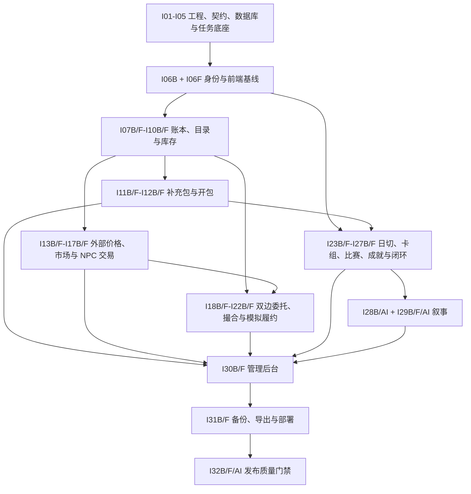

# 卡牌市场模拟器：完整项目迭代实施计划与检查清单

> 本计划仅依据《技术栈与模块职责边界》《模拟器主流程与核心验收》及《产品计划书-卡牌市场模拟器》拆分。I01–I05 保留原编号；从 I06 起按后端（`B`）、前端（`F`）和 AI（`AI`）责任轨道编号。每个可执行轨道应保持可构建、可测试、可独立验收；同阶段的适用轨道全部完成后才进入下一阶段。首发目标是 5–10 人的单机部署 MVP，使用虚拟货币，不接入真实支付或真实卡牌交易。

## 1. 实施原则与完成定义

- **权威边界**：Fastify + SQLite 是余额、库存、开包、订单、比赛和审计的唯一写入者；浏览器和 AI 只提交意图或读取结果。
- **规则边界**：所有可结算规则均在 `packages/rules` 中以纯函数实现并版本化；API、数据库和 AI 包不得复制规则。
- **幂等与审计**：每个写请求携带幂等键；金额、库存、锁定、订单状态、奖励和后台变更均写不可变流水/审计记录。
- **失败降级**：目录、价格和 AI 都可失败；保留最近成功数据或模板结果，绝不破坏已有存档或已结算经济数据。
- **轨道完成定义**：`B` 轨道交付 contracts、规则、迁移、API、事务、任务、错误语义、日志与规则/API/SQLite 测试；`F` 轨道交付页面、查询/mutation、缓存刷新、加载/空/错/无权限/过期状态、Playwright 与 `apps/web/tests/manual/<迭代ID>.md` 人工验收；`AI` 轨道交付最小化输入、Provider/Schema/模板降级、预算/日志和隔离测试。每个轨道均须通过 `pnpm check` 与自身相关测试。
- **需求追踪**：每个 MVP 需求必须能追溯到迭代 checklist、规则/迁移/API/页面资产和自动化测试 ID；未建立追踪关系的“必须”需求不得视为完成。

## 2. 当前基线（2026-07-24）

当前仓库已有 pnpm workspace、Next.js 健康页和目录骨架、Fastify 健康检查、SQLite WAL 初始化、`jobs` 表和任务轮询骨架、AI 叙事 Schema/模板、共享基础类型及 NPC 报价示例。I01–I05 与 I06B 已完成；玩家登录页、管理员后台入口、通用页面状态和浏览器人工验收基线尚未实现，因此下一可执行轨道是 I06F。I06 阶段无 AI 实现任务，不创建 I06AI；不得把 I06B 的 API/unit test 通过视为 I06F 已交付。

## 3. 迭代依赖总览

编号顺序是默认阶段门禁。同一阶段通常先稳定 `B` 的 contracts/API，再完成 `F`；`AI` 只依赖已结算的后端摘要，可与不依赖其输出的前端工作并行。若并行开发，目标轨道列出的所有入边及其 contracts、迁移和测试夹具必须先完成。

### 轨道拆分与完成规则

- `IxxB` 是后端轨道，负责 API、application/domain/infrastructure、数据库、纯规则、任务、审计及其自动化测试；Fastify + SQLite 仍是经济与比赛真相的唯一写入者。
- `IxxF` 是前端轨道，负责 App Router 页面、TanStack Query、只提交用户意图的 mutation、页面状态、Playwright 和人工功能验收；金额、概率、报价、费用、保证金、赛果和奖励只展示服务端响应。
- `IxxAI` 是 AI 轨道，只在确有 `apps/ai`、OpenAI Provider、叙事 Schema/校验/模板降级或 AI 专项质量门禁时建立；“—”表示该阶段不适用，不创建空迭代，也不需要进度文件。
- 基础编号 `Ixx` 仅表示阶段组，不作为 I06 起的可执行迭代 ID。完成记录使用实际轨道名，例如 `progress/I06B.md`、`progress/I12F.md`、`progress/I29AI.md`。
- 每个 `F` 轨道在本计划内自带完整页面任务与验收，不依赖外部页面编号才能判定完成；其他需求文档可以单向引用本计划的轨道 ID。

| 阶段 | 后端轨道 | 前端轨道 | AI 轨道 |
| --- | --- | --- | --- |
| I06–I27 | I06B–I27B | I06F–I27F | — |
| I28 | I28B | — | I28AI |
| I29 | I29B | I29F | I29AI |
| I30–I31 | I30B–I31B | I30F–I31F | — |
| I32 | I32B | I32F | I32AI |

## 4. 逐期实施计划

### I01：工程约束与本地开发基线

目标：让所有应用、包和环境配置能被一致地构建、检查与启动。

- [x] 补齐各 workspace 的 `build`、`check`、`test` 脚本与根目录聚合脚本。
- [x] 建立 `.env.example`、配置解析与启动时配置校验；禁止浏览器获得服务端密钥。
- [x] 配置 ESLint/Prettier/TypeScript 严格检查及 import 路径规范。
- [x] 编写开发、测试、生产三类环境说明与最小启动验证。
- [x] 验收：全新环境执行安装、`pnpm check`、API/前端启动均成功。

### I02：共享契约、错误模型与幂等协议

目标：先稳定跨层数据形状，后开发具体业务。

- [x] 在 `packages/contracts` 定义分页、金额、时间、错误码、请求 ID、幂等键和 API 响应包络。
- [x] 定义用户、SKU、库存、总额/可用额/冻结额、报价、费用、流水、任务、双边订单、比赛、叙事的最小 DTO。
- [x] 定义权威经济事实事件的最小契约与版本：`pack.opened`、`npc.trade.settled`、`p2p.trade.settled`、`tournament.settled`；事件只陈述已完成事实，不携带待执行结算指令。
- [x] 制定错误码表（鉴权、参数、余额不足、库存锁定、版本过期、幂等冲突等）。
- [x] 为所有变更类端点确定 `Idempotency-Key` 行为：同调用者+同键+同请求返回首次结果，同键不同请求返回冲突，并发同键只允许一个业务结果完成。
- [x] 建立“需求编号 → 迭代 → 资产 → 测试 ID”的可维护追踪表模板。
- [x] 验收：契约包可被 web/api/ai 引用；契约测试覆盖序列化、非法输入、幂等请求指纹和冲突语义。

### I03：数据库层、迁移与事务工具

目标：将目前的建表原型升级为可演进的 SQLite 数据层。

- [x] 新建 `packages/database`，采用 Drizzle schema、迁移文件和测试数据库工具。
- [x] 配置 WAL、外键、`busy_timeout`、完整性检查及启动迁移流程。
- [x] 建立用户、会话、幂等请求、账本、资金冻结、审计日志、业务事实事件/outbox、任务、规则版本基础表。
- [x] 提供短事务封装、UTC 时间和货币整数最小单位处理，禁止浮点结算。
- [x] 验收：空库及上一受支持版本均可迁移至最新版本；失败迁移保持原子性，回滚策略和临时库集成测试可用。

### I04：API 横切能力与可观测性

目标：提供一致的 HTTP 安全边界和可诊断性。

- [x] 接入请求 Schema 校验、统一错误处理、请求 ID、结构化 Pino 日志与 CORS 白名单。
- [x] 增加 `/health`、`/ready` 与数据库/任务健康摘要。
- [x] 建立 API OpenAPI 文档生成或校验机制。
- [x] 对写请求记录调用者、幂等键、实体和结果摘要，避免日志泄露密码/令牌。
- [x] 验收：Fastify inject 覆盖健康、校验错误、未知路由和错误响应格式。

### I05：持久化任务框架与启动补跑

目标：使异步工作可串行、可重试、可追踪地运行。

- [x] 完善任务状态机：pending/running/succeeded/failed/dead，含锁、attempt、退避和错误摘要。
- [x] 实现任务注册表、单实例领取、崩溃中任务回收和启动补跑。
- [x] 加入任务唯一键、运行日志、手动重试和管理查询接口。
- [x] 为 `catalog.sync`、`prices.sync`、`daily.rollover`、`market.reprice`、`tournament.settle`、`order.expire`、`narrative.generate`、`backup.create` 预注册类型。
- [x] 建立任务处理器合约测试：重复领取、租约过期、进程中断、退避、dead/manual retry 与优雅停机；各业务处理器后续必须复用。
- [x] 验收：进程中断后任务能安全续跑，不会并发领取；任务可至少执行一次，业务结果至多完成一次。

### I06B：认证、会话与角色后端

目标：建立玩家与管理员的服务端安全身份边界。

- [x] 实现注册、登录、登出、刷新令牌撤销和当前会话查询。
- [x] 使用 Argon2id 密码哈希、短期 access token 与 HttpOnly refresh cookie。
- [x] 实现 player/admin 角色中间件和受保护路由。
- [x] 对认证端点实施输入限制与基础频率限制。
- [x] 验收：错误密码、过期令牌、刷新令牌轮换/撤销/重放、Cookie 安全属性、CSRF、CORS、频率限制和越权访问均有自动化测试。

### I06F：前端基础、认证页面与人工验收基线

目标：补齐现有后端认证之上的可操作页面，使后续迭代能同时交付 API、浏览器功能和人工验收证据。

- [ ] 配置 Tailwind CSS、TanStack Query Provider、统一 contracts 响应包络/API 错误适配、全局通知与 idempotency key mutation 封装；引入 React Hook Form + Zod 作为复杂表单交互校验层，服务端仍为最终校验权威。
- [ ] 建立公开、玩家和管理员 App Router 路由组，以及加载、错误、not-found、无权限和会话过期边界；`app/` 只组合 `pages/` 模块，不承载业务请求和复杂状态。
- [ ] 实现注册、登录、退出、会话恢复页面；玩家登录后进入玩家首页，管理员登录后进入独立 `/admin` 布局和后台首页骨架，普通玩家直接访问任一管理路由时显示 403 且无法读取管理 API。
- [ ] 建立可复用的表单、按钮、确认对话框、分页/筛选、Skeleton、空态、错误重试和数据过期提示；键盘焦点与标签满足核心流程操作，桌面及窄屏均不阻断。
- [ ] 配置 Playwright 与稳定测试账号/数据夹具，覆盖玩家/管理员登录、刷新恢复、错误密码、会话过期、退出和管理越权；测试不得只断言组件存在，必须验证路由与 API 权限结果。
- [ ] 执行玩家/管理员登录、刷新恢复、退出、会话过期和直接访问 `/admin` 的人工验收，保存 `apps/web/tests/manual/I06F.md`，记录构建标识、浏览器、测试数据和截图/录屏路径。
- [ ] 验收：真实浏览器可完成玩家/管理员登录和退出；角色导航、深层链接、加载/错/无权限状态正确；`pnpm check`、前端测试和 I06F 人工验收全部通过后才进入 I07 阶段。

### I07B：存档、初始资金与账本后端

目标：让新用户获得唯一且可追溯的服务端游戏起点。

- [ ] 创建用户存档、余额账户、初始资金规则版本与初始资金流水；定义总额、可用额、冻结额和禁止负余额不变量。
- [ ] 用用户唯一约束与幂等键保护重复创建/重复提交。
- [ ] 提供余额、净资产占位、账本流水和存档摘要查询。
- [ ] 建立资金冻结/释放/扣除与业务实体、账本流水的关联规范，禁止直接修改余额；为买单预占和履约保证金提供共享原语。
- [ ] 使用 Fastify inject + 临时 SQLite 覆盖首次建档、并发/重放、资金冻结/释放和事务失败回滚。
- [ ] 验收：AT-01 的服务端断言通过；并发或重放创建请求只发放一次初始资金，冻结、释放和失败回滚不产生负数或账本不平。

### I07F：存档与账本页面

目标：让玩家在浏览器中创建/读取存档并理解账户资金状态。

- [ ] 前端实现玩家首页第一版：存档摘要、总额/可用额/冻结额、净资产占位、分页账本与明确业务入口；金额仅格式化服务端整数，不在浏览器合计经济真相。
- [ ] 覆盖新存档创建中、无流水、查询失败/重试、重复创建和窄屏状态；Playwright 验证登录后建档、刷新和同键重放。
- [ ] 人工核对余额/流水来自服务端且加载、空、错、重试、窄屏均可操作，保存 `apps/web/tests/manual/I07F.md`。
- [ ] 验收：浏览器可完成 AT-01 的用户操作部分，重复操作不展示第二份存档或初始资金。

### I08B：卡牌目录与 SKU 数据模型后端

目标：以“印刷版本 + 工艺”为粒度建立可交易资产目录。

- [ ] 建立系列、印刷版本、SKU、合法性、稀有度、图像缓存元数据与来源字段。
- [ ] 约束同名不同印刷、nonfoil/foil/etched 为独立 SKU。
- [ ] 提供卡牌搜索、筛选、详情和只读目录 API。
- [ ] 建立人工测试卡/运营例外标识，禁止混淆为外部参考价卡。
- [ ] 使用临时 SQLite 集成测试覆盖分页、筛选、同名不同印刷、工艺区分、权限和人工例外来源。
- [ ] 验收：同名不同版本可独立查询且不会错误聚合，目录 API 契约与来源字段稳定。

### I08F：卡牌目录与详情页面

目标：让玩家按印刷版本和工艺浏览卡牌目录。

- [ ] 前端实现卡牌目录与详情：名称/系列/稀有度/工艺筛选、服务端分页、印刷 SKU 区分、来源和无图片降级；筛选写入 URL，浏览页面不得触发外部请求。
- [ ] Playwright 覆盖空目录、分页、同名不同印刷、筛选无结果和接口失败。
- [ ] 执行来源、SKU 区分、筛选 URL 恢复和无图片降级的人工核对，保存 `apps/web/tests/manual/I08F.md`。
- [ ] 验收：浏览器不会错误合并 SKU，刷新/返回后筛选可恢复且不会触发外部请求。

### I09B：Scryfall Bulk Data 导入与图片缓存后端

目标：把卡牌资料与图片获取收敛为低频后端任务。

- [ ] 实现 Bulk Data 下载、checksum/版本记录、启用系列过滤和解析导入。
- [ ] 仅按需下载并本地缓存项目展示的图片，提供安全静态访问路径。
- [ ] 记录每次同步的来源、差异、失败原因，并保留上一次成功资料。
- [ ] 提供管理员触发与任务状态查看，不允许浏览器直接访问 Scryfall。
- [ ] 使用固定夹具覆盖 checksum 错误、损坏/截断文件、重复印刷、非法图片路径、Schema 缺失和事务中断。
- [ ] 验收：失败同步不删除旧目录；导入 SKU 能追溯 Scryfall ID 与版本，浏览页面不会触发外部请求。

### I09F：目录同步管理页面

目标：让管理员安全查看和触发目录同步，而不让浏览器直连 Scryfall。

- [ ] 在 I06F 管理布局中实现目录同步页：显示最近成功版本/时间、当前任务、差异和失败摘要，管理员可二次确认后幂等触发同步或重试；普通玩家无入口且 API 返回 403。
- [ ] Playwright 覆盖管理员查看/重复触发/失败重试、普通玩家越权和旧目录保留。
- [ ] 执行成功、失败、重复触发和 403 的人工验收，保存 `apps/web/tests/manual/I09F.md`。
- [ ] 验收：页面只调用本地管理 API；失败后旧目录仍可浏览，任务状态与审计可追溯。

### I10B：库存、可用量、成本与资产锁定后端

目标：建立所有经济玩法共享的库存真相层。

- [ ] 实现持有量、可用量、订单锁定量、比赛锁定量、平均成本和市值快照字段。
- [ ] 提供库存变更服务与不可变库存流水；禁止负库存和超额解锁。
- [ ] 实现库存总览、筛选、排序与单卡持仓 API。
- [ ] 定义库存变动与账本流水必须同事务完成的接口。
- [ ] 建立库存对账查询：持有量 = 可用量 + 订单锁定量 + 比赛锁定量，并能反查不可变流水。
- [ ] 验收：并发锁定、释放、扣减及故障注入的集成测试均不产生负数、超额锁定、幽灵库存或半事务。

### I10F：库存总览页面

目标：让玩家查看服务端库存真相、成本与锁定状态。

- [ ] 前端实现库存总览第一版：服务端分页/筛选/排序、持有/可用/订单锁定/比赛锁定数量、成本与价格状态；无价时显示原因，不自行计算市值或解锁资产。
- [ ] Playwright 覆盖空库存、锁定状态、无价 SKU、查询失败和刷新恢复。
- [ ] 执行分页/筛选、锁定量与无价原因的人工核对，保存 `apps/web/tests/manual/I10F.md`。
- [ ] 验收：页面不提供直接改库存或解锁入口，显示值与服务端查询一致。

### I11B：补充包配置与开包规则引擎后端

目标：用可重放、可审计规则产生开包结果。

- [ ] 在规则包实现概率表、卡位、候选池、随机种子和规则版本输入输出。
- [ ] 建立补充包、卡位、卡池、价格、启用状态与概率展示配置；MVP 明确不保存或计算保底状态。
- [ ] 采用服务端 CSPRNG 生成并安全保存随机种子/结果摘要。
- [ ] 编写概率边界、候选池、规则版本与重放的单元测试。
- [ ] 验收：相同输入/种子可重放，浏览器与 AI 均无法指定产出，MVP 不存在保底状态。

### I11F：补充包列表与概率公示页面

目标：让玩家在购买前理解服务端版本化概率与可用状态。

- [ ] 前端实现补充包列表/详情和概率公示组件：显示卡位、稀有度概率、价格、规则版本与启用状态；不得显示或保存保底进度，不得从概率自行抽样。
- [ ] 组件/Playwright 覆盖概率加载、空卡池、禁用包、规则版本变化和窄屏阅读。
- [ ] 人工核对概率、规则版本、禁用原因和无保底文案，保存 `apps/web/tests/manual/I11F.md`。
- [ ] 验收：页面只公示服务端配置，不在浏览器保存或运行抽卡规则。

### I12B：商店购买与服务端开包

目标：完成“资金 → 卡牌 → 库存”的第一个可玩闭环。

- [ ] 实现商店列表、购买预览、开包请求幂等、扣款、开包记录、库存入账和 `pack.opened` 事实事件的单事务流程；I14B 上线前事件只追加保存，不提前计算报价。
- [ ] 返回结果 SKU、成本、参考价/游戏内价状态与开包盈亏摘要。
- [ ] 交易前禁止使用无效/下架包；失败不扣款、不写半条记录。
- [ ] 使用 Fastify inject + 临时 SQLite 覆盖余额不足、包版本过期、并发重复、库存写入失败和完整事务回滚。
- [ ] 验收：AT-03A 的服务端断言通过；开包重放请求不重复扣钱或发卡。AT-03B 的价格展示依赖 I17B/F。

### I12F：补充包商店、开包动画与结果页

目标：完成“资金 → 卡牌 → 库存”的第一个可人工操作闭环。

- [ ] 完成商店购买预览、确认、开包动画、结果、再次开包和历史页面；动画可跳过，只消费服务端结果，并在 mutation 期间禁用相同动作、网络重试复用同一幂等键。
- [ ] Playwright 覆盖成功、余额不足、版本过期、重复点击、刷新结果和动画跳过。
- [ ] 人工执行查看概率、购买、连续点击、刷新结果/历史及失败恢复，保存 `apps/web/tests/manual/I12F.md`。
- [ ] 验收：浏览器只展示一次扣款和一次服务端结果，失败不伪造产出，AT-03A 用户路径通过。

### I13B：MTGJSON 价格映射与不可变快照后端

目标：引入可追溯的 Cardmarket EUR 外部参考价。

- [ ] 下载并校验 MTGJSON `AllPricesToday`/所需文件，记录导入版本与校验和。
- [ ] 建立 MTGJSON UUID、工艺、价格类型到 Scryfall SKU 的准确映射。
- [ ] 仅追加成功快照；无价、零价、映射失败 SKU 标为不可新增交易。
- [ ] 保留最近成功快照、数据新鲜度与失败原因查询。
- [ ] 使用版本固定的导入夹具覆盖 normal/foil/etched、币种、日期、重复映射、零价、缺失字段、checksum 错误和导入中断。
- [ ] 验收：AT-09、AT-10A 的快照写入部分通过；失败导入不替换最近成功数据。

### I13F：价格同步状态页面

目标：让管理员和玩家分别看到权限范围内的价格来源与新鲜度。

- [ ] 管理端价格同步状态页显示版本、校验和、新鲜度、映射/无价统计、任务及失败摘要；玩家侧共享价格状态组件只显示公开来源、更新时间和可交易状态。
- [ ] Playwright 覆盖管理员查看失败快照、玩家查看无价/过期状态和普通玩家越权。
- [ ] 人工核对来源、更新时间、过期/无价原因和权限隔离，保存 `apps/web/tests/manual/I13F.md`。
- [ ] 验收：页面不会把兜底价标为 Cardmarket 价，普通玩家无法读取管理状态详情。

### I14B：市场规则、游戏内报价与 NPC 报价后端

目标：基于外部锚点、服务器内供需和有界事件生成可重放的游戏内市场价格。

- [ ] 在规则包实现 EUR 欧分到虚拟货币最小单位的版本化兑换、明确舍入、最低报价、费用、价差和上/下限计算。
- [ ] 建立供需聚合、系列周期、卡牌关联、流动性和基础市场事件的输入模型；消费 I02 定义的已结算事实事件，玩家开包/NPC/P2P 成交不得直接修改外部快照或市场系数。
- [ ] 实现 `market.reprice`：按价格快照与事件唯一键幂等聚合并输出游戏内中间价、NPC 买入/卖出价、参数快照、计算原因和规则版本。
- [ ] 市场事件必须带作用范围、生效区间和系数上限；到期或重放不得重复叠加。失败保留最近成功报价并告警。
- [ ] 拒绝无有效外部价 SKU 的新交易；旧持仓继续用最近成功快照估值。
- [ ] 提供单卡报价与全服市场指数计算 API。
- [ ] 编写正常、边界、非法参数、舍入、关联传播、事件到期和确定性重放 Vitest；为并发重复市场事件补充临时 SQLite 集成测试。
- [ ] 验收：E4、E7–E11 的 MVP 路径和 AT-11 的市场事件部分通过；报价可重放、价差有效、系数有界、参数越界被拒绝。

### I14F：市场首页与报价展示

目标：让玩家理解外部锚点、游戏内报价、市场事件与可交易状态。

- [ ] 实现卡牌搜索/筛选、外部参考价、游戏内价、NPC 买卖报价、市场指数、基础事件、计算原因摘要、来源和更新时间；不可交易 SKU 明确禁用交易入口。
- [ ] Playwright 覆盖正常报价、无价、过期、事件上限和查询失败。
- [ ] 人工核对双价格、来源、更新时间、事件原因和禁用状态，保存 `apps/web/tests/manual/I14F.md`。
- [ ] 验收：页面不自行计算报价，数据失败时不会伪装为实时或可交易。

### I15B：玩家向 NPC 买入后端

目标：保证玩家可以用虚拟货币购买可交易 SKU。

- [ ] 实现报价预览、限价确认、余额校验、库存增加、账本/交易流水、`npc.trade.settled` 事实事件和幂等提交。
- [ ] 将实际成交绑定到报价快照与规则版本，防止前端篡改金额。
- [ ] 增加交易量/流动性限制的服务端检查。
- [ ] 验收：同键重放、同键异参、并发重复、过期报价、余额不足及库存写入故障均有集成测试；余额、库存、手续费和流水原子一致。

### I15F：NPC 买入页面

目标：让玩家通过服务端预览和确认安全买入卡牌。

- [ ] 实现 NPC 买入数量表单、服务端预览、确认弹窗、提交中禁用、成功/失败状态；成交后以响应刷新余额、库存、报价和流水缓存，不本地推导新余额。
- [ ] Playwright 覆盖成功、余额不足、报价过期、限额、重复点击和失败后重新预览。
- [ ] 人工执行买入、报价过期、余额不足和失败恢复，保存 `apps/web/tests/manual/I15F.md`。
- [ ] 验收：预览、确认与成交结果一致，重复点击不产生第二笔交易。

### I16B：玩家向 NPC 卖出后端

目标：完成开包后的最低流动性与再投资通路。

- [ ] 实现可用库存校验、NPC 收购成交、库存扣减、余额增加、费用、流水和 `npc.trade.settled` 事实事件同事务结算。
- [ ] 支持单张、指定数量、全部持有出售；批量出售仅作为后续扩展预留契约。
- [ ] 对成交时价格变化执行服务端限价保护。
- [ ] 验收：AT-04 通过；同键异参、并发卖出、报价变化和事务故障均安全失败；无法出售被订单/比赛锁定的库存。

### I16F：NPC 卖出与库存估值页面

目标：完成开包后的可见变现与再投资通路。

- [ ] 完善库存页：数量、成本均价、服务端现价/市值/盈亏和锁定状态；提供单张、指定数量和全部持有的服务端卖出预览与二次确认。
- [ ] Playwright 覆盖成功、锁定库存、数量不足、报价变化、重复点击与刷新。
- [ ] 人工执行卖出、锁定库存拒绝、报价变化和失败恢复，保存 `apps/web/tests/manual/I16F.md`。
- [ ] 验收：AT-04 用户路径通过，页面不出售锁定资产、不自行重算余额或盈亏。

### I17B：价格历史、市场查询与每日同步后端

目标：让价格数据可理解、可刷新、可在失败时降级。

- [ ] 按天保存外部参考价与游戏内报价历史，提供 7 天/30 天/全部查询。
- [ ] 将 `prices.sync` 接入日程与启动补跑，成功后以快照唯一键投递 `market.reprice`，失败后告警。
- [ ] 增加数据源说明：MTGJSON/Cardmarket、虚拟货币、非实时/非真实资产。
- [ ] 验收：成功/失败同步都不丢旧价；AT-03B 的数据与 AT-10A 通过。每日资金和比赛刷新对应的 AT-10B 延后至 I23B/I25B。

### I17F：价格历史与市场曲线页面

目标：让价格数据可理解、可切换时间范围并在失败时明确降级。

- [ ] 完成卡牌搜索筛选、ECharts 7 天/30 天/全部双曲线、数据更新时间/过期状态、市场指数及图表空数据/降级表格；明确区分 Cardmarket 参考价和游戏内报价。
- [ ] Playwright 覆盖时间范围切换、单条/空历史、失败同步仍显示旧价、图表键盘/窄屏可读。
- [ ] 人工核对双曲线、范围切换、旧价降级和数据来源说明，保存 `apps/web/tests/manual/I17F.md`。
- [ ] 验收：AT-03B 展示部分通过，失败同步仍显示旧价和过期状态而非空白。

### I18B：P2P 双边委托预览与订单创建后端

目标：建立玩家买单/卖单的明确确认、资金/库存预占与取消入口。

- [ ] 定义 buy/sell 方向、状态、用户、SKU、原始/剩余数量、限价、费用、预计支出/到手、有效期、版本和审计字段。
- [ ] 实现服务端买单/卖单预览：返回有效报价范围、资金或库存可用量、费用、预计金额、卖单模拟履约保证金规则和预览版本。
- [ ] 创建委托时要求未过期预览版本并原子预占买方资金，或锁定卖方库存并预占相应保证金；拒绝客户端自报费用或保证金。
- [ ] 提供我的买单/卖单、撤单和双边订单簿查询；撤单幂等释放未成交资金、库存和保证金预占。
- [ ] 验收：AT-05A 通过，D9/D11 的双边创建路径可用；并发创建、重复确认、预览过期、资金/库存不足和撤单重放均有集成测试。

### I18F：P2P 委托创建与我的订单页面

目标：让玩家明确确认买/卖方向、费用、保证金和取消规则。

- [ ] 实现独立委托流程：选择买/卖方向、SKU、数量、限价和有效期，读取服务端预览并展示费用、预计支出/到手、保证金、版本和取消规则；二次确认后提交，预览过期必须重新获取。
- [ ] 实现我的委托列表、详情、状态筛选和撤单确认；Playwright 覆盖买/卖单、资金/库存不足、预览过期、重复确认/撤单。
- [ ] 人工执行买单、卖单、预览过期、重复确认与撤单，保存 `apps/web/tests/manual/I18F.md`。
- [ ] 验收：AT-05A 用户路径通过，页面不允许绕过预览或编辑服务端费用/保证金。

### I19B：P2P 撮合、资金冻结与限价后端

目标：实现可预测且不依赖前端的双边委托撮合。

- [ ] 在 `order-rules` 定义价格—时间优先、成交价、部分成交、剩余数量、费用与自成交拒绝规则，并写入规则版本。
- [ ] 实现买卖委托匹配：把成交部分的买方资金、卖方库存和保证金从委托预占转换为待履约持有，原子更新双方剩余数量并写成交记录；此阶段不转移最终所有权、不写 `p2p.trade.settled`。
- [ ] 以短事务、条件更新、唯一撮合键和订单状态版本处理并发撮合，保证订单、待履约资产和预占余额没有部分更新。
- [ ] 编写正常、边界、非法、部分成交、价格优先/时间优先和确定性规则单测。
- [ ] 验收：AT-05B 通过；并发匹配同一剩余数量不会超卖、超扣或重复成交。

### I19F：双边订单簿与撮合状态页面

目标：向玩家展示服务端撮合顺序、成交和待履约状态。

- [ ] 展示双边订单簿、价格—时间顺序、部分/全部成交、剩余数量、待履约资产、余额状态和订单状态变化；刷新/轮询只接受服务端状态，连接失败时提示数据可能过期。
- [ ] Playwright 使用两个玩家覆盖部分/全部撮合、刷新恢复和并发状态展示。
- [ ] 人工核对两个玩家的订单簿、部分成交、剩余数量与待履约状态，保存 `apps/web/tests/manual/I19F.md`。
- [ ] 验收：AT-05B 的可见状态与服务端成交记录一致，断线不会伪造最新状态。

### I20B：模拟履约保证金、完成与取消后端

目标：完成 P2P 成交后的履约状态机。

- [ ] 实现确认履约：在一个短事务中扣除待履约买方资金、把库存转入买方、结算卖方收入/费用、返还保证金并追加 `p2p.trade.settled` 事实事件；契约返回模拟履约类型与审计关联，不引入实体物流状态。
- [ ] 实现取消履约：扣除已冻结保证金、恢复卖方库存、退回买方资金并写完整审计；不得产生 `p2p.trade.settled` 事件。
- [ ] 实现到期订单处理任务和重复状态迁移防护。
- [ ] 验收：AT-06 通过；每个状态转换都能查到关联账本与审计。

### I20F：模拟履约确认与取消页面

目标：让玩家理解待履约期限、保证金和非实体物流边界。

- [ ] 提供待履约列表/详情、履约确认、取消说明、期限、保证金明细和无实体物流声明；确认/取消分别二次确认并在提交期间禁用，结果关联账本和审计入口。
- [ ] Playwright 覆盖履约、取消、到期、重复点击和失败重试。
- [ ] 人工执行正常履约、取消履约、到期和重复点击，保存 `apps/web/tests/manual/I20F.md`。
- [ ] 验收：AT-06 用户路径通过，保证金状态与服务端一致且界面明确不涉及实体物流。

### I21B：订单风控与异常交易防护后端

目标：限制刷单、价格操纵和异常频率。

- [ ] 在规则包实现价格边界、冷却、频率/数量限额和异常评分的可配置校验。
- [ ] 对自买自卖、异常价格、重复请求与高频取消做服务端拦截或标记。
- [ ] 记录风控决策、规则版本和人工复核入口；不得静默修改资产。
- [ ] 为基础市场事件、系数上限与异常订单编写规则和集成测试；高风险崩盘/泡沫仍属于首发后 E14。
- [ ] 验收：AT-11 的异常订单部分通过，合法 NPC/P2P 交易不被误伤。

### I21F：风控提示与异常订单只读页面

目标：让玩家理解拒绝原因，并为管理员提供不越权的复核入口。

- [ ] 玩家端显示稳定、可行动的风控拒绝原因和冷却/限额信息；管理端提供只读异常订单列表、详情和关联日志入口，不允许从页面直接改资产或静默放行。
- [ ] Playwright 覆盖越界价格、高频取消、自成交拒绝、合法交易未误伤和管理端脱敏详情。
- [ ] 人工执行异常/合法订单及管理员详情查看，保存 `apps/web/tests/manual/I21F.md`。
- [ ] 验收：服务端拒绝原因可理解、合法交易不被前端错误阻断，管理页面只读且脱敏。

### I22B：P2P 全链路一致性与恢复

目标：将订单系统达到可上线的可恢复状态。

- [ ] 覆盖买单/卖单创建、部分/全部撮合、模拟履约、取消、到期、重试和重启的端到端用例。
- [ ] 核对可用/预占/待履约资金、可用/锁定/待履约库存、保证金、剩余委托、成交记录、账本和审计的一致性查询。
- [ ] 为订单状态机、并发和幂等建立回归测试集。
- [ ] 输出订单运营手册：异常订单定位、人工冻结、禁止直接修数原则。
- [ ] 验收：AT-05A、AT-05B、AT-06、AT-11、AT-12 的订单部分均通过。

### I22F：P2P 浏览器全链路与恢复验收

目标：验证双玩家页面在重试、刷新和服务重启后恢复一致状态。

- [ ] 完成 P2P Playwright 回归：两个浏览器上下文覆盖创建、撮合、部分成交、撤单、履约/取消、到期、刷新与服务重启后的页面恢复；核对可用/冻结/待履约展示。
- [ ] 以非开发者可执行步骤完成整条 P2P 人工验收，附关键状态截图和关联请求/订单 ID，保存 `apps/web/tests/manual/I22F.md`。
- [ ] 验收：页面恢复后的订单、资金、库存和保证金与 I22B 对账一致，无重复操作或幽灵状态。

### I23B：每日工作资金与日切后端

目标：保证玩家每日可重新进入经营循环。

- [ ] 实现服务器配置自然日/时区、工作资金规则版本、用户+日期唯一约束和领取幂等键。
- [ ] 将工作资金资格接入 `daily.rollover`；本期只实现资金子处理器，不直接重复入账，比赛刷新子处理器在 I25B 接入同一日期执行记录。
- [ ] 使用可注入时钟覆盖跨日、停机补跑、重复请求、时区/DST 边界和配置变更。
- [ ] 验收：AT-02 与 AT-10B 的资金部分通过；补跑不会重复发钱或错用日期。

### I23F：每日工作资金领取页面

目标：让玩家从仪表盘安全领取每日工作资金并理解下次时间。

- [ ] 完善仪表盘领取入口：服务端资格、金额、日期、倒计时/下次时间和流水；成功后立即禁用并刷新，失败/跨日时重新查询服务端，不用客户端日期决定资格。
- [ ] Playwright 覆盖可领取、已领取、重复点击、跨日和服务端时区差异。
- [ ] 人工执行领取、重复点击、刷新、跨日和窄屏操作，保存 `apps/web/tests/manual/I23F.md`。
- [ ] 验收：AT-02 用户路径通过，按钮状态和下一次可领时间只取服务端。

### I24B：卡组草稿、合法性与库存竞争后端

目标：让收藏资产具备比赛使用价值。

- [ ] 定义赛制、主牌/备牌、数量规则和卡牌合法性输入，完成 `deck-rules`。
- [ ] 实现卡组草稿保存、后端合法性校验、可用库存提示和锁定冲突提示。
- [ ] 订单与比赛使用同一库存可用量，禁止一张卡重复占用。
- [ ] 提供卡组列表、编辑页和只读强度摘要接口。
- [ ] 为 `deck-rules` 编写正常、边界、非法牌张/数量/赛制与确定性重放单测。
- [ ] 验收：非法卡组、已锁定库存、并发订单/报名均被正确拒绝并保持资产不变量。

### I24F：卡组列表与编辑页面

目标：让玩家从可用库存构筑卡组并理解服务端合法性结果。

- [ ] 实现卡组列表/编辑器：从可用库存选择主牌/备牌、保存草稿、展示服务端合法性/强度摘要与订单/比赛锁定冲突；Zustand 只保存未提交草稿。
- [ ] Playwright 覆盖空库存、合法/非法卡组、未保存离开提示和锁定冲突。
- [ ] 人工执行卡组编辑、保存、非法提示和锁定冲突，保存 `apps/web/tests/manual/I24F.md`。
- [ ] 验收：页面不自行判定最终合法性，未提交草稿与服务器卡组状态清楚区分。

### I25B：每日比赛配置、报名与确定性结算后端

目标：实现由规则引擎决定的可追溯赛事结果。

- [ ] 建立比赛模板、日赛事、NPC 对手、报名条件、奖励和次数限制配置。
- [ ] 将每日比赛刷新接入 `daily.rollover`，以模板+自然日唯一键创建赛事；跨日、重复执行和停机补跑不得重复创建或重置已报名赛事。
- [ ] 报名时锁定卡组库存，并投递唯一 `tournament.settle` 任务；以比赛唯一键、规则版本、随机种子结算赛果和奖励，并在同一事务追加 `tournament.settled` 事实事件。
- [ ] 实现 `tournament-rules`：卡组强度、对手参数、胜负、排名与奖励的纯函数。
- [ ] 编写正常、边界、非法参数、固定种子重放、任务重领、并发结算和事务故障回滚测试。
- [ ] 验收：AT-07 与 AT-10B 全部通过；重复报名或重放结算不会重复奖励。

### I25F：每日比赛、报名与结果页面

目标：让玩家报名每日比赛并查看服务端确定性赛果和奖励。

- [ ] 提供今日比赛、报名预览/确认、结算中、结果、奖励和历史赛事页面；重复报名禁用，赛果与奖励只展示服务端响应。
- [ ] Playwright 覆盖今日无比赛、合法/非法报名、重复提交、结算刷新和历史结果。
- [ ] 人工执行报名、重复点击、结算刷新、结果与历史查看，保存 `apps/web/tests/manual/I25F.md`。
- [ ] 验收：AT-07 用户路径通过，页面不自行决定赛果或奖励。

### I26B：成就、收藏里程碑与奖励防刷后端

目标：将比赛结果转化为长期目标，同时不破坏经济边界。

- [ ] 定义成就配置、进度、解锁时间、展示物、奖励与规则版本。
- [ ] 幂等消费 `tournament.settled` 事实事件后调用 `achievement-rules`，与奖励流水同事务或幂等任务处理；历史事件补跑不得重复解锁。
- [ ] 实现首次参赛、连胜、系列/颜色卡组、收藏进度、冠军等首批成就。
- [ ] 增加每日次数、重复参赛和异常奖励风控。
- [ ] 为 `achievement-rules` 编写正常、边界、非法事件、重复事件与确定性单测，并覆盖并发解锁和奖励事务回滚。
- [ ] 验收：成就不会重复解锁/发奖，能从赛事和流水反查来源。

### I26F：成就与收藏里程碑页面

目标：展示长期目标、解锁状态、奖励与可追溯来源。

- [ ] 实现成就列表/详情、进度、解锁时间、展示物、奖励领取状态和赛事/收藏来源跳转；未解锁、刚解锁、已领取和失败状态清晰。
- [ ] Playwright 覆盖重复事件不重复展示/发奖、空成就和来源跳转。
- [ ] 人工核对成就状态、来源、奖励与重复刷新，保存 `apps/web/tests/manual/I26F.md`。
- [ ] 验收：展示状态与服务端解锁/奖励事实一致，不由前端直接解锁或发奖。

### I27B：比赛与经济闭环服务端验收

目标：验证服务端事实和演示数据可以支持完整玩家循环。

- [ ] 建立主流程演示数据和可重复的后端验收夹具。
- [ ] 串联工作资金、开包、NPC/P2P 交易、构筑、比赛、成就/奖励和再投资的 API/SQLite E2E，对账余额、库存、锁定和流水。
- [ ] 验收：满足 MVP 定义第 1、2、3、5 条的服务端部分（AI 叙事除外）。

### I27F：比赛与经济闭环浏览器验收

目标：验证玩家能从工作资金持续完成核心循环。

- [ ] 串联“领取工作资金 → 开包/NPC 交易/P2P 双边委托 → 构筑 → 比赛 → 成就/奖励 → 再投资”Playwright E2E 测试。
- [ ] 完成仪表盘：余额、净资产、今日资金、今日比赛、市场指数、待办入口。
- [ ] 完成收藏册基础进度、卡牌详情与比赛/库存跳转。
- [ ] 使用桌面和窄屏真实浏览器执行玩家闭环人工演示，逐步记录页面、服务端事实 ID 和失败恢复；保存 `apps/web/tests/manual/I27F.md`，不得只引用 E2E 结果。
- [ ] 验收：页面闭环满足 MVP 定义第 1、2、3、5 条（AI 叙事除外），并与 I27B 对账一致。

### I28B：AI 叙事任务与查询后端

目标：以已结算比赛事实创建唯一叙事任务，并提供不阻塞比赛的持久化边界。

- [ ] 实现已结算比赛最小化摘要、`tournamentId + narrativeVersion` 唯一任务和持久化生成记录。
- [ ] 比赛结算成功后投递任务；比赛 HTTP 请求不等待模型，叙事状态查询不暴露未结算或敏感字段。
- [ ] 覆盖任务重领、并发领取、重启和重复结果保存，保证不会重复生成记录或影响赛事结算。
- [ ] 验收：叙事任务至少执行一次、记录至多生成一次，任何状态都不回滚比赛或奖励。

### I28AI：OpenAI 叙事 Provider

目标：在不授予经济权限的条件下接入可配置、可观测的异步叙事 Provider。

- [ ] 接入 Responses API Structured Outputs；模型、超时、重试、最大输出和预算只由服务端配置。
- [ ] 不提供 function tool、数据库工具、网络搜索或任何经济写入能力。
- [ ] 记录模型、摘要哈希、输出、延迟、token/成本、失败原因，不记录密钥和敏感信息。
- [ ] 使用 Provider mock/录制夹具验证请求不包含 tools、未结算/敏感字段或客户端模型参数，预算耗尽时不发起外部调用。
- [ ] 验收：Provider 只接收 I28B 的最小化已结算摘要，无工具、无经济权限，预算耗尽安全失败。

### I29B：叙事状态与结果查询后端

目标：向浏览器提供稳定、脱敏的生成状态、AI/模板结果和重试查询语义。

- [ ] 提供 pending/succeeded/fallback 状态、战报结果、AI 标识和可重试查询错误；只返回已经持久化且通过校验的结果。
- [ ] 查询与比赛/用户权限绑定，刷新或重启后仍返回相同记录；不得把 Provider 原始错误或敏感输入传给浏览器。
- [ ] 使用 Fastify inject 覆盖未结算、生成中、成功、模板、无权限和重启恢复。
- [ ] 验收：AT-08 的查询与权限部分通过，叙事状态不影响比赛事实。

### I29AI：叙事校验、预算与模板降级

目标：让 AI 成为可替换的展示增强，而非系统依赖。

- [ ] 校验 JSON Schema、长度、枚举、语言与内容安全；失败统一转模板战报。
- [ ] 为超时、限流、非 JSON、Schema 错误、内容过滤建立可观测的降级路径。
- [ ] 对每用户/每日和全局调用次数/预算执行限制。
- [ ] 使用固定赛果分别测试成功、超时、限流、非 JSON、Schema/语言/内容错误、预算耗尽和模板失败兜底。
- [ ] 验收：AT-08 的 AI/降级部分通过；任意失败都不改变赛果、余额、库存、奖励或成就，日志不含密钥和敏感输入。

### I29F：赛事战报与 AI 降级展示

目标：让玩家区分生成中、AI 战报和模板降级，同时始终先看到已结算结果。

- [ ] 实现战报、关键回合、NPC 台词、AI 标识和生成中/成功/模板降级/可重试查询状态；刷新页面后继续读取持久化结果，不因 AI 失败显示比赛未结算。
- [ ] Playwright 覆盖加载、成功、模板、查询失败和刷新恢复，并核对三种状态下余额、库存、奖励不变。
- [ ] 人工执行生成中、AI 成功与模板降级三种场景，保存 `apps/web/tests/manual/I29F.md`。
- [ ] 验收：AT-08 用户界面部分通过，AI 失败只改变叙事展示。

### I30B：管理后台服务端与运营命令

目标：提供受角色、版本、幂等与审计保护的日志、活动、玩家和运营配置 API。

- [ ] 提供后台首页聚合，以及只读、服务端分页的审计/任务/异常交易/Agent 日志查询；支持按时间、操作者、用户、实体、动作、结果、请求 ID 和任务类型筛选，不提供删除/修改或敏感原文。
- [ ] 实现活动草稿、预览、发布/定时发布、暂停和结束状态机；校验活动类型、展示文案、目标 SKU/系列/全服范围、UTC 生效区间、互斥冲突、影响参数和上限。
- [ ] 活动发布绑定预览版本、实体版本和幂等键；已发布版本不可原地覆盖，成功后以活动版本唯一键投递 `market.reprice`，事件不得改写外部价格快照。
- [ ] 提供按用户 ID、用户名、角色和状态的服务端检索/分页及最小化详情；实现冻结/解冻、会话撤销和余额/库存补偿修正命令，禁止直接覆盖最终余额/库存、删除原流水或由 AdminModule 跨模块改表。
- [ ] 提供同步系列/SKU 启停及人工例外来源、无保底补充包、市场参数、比赛、成就、奖励和持久化任务的配置与版本预览；支持价格/目录同步、任务重试、数据过期和 Agent 记录查询；不展示尚未实现的活动包或每日/每周任务配置。
- [ ] 提供配置/活动回滚或停用策略；所有管理写操作要求 `admin` 角色、CSRF（Cookie 场景）、`Idempotency-Key`、稳定错误语义、必填原因（适用时）、实体版本和不可变审计记录。
- [ ] Fastify inject + 临时 SQLite 覆盖普通玩家 403、会话撤销、同键重放/异参、并发版本冲突、活动越界/冲突/重复发布、暂停/结束重放、用户补偿事务回滚、配置停用、同步重复触发、日志只读与敏感字段脱敏。
- [ ] 验收：AT-13 的服务端部分通过；每次变更均能关联请求 ID、幂等键、新流水（适用时）与不可变审计。

### I30F：管理后台页面

目标：让管理员登录后查看日志、发布活动并安全管理玩家数据和首发配置。

- [ ] 完成独立 `/admin` 首页和导航，显示环境、目录/价格新鲜度、失败任务、活动、待复核异常与最近操作摘要；普通玩家菜单无入口，深层链接显示 403 且不能读取管理 API。
- [ ] 提供只读日志列表/详情及服务端筛选；显示脱敏前后值、配置/规则版本和关联记录，不提供删除或修改。
- [ ] 提供活动草稿、服务端预览、发布/定时发布、暂停和结束页面；显示活动版本、任务状态和审计记录，不做本地伪成功。
- [ ] 提供玩家检索/详情、冻结/解冻、会话撤销及“原因 → 说明 → 服务端预览 → 二次确认 → 查看新流水/审计”的补偿修正流程；不允许输入最终余额/库存。
- [ ] 提供内容、参数、比赛、成就、奖励、同步任务与 Agent 记录页面，只展示首发已实现能力。
- [ ] Playwright 覆盖深层链接/会话过期、日志筛选、活动完整生命周期、玩家管理、重复提交和普通玩家越权。
- [ ] 人工执行管理员/玩家权限、日志、活动发布/暂停、玩家冻结/解冻/会话撤销/补偿修正，保存 `apps/web/tests/manual/I30F.md`。
- [ ] 验收：AT-13 用户界面部分通过，任何页面均不能直接修数或删除日志。

### I31B：备份、恢复、数据导出与部署后端

目标：让单台 Linux 服务器的可持续运行达到首发要求。

- [ ] 通过 `backup.create` 实现 SQLite 一致性备份、至少保留 7 份、完整性检查、定时/部署前触发、下载与恢复演练。
- [ ] 实现玩家库存/交易/经营报表 CSV/JSON 导出，验证用户隔离、权限、稳定字段和 CSV 公式注入防护。
- [ ] 提供 Docker Compose（app + Caddy）、持久化卷、环境变量说明、健康检查和升级步骤。
- [ ] 配置 GitHub Actions：检查、测试、构建并发布版本化镜像；使用受保护 secrets 部署目标服务器，部署前备份/迁移，部署后检查 `/ready`，失败停止并执行文档化回滚。
- [ ] 覆盖 WAL 活跃写入时备份、损坏备份、恢复版本不兼容、迁移失败、部署后健康失败和服务器重启；验证数据、订单、比赛、任务与叙事记录仍存在。
- [ ] 验收：AT-12 通过；全新 Linux 主机按文档可启动，定时备份与恢复演练成功，CI/CD 能部署并验证或安全回滚。

### I31F：导出与备份状态页面

目标：让玩家导出个人数据，并让管理员查看备份/恢复演练状态。

- [ ] 提供玩家导出入口及管理员备份/恢复演练状态与备份下载入口；显示生成中、成功、过期和失败状态，下载请求复核权限，不在浏览器拼装权威报表或数据库文件路径。
- [ ] Playwright 覆盖导出权限、失败重试、CSV 安全样例和管理员备份状态。
- [ ] 人工执行玩家导出、越权下载拒绝、失败恢复和管理员备份状态查看，保存 `apps/web/tests/manual/I31F.md`。
- [ ] 验收：页面下载服务端生成的文件且不暴露内部路径，用户隔离正确。

### I32B：发布前后端质量门禁

目标：把服务端规则、经济一致性、安全、恢复与部署作为发布阻断条件。

- [ ] 汇总 Vitest 规则测试、Fastify/SQLite 集成测试、任务/恢复测试与 API 主流程门禁。
- [ ] 完成需求追踪矩阵，确认每个“必须”需求至少关联一个迭代完成证据和一个测试/验收 ID，且不存在配置先于执行引擎或父验收早于子项的情况。
- [ ] AT-01 至 AT-13 中涉及规则、金额、库存、订单、管理权限、活动、用户补偿、幂等、并发、回滚、任务重跑和恢复的路径必须自动化；人工验收用于验证真实浏览器操作、文案、视觉状态和可恢复性，不能替代这些自动化断言。
- [ ] 执行全局经济对账：余额与账本、持有与库存流水、冻结资金、订单/比赛锁定、奖励和保证金全部一致，任何不平阻断发布。
- [ ] 执行服务端安全检查：密码/会话、权限、输入校验、限流、密钥隔离、日志脱敏和管理命令审计。
- [ ] 建立上线回滚、故障告警、值守与首周观察指标（任务失败、快照新鲜度、账本不平、AI 成本）。
- [ ] 验收：后端 AT-01 至 AT-13、全局对账、恢复、部署与安全门禁通过，且无 P0/P1 未解决问题。

### I32F：发布前前端质量门禁

目标：把玩家/管理员真实浏览器流程、页面状态与人工功能验收作为发布阻断条件。

- [ ] 汇总前端单元/组件测试、Playwright 玩家/管理主流程和人工验收三层证据。
- [ ] 汇总并复跑 `apps/web/tests/manual/I06F.md`、I07F–I27F 及 I29F–I31F 的全部记录；在桌面与窄屏完成玩家闭环、管理员日志/活动/用户管理回归，并把最终复跑环境、结果和证据保存到 `apps/web/tests/manual/I32F.md`；缺失证据或失败步骤阻断发布。
- [ ] 核对所有页面的加载、空、错、无权限、过期、重复提交、刷新恢复和窄屏状态；确认前端不计算经济真相。
- [ ] 执行虚拟资产、价格来源/更新时间、概率、AI 标识、素材授权和可访问性说明检查。
- [ ] 验收：玩家和管理员主流程满足《模拟器主流程与核心验收》，不存在阻断操作的 P0/P1 页面问题。

### I32AI：发布前 AI 质量门禁

目标：验证 AI 叙事的权限隔离、结构化输出、预算和全量降级路径。

- [ ] 汇总 Provider、Schema、内容、预算、超时/限流和模板降级测试，覆盖成功、非 JSON、Schema/语言/内容错误、预算耗尽与模板兜底。
- [ ] 复核 AI 请求不含 tools、未结算/敏感字段或客户端模型参数，日志不含密钥和敏感输入。
- [ ] 复跑 AT-08 并核对任意 AI 结果都不改变赛果、余额、库存、奖励或成就；验证服务重启后叙事记录可恢复。
- [ ] 验收：AI 轨道无 P0/P1，失败只影响叙事展示，成本和成功率具备上线观察指标。

## 5. MVP 必须需求追踪表

本表确定产品需求的轨道归属；`I06B/F` 是“I06B 与 I06F”的紧凑写法，不是新的迭代 ID，`B/F/AI` 同理。详细资产和测试 ID 在 I02 建立的追踪表中持续补全。任一行未完成时，I32B、I32F、I32AI 中受影响的轨道不得完成。

| 产品需求 | 主责迭代 | 核心验收 |
| --- | --- | --- |
| A2、A3、F1 | I06B/F、I07B/F | AT-01、AT-12、认证与存档浏览器验收 |
| A7 | I31B/F | AT-12、导出权限/格式测试 |
| B1、B3 | I08B/F、I09B/F | AT-03A、AT-09 |
| C1–C4、C9 | I11B/F、I12B/F、I32F | AT-03A、开包历史/动画状态、概率说明检查 |
| D1–D3、D5、D8 | I14B/F–I16B/F | AT-04 |
| D9、D11、D12 | I18B/F–I19B/F、I21B/F–I22B/F | AT-05A、AT-05B、AT-11、AT-12 |
| D13 | I20B/F–I22B/F | AT-06、AT-12 |
| E1–E6 | I13B/F–I17B/F | AT-03B、AT-09、AT-10A |
| E7–E11 | I14B/F、I17B/F、I21B/F | AT-10A、AT-11 |
| F2 | I23B/F | AT-02、AT-10B |
| G1 | I24B/F | AT-07 |
| G2、G3、G6 | I25B/F–I27B/F | AT-07、AT-10B、AT-12 |
| G5 | I26B/F–I27B/F | AT-07、AT-12 |
| G4、G7 | I28B/AI、I29B/F/AI | AT-08、AT-12 |
| H1 | I06B/F、I30B/F | AT-13、认证/RBAC 与管理路由验收 |
| H2–H4 | I09B/F、I11B/F、I14B/F、I30B/F | AT-13、管理配置、版本冲突与停用测试 |
| H5、H6、H8 | I30B/F | AT-13、活动/用户补偿/日志权限与审计测试 |
| I1–I4 | I03、I05、I09B/F、I13B/F、I17B/F、I23B/F、I25B/F、I31B/F | AT-09、AT-10、AT-12 |
| I5 | I28B/AI、I29B/F/AI | AT-08 |
| I7–I9、I13 | I02–I05、I06B/F、I17B/F、I28B/AI、I29B/F/AI、I30B/F–I31B/F、I32B/F/AI | 安全、权限、可观测性、数据/概率/AI 标识检查 |
| I10 | I01–I05、I06B/F–I27B/F、I28B/AI、I29B/F/AI、I30B/F–I31B/F、I32B/F/AI | AT-01 至 AT-13 自动化矩阵、各 `F` 轨道 Playwright 与人工验收记录 |
| I11 | I31B | CI/CD 部署、健康检查与回滚演练 |

## 6. 首发后候选迭代（不阻塞 MVP）

以下均来自产品计划书的“应该/可以”项，只在 I32B、I32F、I32AI 全部完成后根据真实使用数据排期：游客模式与新手引导（A1/A5）、多设备同步和设置（A4/A6）、多系列与收藏册/图鉴增强（B2/B4-B8）、特殊包/批量开包（C6/C7）、按筛选结果批量交易（D4）、价格提醒/分析/高风险泡沫（E12-E14）、任务/等级/店铺/仓库/借贷/排行榜/赛季（F3-F10）、完整移动端与多语言（I6/I12）。每项进入开发前，应按 I02 的契约、I03 的迁移和 `B/F/AI` 责任轨道重新拆分，并复用 I32 三轨质量门禁。

## 7. MVP 最终发布清单

- [ ] 玩家能完成完整循环：工作资金、获得卡牌、构筑参赛、赛果/成就、交易、再投资。
- [ ] NPC 做市、P2P 双边委托/撮合和模拟履约保证金均可在低在线环境稳定运行。
- [ ] 可交易 SKU、外部参考价、游戏报价、赛事奖励与成就均能追溯来源和规则版本。
- [ ] 供需、系列周期、关联卡和基础市场事件只影响有界游戏报价，不能覆盖外部价格快照。
- [ ] AI 叙事仅影响展示，所有失败均自动降级为模板，绝不影响经济结算。
- [ ] 管理员登录后可进入后台查看脱敏日志、发布/暂停活动、检索和安全管理玩家；普通玩家不能访问，补偿修正不覆盖历史流水且所有管理写入可审计。
- [ ] 每日同步、市场重定价、日切、比赛结算、订单到期、备份和启动补跑均幂等；服务器重启后数据一致。
- [ ] 玩家与管理端核心流程均有 Playwright 和版本化人工验收记录，桌面及窄屏操作无阻断；不能只以 unit/API test 通过作为前端完成证据。
- [ ] Docker 部署、CI/CD、备份恢复、健康检查、日志与关键告警均完成验证。
