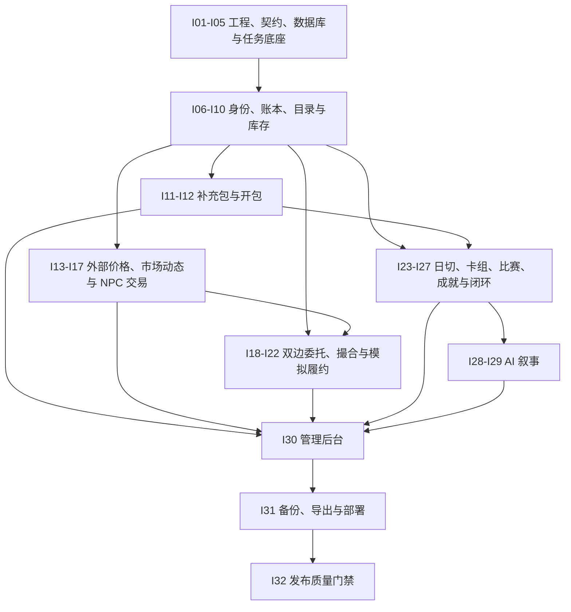

# 卡牌市场模拟器：完整项目迭代实施计划与检查清单

> 本计划依据《技术栈与模块职责边界》《模拟器主流程与核心验收》及《产品计划书-卡牌市场模拟器》拆分。每期应保持可构建、可测试、可演示；未完成当期 checklist 不进入下一期。首发目标是 5–10 人的单机部署 MVP，使用虚拟货币，不接入真实支付或真实卡牌交易。

## 1. 实施原则与完成定义

- **权威边界**：Fastify + SQLite 是余额、库存、开包、订单、比赛和审计的唯一写入者；浏览器和 AI 只提交意图或读取结果。
- **规则边界**：所有可结算规则均在 `packages/rules` 中以纯函数实现并版本化；API、数据库和 AI 包不得复制规则。
- **幂等与审计**：每个写请求携带幂等键；金额、库存、锁定、订单状态、奖励和后台变更均写不可变流水/审计记录。
- **失败降级**：目录、价格和 AI 都可失败；保留最近成功数据或模板结果，绝不破坏已有存档或已结算经济数据。
- **每期完成定义**：功能代码、迁移、契约、API 错误语义、前端空/错/加载状态和必要日志均到位；规则测试覆盖正常/边界/非法/重放，API/事务/任务测试覆盖权限/错误/幂等/并发/回滚，核心页面测试覆盖加载/空态/失败/重复点击；`pnpm check` 与本期相关测试通过。
- **需求追踪**：每个 MVP 需求必须能追溯到迭代 checklist、规则/迁移/API/页面资产和自动化测试 ID；未建立追踪关系的“必须”需求不得视为完成。

## 2. 当前基线（2026-07-23）

当前仓库已有 pnpm workspace、Next.js 页面骨架、Fastify 健康检查、SQLite WAL 初始化、`jobs` 表和任务轮询骨架、AI 叙事 Schema/模板、共享基础类型及 NPC 报价示例。以下计划仍从基础设施收口开始，避免将原型直接扩展成经济真相层。

## 3. 迭代依赖总览

编号顺序是默认执行门禁，依赖图只强调跨领域前置关系，不授权跳过中间迭代。若并行开发，目标迭代列出的所有入边及其 contracts、迁移和测试夹具必须先完成。

## 4. 逐期实施计划

### I01：工程约束与本地开发基线

目标：让所有应用、包和环境配置能被一致地构建、检查与启动。

- [x] 补齐各 workspace 的 `build`、`check`、`test` 脚本与根目录聚合脚本。
- [x] 建立 `.env.example`、配置解析与启动时配置校验；禁止浏览器获得服务端密钥。
- [x] 配置 ESLint/Prettier/TypeScript 严格检查及 import 路径规范。
- [x] 编写开发、测试、生产三类环境说明与最小启动验证。
- [x] 验收：全新环境执行安装、`pnpm check`、API/前端启动均成功。

### I02：共享契约、错误模型与幂等协议

目标：先稳定跨层数据形状，后开发具体业务。

- [x] 在 `packages/contracts` 定义分页、金额、时间、错误码、请求 ID、幂等键和 API 响应包络。
- [x] 定义用户、SKU、库存、总额/可用额/冻结额、报价、费用、流水、任务、双边订单、比赛、叙事的最小 DTO。
- [x] 定义权威经济事实事件的最小契约与版本：`pack.opened`、`npc.trade.settled`、`p2p.trade.settled`、`tournament.settled`；事件只陈述已完成事实，不携带待执行结算指令。
- [x] 制定错误码表（鉴权、参数、余额不足、库存锁定、版本过期、幂等冲突等）。
- [x] 为所有变更类端点确定 `Idempotency-Key` 行为：同调用者+同键+同请求返回首次结果，同键不同请求返回冲突，并发同键只允许一个业务结果完成。
- [x] 建立“需求编号 → 迭代 → 资产 → 测试 ID”的可维护追踪表模板。
- [x] 验收：契约包可被 web/api/ai 引用；契约测试覆盖序列化、非法输入、幂等请求指纹和冲突语义。

### I03：数据库层、迁移与事务工具

目标：将目前的建表原型升级为可演进的 SQLite 数据层。

- [x] 新建 `packages/database`，采用 Drizzle schema、迁移文件和测试数据库工具。
- [x] 配置 WAL、外键、`busy_timeout`、完整性检查及启动迁移流程。
- [x] 建立用户、会话、幂等请求、账本、资金冻结、审计日志、业务事实事件/outbox、任务、规则版本基础表。
- [x] 提供短事务封装、UTC 时间和货币整数最小单位处理，禁止浮点结算。
- [x] 验收：空库及上一受支持版本均可迁移至最新版本；失败迁移保持原子性，回滚策略和临时库集成测试可用。

### I04：API 横切能力与可观测性

目标：提供一致的 HTTP 安全边界和可诊断性。

- [x] 接入请求 Schema 校验、统一错误处理、请求 ID、结构化 Pino 日志与 CORS 白名单。
- [x] 增加 `/health`、`/ready` 与数据库/任务健康摘要。
- [x] 建立 API OpenAPI 文档生成或校验机制。
- [x] 对写请求记录调用者、幂等键、实体和结果摘要，避免日志泄露密码/令牌。
- [x] 验收：Fastify inject 覆盖健康、校验错误、未知路由和错误响应格式。

### I05：持久化任务框架与启动补跑

目标：使异步工作可串行、可重试、可追踪地运行。

- [ ] 完善任务状态机：pending/running/succeeded/failed/dead，含锁、attempt、退避和错误摘要。
- [ ] 实现任务注册表、单实例领取、崩溃中任务回收和启动补跑。
- [ ] 加入任务唯一键、运行日志、手动重试和管理查询接口。
- [ ] 为 `catalog.sync`、`prices.sync`、`daily.rollover`、`market.reprice`、`tournament.settle`、`order.expire`、`narrative.generate`、`backup.create` 预注册类型。
- [ ] 建立任务处理器合约测试：重复领取、租约过期、进程中断、退避、dead/manual retry 与优雅停机；各业务处理器后续必须复用。
- [ ] 验收：进程中断后任务能安全续跑，不会并发领取；任务可至少执行一次，业务结果至多完成一次。

### I06：认证、会话与角色

目标：建立玩家与管理员的安全身份边界。

- [ ] 实现注册、登录、登出、刷新令牌撤销和当前会话查询。
- [ ] 使用 Argon2id 密码哈希、短期 access token 与 HttpOnly refresh cookie。
- [ ] 实现 player/admin 角色中间件和受保护路由。
- [ ] 对认证端点实施输入限制与基础频率限制。
- [ ] 验收：错误密码、过期令牌、刷新令牌轮换/撤销/重放、Cookie 安全属性、CSRF、CORS、频率限制和越权访问均有自动化测试。

### I07：存档、初始资金与账本

目标：让新用户获得唯一且可追溯的游戏起点。

- [ ] 创建用户存档、余额账户、初始资金规则版本与初始资金流水；定义总额、可用额、冻结额和禁止负余额不变量。
- [ ] 用用户唯一约束与幂等键保护重复创建/重复提交。
- [ ] 提供余额、净资产占位、账本流水和存档摘要查询。
- [ ] 建立资金冻结/释放/扣除与业务实体、账本流水的关联规范，禁止直接修改余额；为买单预占和履约保证金提供共享原语。
- [ ] 验收：AT-01 通过；并发或重放创建请求只发放一次初始资金；冻结、释放和失败回滚不产生负数或账本不平。

### I08：卡牌目录与 SKU 数据模型

目标：以“印刷版本 + 工艺”为粒度建立可交易资产目录。

- [ ] 建立系列、印刷版本、SKU、合法性、稀有度、图像缓存元数据与来源字段。
- [ ] 约束同名不同印刷、nonfoil/foil/etched 为独立 SKU。
- [ ] 提供卡牌搜索、筛选、详情和只读目录 API。
- [ ] 建立人工测试卡/运营例外标识，禁止混淆为外部参考价卡。
- [ ] 验收：同名不同版本可独立查询且不会错误聚合；分页、筛选、权限和人工例外来源均有集成测试。

### I09：Scryfall Bulk Data 首次导入与图片缓存

目标：把卡牌资料与图片获取收敛为低频后端任务。

- [ ] 实现 Bulk Data 下载、checksum/版本记录、启用系列过滤和解析导入。
- [ ] 仅按需下载并本地缓存项目展示的图片，提供安全静态访问路径。
- [ ] 记录每次同步的来源、差异、失败原因，并保留上一次成功资料。
- [ ] 提供管理员触发与任务状态查看，不允许浏览器直接访问 Scryfall。
- [ ] 使用固定夹具覆盖 checksum 错误、损坏/截断文件、重复印刷、非法图片路径、Schema 缺失和事务中断。
- [ ] 验收：失败同步不删除旧目录；导入 SKU 能追溯 Scryfall ID 与版本，浏览页面不会触发外部请求。

### I10：库存、可用量、成本与资产锁定基础

目标：建立所有经济玩法共享的库存真相层。

- [ ] 实现持有量、可用量、订单锁定量、比赛锁定量、平均成本和市值快照字段。
- [ ] 提供库存变更服务与不可变库存流水；禁止负库存和超额解锁。
- [ ] 实现库存总览、筛选、排序与单卡持仓 API。
- [ ] 定义库存变动与账本流水必须同事务完成的接口。
- [ ] 建立库存对账查询：持有量 = 可用量 + 订单锁定量 + 比赛锁定量，并能反查不可变流水。
- [ ] 验收：并发锁定、释放、扣减及故障注入的集成测试均不产生负数、超额锁定、幽灵库存或半事务。

### I11：补充包配置与开包规则引擎

目标：用可重放、可审计规则产生开包结果。

- [ ] 在规则包实现概率表、卡位、候选池、随机种子和规则版本输入输出。
- [ ] 建立补充包、卡位、卡池、价格、启用状态与概率展示配置；MVP 明确不保存或计算保底状态。
- [ ] 采用服务端 CSPRNG 生成并安全保存随机种子/结果摘要。
- [ ] 编写概率边界、候选池、规则版本与重放的单元测试。
- [ ] 验收：相同输入/种子可重放，前端与 AI 均无法指定产出。

### I12：商店购买、服务端开包与结果页

目标：完成“资金 → 卡牌 → 库存”的第一个可玩闭环。

- [ ] 实现商店列表、购买预览、开包请求幂等、扣款、开包记录、库存入账和 `pack.opened` 事实事件的单事务流程；I14 上线前事件只追加保存，不提前计算报价。
- [ ] 返回结果 SKU、成本、参考价/游戏内价状态与开包盈亏摘要。
- [ ] 实现商店、开包动画、结果页、重复点击防护和开包历史页面。
- [ ] 交易前禁止使用无效/下架包；失败不扣款、不写半条记录。
- [ ] 使用 Fastify inject + 临时 SQLite 覆盖余额不足、包版本过期、并发重复、库存写入失败和完整事务回滚。
- [ ] 验收：AT-03A 通过；开包重放请求不重复扣钱或发卡。AT-03B 延后至 I17。

### I13：MTGJSON 价格映射与不可变快照

目标：引入可追溯的 Cardmarket EUR 外部参考价。

- [ ] 下载并校验 MTGJSON `AllPricesToday`/所需文件，记录导入版本与校验和。
- [ ] 建立 MTGJSON UUID、工艺、价格类型到 Scryfall SKU 的准确映射。
- [ ] 仅追加成功快照；无价、零价、映射失败 SKU 标为不可新增交易。
- [ ] 保留最近成功快照、数据新鲜度与失败原因查询。
- [ ] 使用版本固定的导入夹具覆盖 normal/foil/etched、币种、日期、重复映射、零价、缺失字段、checksum 错误和导入中断。
- [ ] 验收：AT-09、AT-10A 的快照写入部分通过；失败导入不替换最近成功数据。

### I14：市场规则、游戏内报价与 NPC 报价

目标：基于外部锚点、服务器内供需和有界事件生成可重放的游戏内市场价格。

- [ ] 在规则包实现 EUR 欧分到虚拟货币最小单位的版本化兑换、明确舍入、最低报价、费用、价差和上/下限计算。
- [ ] 建立供需聚合、系列周期、卡牌关联、流动性和基础市场事件的输入模型；消费 I02 定义的已结算事实事件，玩家开包/NPC/P2P 成交不得直接修改外部快照或市场系数。
- [ ] 实现 `market.reprice`：按价格快照与事件唯一键幂等聚合并输出游戏内中间价、NPC 买入/卖出价、参数快照、计算原因和规则版本。
- [ ] 市场事件必须带作用范围、生效区间和系数上限；到期或重放不得重复叠加。失败保留最近成功报价并告警。
- [ ] 拒绝无有效外部价 SKU 的新交易；旧持仓继续用最近成功快照估值。
- [ ] 提供单卡报价与全服市场指数计算 API。
- [ ] 编写正常、边界、非法参数、舍入、关联传播、事件到期和确定性重放 Vitest；为并发重复市场事件补充临时 SQLite 集成测试。
- [ ] 验收：E4、E7–E11 的 MVP 路径和 AT-11 的市场事件部分通过；报价可重放、价差有效、系数有界、参数越界被拒绝。

### I15：玩家向 NPC 买入交易

目标：保证玩家可以用虚拟货币购买可交易 SKU。

- [ ] 实现报价预览、限价确认、余额校验、库存增加、账本/交易流水、`npc.trade.settled` 事实事件和幂等提交。
- [ ] 将实际成交绑定到报价快照与规则版本，防止前端篡改金额。
- [ ] 实现市场买入界面、确认弹窗、成功/失败状态与缓存刷新。
- [ ] 增加交易量/流动性限制的服务端检查。
- [ ] 验收：同键重放、同键异参、并发重复、过期报价、余额不足及库存写入故障均有集成测试；余额、库存、手续费和流水原子一致。

### I16：玩家向 NPC 卖出交易与库存总览

目标：完成开包后的最低流动性与再投资通路。

- [ ] 实现可用库存校验、NPC 收购成交、库存扣减、余额增加、费用、流水和 `npc.trade.settled` 事实事件同事务结算。
- [ ] 支持单张、指定数量、全部持有出售；批量出售仅作为后续扩展预留契约。
- [ ] 完善库存页：数量、成本均价、现价、市值、盈亏和锁定状态。
- [ ] 对成交时价格变化执行服务端限价保护。
- [ ] 验收：AT-04 通过；同键异参、并发卖出、报价变化和事务故障均安全失败；无法出售被订单/比赛锁定的库存。

### I17：价格历史、市场查询与每日同步编排

目标：让价格数据可理解、可刷新、可在失败时降级。

- [ ] 按天保存外部参考价与游戏内报价历史，提供 7 天/30 天/全部查询。
- [ ] 实现卡牌搜索筛选、双曲线、数据更新时间、过期状态和市场指数页面。
- [ ] 将 `prices.sync` 接入日程与启动补跑，成功后以快照唯一键投递 `market.reprice`，失败后告警。
- [ ] 增加数据源说明：MTGJSON/Cardmarket、虚拟货币、非实时/非真实资产。
- [ ] 验收：成功/失败同步都不丢旧价；AT-03B、AT-10A 通过。每日资金和比赛刷新对应的 AT-10B 延后至 I23/I25。

### I18：P2P 双边委托预览与订单创建

目标：建立玩家买单/卖单的明确确认、资金/库存预占与取消入口。

- [ ] 定义 buy/sell 方向、状态、用户、SKU、原始/剩余数量、限价、费用、预计支出/到手、有效期、版本和审计字段。
- [ ] 实现服务端买单/卖单预览：返回有效报价范围、资金或库存可用量、费用、预计金额、卖单模拟履约保证金规则和预览版本。
- [ ] 创建委托时原子预占买方资金，或锁定卖方库存并预占相应保证金；前端必须显式确认未过期预览，不能自行计算费用或保证金。
- [ ] 提供我的买单/卖单、撤单和双边订单簿查询；撤单幂等释放未成交资金、库存和保证金预占。
- [ ] 验收：AT-05A 通过，D9/D11 的双边创建路径可用；并发创建、重复确认、预览过期、资金/库存不足和撤单重放均有集成测试。

### I19：P2P 撮合、买方资金冻结与限价

目标：实现可预测且不依赖前端的双边委托撮合。

- [ ] 在 `order-rules` 定义价格—时间优先、成交价、部分成交、剩余数量、费用与自成交拒绝规则，并写入规则版本。
- [ ] 实现买卖委托匹配：把成交部分的买方资金、卖方库存和保证金从委托预占转换为待履约持有，原子更新双方剩余数量并写成交记录；此阶段不转移最终所有权、不写 `p2p.trade.settled`。
- [ ] 以短事务、条件更新、唯一撮合键和订单状态版本处理并发撮合，保证订单、待履约资产和预占余额没有部分更新。
- [ ] 前端展示订单簿、成交结果、余额状态和订单状态变化。
- [ ] 编写正常、边界、非法、部分成交、价格优先/时间优先和确定性规则单测。
- [ ] 验收：AT-05B 通过；并发匹配同一剩余数量不会超卖、超扣或重复成交。

### I20：模拟履约保证金、完成与取消

目标：完成 P2P 成交后的履约状态机。

- [ ] 实现确认履约：在一个短事务中扣除待履约买方资金、把库存转入买方、结算卖方收入/费用、返还保证金并追加 `p2p.trade.settled` 事实事件；界面明确该流程不涉及实体卡牌物流。
- [ ] 实现取消履约：扣除已冻结保证金、恢复卖方库存、退回买方资金并写完整审计；不得产生 `p2p.trade.settled` 事件。
- [ ] 实现到期订单处理任务和重复状态迁移防护。
- [ ] 前端提供待履约、履约确认、取消说明和保证金明细。
- [ ] 验收：AT-06 通过；每个状态转换都能查到关联账本与审计。

### I21：订单风控与异常交易防护

目标：限制刷单、价格操纵和异常频率。

- [ ] 在规则包实现价格边界、冷却、频率/数量限额和异常评分的可配置校验。
- [ ] 对自买自卖、异常价格、重复请求与高频取消做服务端拦截或标记。
- [ ] 记录风控决策、规则版本和人工复核入口；不得静默修改资产。
- [ ] 为基础市场事件、系数上限与异常订单编写规则和集成测试；高风险崩盘/泡沫仍属于首发后 E14。
- [ ] 验收：AT-11 的异常订单部分通过，合法 NPC/P2P 交易不被误伤。

### I22：P2P 交易全链路验收与恢复

目标：将订单系统达到可上线的可恢复状态。

- [ ] 覆盖买单/卖单创建、部分/全部撮合、模拟履约、取消、到期、重试和重启的端到端用例。
- [ ] 核对可用/预占/待履约资金、可用/锁定/待履约库存、保证金、剩余委托、成交记录、账本和审计的一致性查询。
- [ ] 为订单状态机、并发和幂等建立回归测试集。
- [ ] 输出订单运营手册：异常订单定位、人工冻结、禁止直接修数原则。
- [ ] 验收：AT-05A、AT-05B、AT-06、AT-11、AT-12 的订单部分均通过。

### I23：每日工作资金与日切

目标：保证玩家每日可重新进入经营循环。

- [ ] 实现服务器配置自然日/时区、工作资金规则版本、用户+日期唯一约束和领取幂等键。
- [ ] 将工作资金资格接入 `daily.rollover`；本期只实现资金子处理器，不直接重复入账，比赛刷新子处理器在 I25 接入同一日期执行记录。
- [ ] 实现仪表盘领取入口、倒计时/下次时间和流水展示。
- [ ] 使用可注入时钟覆盖跨日、停机补跑、重复请求、时区/DST 边界和配置变更。
- [ ] 验收：AT-02 与 AT-10B 的资金部分通过；补跑不会重复发钱或错用日期。

### I24：卡组草稿、合法性与库存竞争

目标：让收藏资产具备比赛使用价值。

- [ ] 定义赛制、主牌/备牌、数量规则和卡牌合法性输入，完成 `deck-rules`。
- [ ] 实现卡组草稿保存、后端合法性校验、可用库存提示和锁定冲突提示。
- [ ] 订单与比赛使用同一库存可用量，禁止一张卡重复占用。
- [ ] 提供卡组列表、编辑页和只读强度摘要接口。
- [ ] 为 `deck-rules` 编写正常、边界、非法牌张/数量/赛制与确定性重放单测。
- [ ] 验收：非法卡组、已锁定库存、并发订单/报名均被正确拒绝并保持资产不变量。

### I25：每日比赛配置、报名与确定性结算

目标：实现由规则引擎决定的可追溯赛事结果。

- [ ] 建立比赛模板、日赛事、NPC 对手、报名条件、奖励和次数限制配置。
- [ ] 将每日比赛刷新接入 `daily.rollover`，以模板+自然日唯一键创建赛事；跨日、重复执行和停机补跑不得重复创建或重置已报名赛事。
- [ ] 报名时锁定卡组库存，并投递唯一 `tournament.settle` 任务；以比赛唯一键、规则版本、随机种子结算赛果和奖励，并在同一事务追加 `tournament.settled` 事实事件。
- [ ] 实现 `tournament-rules`：卡组强度、对手参数、胜负、排名与奖励的纯函数。
- [ ] 提供今日比赛、报名、结果、历史赛事页面。
- [ ] 编写正常、边界、非法参数、固定种子重放、任务重领、并发结算和事务故障回滚测试。
- [ ] 验收：AT-07 与 AT-10B 全部通过；重复报名或重放结算不会重复奖励。

### I26：成就、收藏里程碑与比赛奖励防刷

目标：将比赛结果转化为长期目标，同时不破坏经济边界。

- [ ] 定义成就配置、进度、解锁时间、展示物、奖励与规则版本。
- [ ] 幂等消费 `tournament.settled` 事实事件后调用 `achievement-rules`，与奖励流水同事务或幂等任务处理；历史事件补跑不得重复解锁。
- [ ] 实现首次参赛、连胜、系列/颜色卡组、收藏进度、冠军等首批成就。
- [ ] 增加每日次数、重复参赛和异常奖励风控。
- [ ] 为 `achievement-rules` 编写正常、边界、非法事件、重复事件与确定性单测，并覆盖并发解锁和奖励事务回滚。
- [ ] 验收：成就不会重复解锁/发奖，能从赛事和流水反查来源。

### I27：比赛与经济闭环体验验收

目标：验证玩家能从工作资金持续完成核心循环。

- [ ] 串联“领取工作资金 → 开包/NPC 交易/P2P 双边委托 → 构筑 → 比赛 → 成就/奖励 → 再投资”E2E 测试。
- [ ] 完成仪表盘：余额、净资产、今日资金、今日比赛、市场指数、待办入口。
- [ ] 完成收藏册基础进度、卡牌详情与比赛/库存跳转。
- [ ] 建立主流程演示数据和可重复的验收脚本。
- [ ] 验收：满足 MVP 定义第 1、2、3、5 条（AI 叙事除外）。

### I28：AI 叙事任务编排与 OpenAI Provider

目标：在不授予经济权限的条件下接入异步赛事叙事。

- [ ] 实现已结算比赛最小化摘要、`tournamentId + narrativeVersion` 唯一任务和持久化生成记录。
- [ ] 接入 Responses API Structured Outputs；模型、超时、重试、最大输出和预算只由服务端配置。
- [ ] 不提供 function tool、数据库工具、网络搜索或任何经济写入能力。
- [ ] 记录模型、摘要哈希、输出、延迟、token/成本、失败原因，不记录密钥和敏感信息。
- [ ] 使用 Provider mock/录制夹具验证请求不包含 tools、未结算/敏感字段或客户端模型参数，预算耗尽时不发起外部调用。
- [ ] 验收：比赛 HTTP 请求不等待模型；任务重领、并发领取和重启不会重复生成或影响赛事结算。

### I29：叙事校验、模板降级与展示

目标：让 AI 成为可替换的展示增强，而非系统依赖。

- [ ] 校验 JSON Schema、长度、枚举、语言与内容安全；失败统一转模板战报。
- [ ] 为超时、限流、非 JSON、Schema 错误、内容过滤建立可观测的降级路径。
- [ ] 实现战报、关键回合、NPC 台词和生成状态的前端展示。
- [ ] 对每用户/每日和全局调用次数/预算执行限制。
- [ ] 使用固定赛果分别测试成功、超时、限流、非 JSON、Schema/语言/内容错误、预算耗尽和模板失败兜底；前端覆盖加载、成功、模板和重试状态。
- [ ] 验收：AT-08 通过；任意 AI 失败都不改变赛果、余额、库存、奖励或成就，日志不含密钥和敏感输入。

### I30：管理后台与运营配置

目标：使运营能在不改代码的情况下管理首发内容和参数。

- [ ] 实现管理员登录与后台导航，所有写操作要求角色并写审计。
- [ ] 提供同步系列/SKU 启停及人工例外来源、无保底补充包、市场参数、基础市场事件、比赛、成就、奖励和持久化任务的配置与版本预览；不展示尚未实现的活动包或每日/每周任务配置。
- [ ] 支持价格同步、目录同步、任务重试、数据过期和 Agent 记录查询。
- [ ] 提供参数回滚/停用策略，禁止无日志直接修改玩家余额或库存。
- [ ] 覆盖非管理员拒绝、并发版本冲突、参数越界、回滚/停用、同步重复触发和审计脱敏集成测试。
- [ ] 验收：管理员可完成首发已实现内容配置并从审计日志追溯每一次变更。

### I31：备份、恢复、数据导出与部署

目标：让单台 Linux 服务器的可持续运行达到首发要求。

- [ ] 通过 `backup.create` 实现 SQLite 一致性备份、至少保留 7 份、完整性检查、定时/部署前触发、下载与恢复演练。
- [ ] 实现玩家库存/交易/经营报表 CSV/JSON 导出，验证用户隔离、权限、稳定字段和 CSV 公式注入防护。
- [ ] 提供 Docker Compose（app + Caddy）、持久化卷、环境变量说明、健康检查和升级步骤。
- [ ] 配置 GitHub Actions：检查、测试、构建并发布版本化镜像；使用受保护 secrets 部署目标服务器，部署前备份/迁移，部署后检查 `/ready`，失败停止并执行文档化回滚。
- [ ] 覆盖 WAL 活跃写入时备份、损坏备份、恢复版本不兼容、迁移失败、部署后健康失败和服务器重启；验证数据、订单、比赛、任务与叙事记录仍存在。
- [ ] 验收：AT-12 通过；全新 Linux 主机按文档可启动，定时备份与恢复演练成功，CI/CD 能部署并验证或安全回滚。

### I32：发布前质量门禁与 MVP 验收

目标：把所有核心规则、边界和用户主流程作为发布阻断条件。

- [ ] 建立 Vitest 规则单测、Fastify/SQLite 集成测试和 Playwright 主流程测试分层。
- [ ] 完成需求追踪矩阵，确认每个“必须”需求至少关联一个迭代完成证据和一个测试/验收 ID，且不存在配置先于执行引擎或父验收早于子项的情况。
- [ ] AT-01 至 AT-12 中涉及规则、金额、库存、订单、权限、幂等、并发、回滚、任务重跑和恢复的路径必须自动化；仅视觉、素材授权和真实主机部署允许保留有记录的人工验收。
- [ ] 执行全局经济对账：余额与账本、持有与库存流水、冻结资金、订单/比赛锁定、奖励和保证金全部一致，任何不平阻断发布。
- [ ] 执行安全检查：密码/会话、权限、输入校验、限流、密钥隔离、日志脱敏、前端无经济计算。
- [ ] 执行数据/版权说明检查：虚拟资产声明、价格来源与更新时间、概率说明、AI 标识、素材授权审查待办。
- [ ] 建立上线回滚、故障告警、值守与首周观察指标（任务失败、快照新鲜度、账本不平、AI 成本）。
- [ ] 验收：《模拟器主流程与核心验收》第 6 节 MVP 通过定义全部满足，且无 P0/P1 未解决问题。

## 5. MVP 必须需求追踪表

本表确定需求归属；详细资产和测试 ID 在 I02 建立的追踪表中持续补全。任一行未完成时不得勾选 I32。

| 产品需求 | 主责迭代 | 核心验收 |
| --- | --- | --- |
| A2、A3、F1 | I06–I07 | AT-01、AT-12 |
| A7 | I31 | AT-12、导出权限/格式测试 |
| B1、B3 | I08–I09 | AT-03A、AT-09 |
| C1–C4、C9 | I11–I12、I32 | AT-03A、开包历史/动画状态、概率说明检查 |
| D1–D3、D5、D8 | I14–I16 | AT-04 |
| D9、D11、D12 | I18–I19、I21–I22 | AT-05A、AT-05B、AT-11、AT-12 |
| D13 | I20–I22 | AT-06、AT-12 |
| E1–E6 | I13–I17 | AT-03B、AT-09、AT-10A |
| E7–E11 | I14、I17、I21 | AT-10A、AT-11 |
| F2 | I23 | AT-02、AT-10B |
| G1 | I24 | AT-07 |
| G2、G3、G6 | I25–I27 | AT-07、AT-10B、AT-12 |
| G5 | I26–I27 | AT-07、AT-12 |
| G4、G7 | I28–I29 | AT-08、AT-12 |
| H1 | I06、I30 | 认证/RBAC 集成测试 |
| H2–H4、H6、H8 | I09、I11、I14、I25–I26、I30 | 管理配置、版本冲突、回滚与审计测试 |
| I1–I4 | I03、I05、I09、I13、I17、I23、I25、I31 | AT-09、AT-10、AT-12 |
| I5 | I28–I29 | AT-08 |
| I7–I9、I13 | I02–I06、I17、I28–I32 | 安全、权限、可观测性、数据/概率/AI 标识检查 |
| I10 | I01–I32 分布式门禁 | AT-01 至 AT-12 自动化矩阵 |
| I11 | I31 | CI/CD 部署、健康检查与回滚演练 |

## 6. 首发后候选迭代（不阻塞 MVP）

以下均来自产品计划书的“应该/可以”项，只在 I32 后根据真实使用数据排期：游客模式与新手引导（A1/A5）、多设备同步和设置（A4/A6）、多系列与收藏册/图鉴增强（B2/B4-B8）、特殊包/批量开包（C6/C7）、按筛选结果批量交易（D4）、价格提醒/分析/高风险泡沫（E12-E14）、任务/等级/店铺/仓库/借贷/排行榜/赛季（F3-F10）、完整移动端与多语言（I6/I12）。每项进入开发前，应按本文件 I02 的契约、I03 的迁移、I32 的质量门禁重新拆分为独立迭代。

## 7. MVP 最终发布清单

- [ ] 玩家能完成完整循环：工作资金、获得卡牌、构筑参赛、赛果/成就、交易、再投资。
- [ ] NPC 做市、P2P 双边委托/撮合和模拟履约保证金均可在低在线环境稳定运行。
- [ ] 可交易 SKU、外部参考价、游戏报价、赛事奖励与成就均能追溯来源和规则版本。
- [ ] 供需、系列周期、关联卡和基础市场事件只影响有界游戏报价，不能覆盖外部价格快照。
- [ ] AI 叙事仅影响展示，所有失败均自动降级为模板，绝不影响经济结算。
- [ ] 每日同步、市场重定价、日切、比赛结算、订单到期、备份和启动补跑均幂等；服务器重启后数据一致。
- [ ] Docker 部署、CI/CD、备份恢复、健康检查、日志与关键告警均完成验证。
