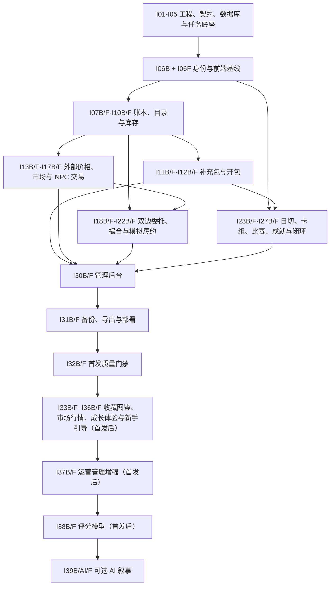

# 卡牌市场模拟器：完整项目迭代实施计划与检查清单

> 本计划仅依据《技术栈与模块职责边界》《模拟器主流程与核心验收》及《产品计划书-卡牌市场模拟器》拆分。I01–I05 保留原编号；从 I06 起按后端（`B`）、前端（`F`）和 AI（`AI`）责任轨道编号。每个可执行轨道应保持可构建、可测试、可独立验收；同阶段的适用轨道全部完成后才进入下一阶段。首发目标是 5–10 人的单机部署 MVP，使用虚拟货币，不接入真实支付或真实卡牌交易。**OpenAI/Agent 赛事叙事自本次计划调整起延后至 I39 发布后，作为非必要、可选能力，不构成 I32 首发门禁。** **计划调整（2026-08-04）：在 I35 之后新增 I36 新手引导与首次体验；原 I36 运营管理增强后移为 I37，原 I37 评分模型后移为 I38，原 I38 可选 AI 叙事后移为 I39。均不构成 I32 首发门禁。**

## 1. 实施原则与完成定义

- **权威边界**：Fastify + SQLite 是余额、库存、开包、订单、比赛和审计的唯一写入者；浏览器和 AI 只提交意图或读取结果。
- **规则边界**：所有可结算规则均在 `packages/rules` 中以纯函数实现并版本化；API、数据库和 AI 包不得复制规则。
- **幂等与审计**：每个写请求携带幂等键；金额、库存、锁定、订单状态、奖励和后台变更均写不可变流水/审计记录。
- **失败降级**：目录、价格可失败；I39 发布后若启用 AI，AI 也必须可失败并保留模板结果，绝不破坏已有存档或已结算经济数据。
- **轨道完成定义**：`B` 轨道交付 contracts、规则、迁移、API、事务、任务、错误语义、日志与规则/API/SQLite 测试；`F` 轨道交付页面、查询/mutation、缓存刷新、加载/空/错/无权限/过期状态、Playwright 与 `apps/web/tests/manual/<迭代ID>.md` 人工验收；I39 发布后才排期的可选 `AI` 轨道交付最小化输入、Provider/Schema/模板降级、预算/日志和隔离测试。每个已排期轨道均须通过 `pnpm check` 与自身相关测试。
- **需求追踪**：每个 MVP 需求必须能追溯到迭代 checklist、规则/迁移/API/页面资产和自动化测试 ID；未建立追踪关系的“必须”需求不得视为完成。

## 2. 当前基线（2026-07-29）

当前仓库已有 pnpm workspace、Next.js 前端基础与认证页面、Fastify 健康检查、SQLite WAL 初始化、持久化任务轮询、AI 叙事 Schema/模板、共享基础类型及 NPC 报价示例。I01–I25F 已完成；ADR-003 已采纳“Leyline 数据积累 → 离线 ML 验证 → 管理员发布 ML 主评分”的分阶段策略；下一可执行轨道为 I26B。现有 AI 叙事骨架仅保留，不在首发至 I39 的实施范围内启用或验收。

## 3. 迭代依赖总览

```mermaid
flowchart TD
  A[I01-I05 工程、契约、数据库与任务底座] --> B[I06B + I06F 身份与前端基线]
  B --> B2[I07B/F-I10B/F 账本、目录与库存]
  B2 --> C[I11B/F-I12B/F 补充包与开包]
  B2 --> D[I13B/F-I17B/F 外部价格、市场与 NPC 交易]
  B2 --> E[I18B/F-I22B/F 双边委托、撮合与模拟履约]
  D --> E
  B --> F[I23B/F-I27B/F 日切、卡组、比赛、成就与闭环]
  C --> F
  C --> H[I30B/F 管理后台]
  D --> H
  E --> H
  F --> H
  H --> I[I31B/F 备份、导出与部署]
  I --> J[I32B/F 首发质量门禁]
  J --> M[I33B/F–I36B/F 收藏图鉴、市场行情、成长体验与新手引导（首发后）]
  M --> N[I37B/F 运营管理增强（首发后）]
  N --> K[I38B/F 评分模型（首发后）]
  K --> L[I39B/AI/F 可选 AI 叙事]
```

编号顺序是默认阶段门禁。同一阶段通常先稳定 `B` 的 contracts/API，再完成 `F`；`AI` 只依赖已结算的后端摘要，可与不依赖其输出的前端工作并行。若并行开发，目标轨道列出的所有入边及其 contracts、迁移和测试夹具必须先完成。

### 轨道拆分与完成规则

- `IxxB` 是后端轨道，负责 API、application/domain/infrastructure、数据库、纯规则、任务、审计及其自动化测试；Fastify + SQLite 仍是经济与比赛真相的唯一写入者。
- `IxxF` 是前端轨道，负责 App Router 页面、TanStack Query、只提交用户意图的 mutation、页面状态、Playwright 和人工功能验收；金额、概率、报价、费用、保证金、赛果和奖励只展示服务端响应。
- `IxxAI` 是 AI 轨道，只在 I39 发布后确有 `apps/ai`、OpenAI Provider、叙事 Schema/校验/模板降级或 AI 专项质量门禁时建立；“—”表示该阶段不适用，不创建空迭代，也不需要进度文件。
- 基础编号 `Ixx` 仅表示阶段组，不作为 I06 起的可执行迭代 ID。完成记录使用实际轨道名，例如 `progress/I06B.md`、`progress/I12F.md`、`progress/I39AI.md`。
- 每个 `F` 轨道在本计划内自带完整页面任务与验收，不依赖外部页面编号才能判定完成；其他需求文档可以单向引用本计划的轨道 ID。

| 阶段 | 后端轨道 | 前端轨道 | AI 轨道 |
| --- | --- | --- | --- |
| I06–I27 | I06B–I27B | I06F–I27F | — |
| I28–I29 | — | — | —（AI 叙事已移至 I39） |
| I30–I31 | I30B–I31B | I30F–I31F | — |
| I32 | I32B | I32F | — |
| I33 | I33B | I33F | — |
| I34 | I34B | I34F | — |
| I35 | I35B | I35F | — |
| I36 | I36B | I36F | — |
| I37 | I37B | I37F | — |
| I38 | I38B | I38F | — |
| I39（I38 发布后，可选） | I39B | I39F | I39AI |

## 4. 逐期实施计划

### I01：工程约束与本地开发基线

目标：让所有应用、包和环境配置能被一致地构建、检查与启动。

- [x] 补齐各 workspace 的 `build`、`check`、`test` 脚本与根目录聚合脚本。
- [x] 建立 `.env.example`、配置解析与启动时配置校验；禁止浏览器获得服务端密钥。
- [x] 配置 ESLint/Prettier/TypeScript 严格检查及 import 路径规范。
- [x] 编写开发、测试、生产三类环境说明与最小启动验证。
- [x] 验收：全新环境执行安装、`pnpm check`、API/前端启动均成功。

### I02：共享契约、错误模型与幂等协议

目标：先稳定跨层数据形状，后开发具体业务。

- [x] 在 `packages/contracts` 定义分页、金额、时间、错误码、请求 ID、幂等键和 API 响应包络。
- [x] 定义用户、SKU、库存、总额/可用额/冻结额、报价、费用、流水、任务、双边订单、比赛、叙事的最小 DTO。
- [x] 定义权威经济事实事件的最小契约与版本：`pack.opened`、`npc.trade.settled`、`p2p.trade.settled`、`tournament.settled`；事件只陈述已完成事实，不携带待执行结算指令。
- [x] 制定错误码表（鉴权、参数、余额不足、库存锁定、版本过期、幂等冲突等）。
- [x] 为所有变更类端点确定 `Idempotency-Key` 行为：同调用者+同键+同请求返回首次结果，同键不同请求返回冲突，并发同键只允许一个业务结果完成。
- [x] 建立“需求编号 → 迭代 → 资产 → 测试 ID”的可维护追踪表模板。
- [x] 验收：契约包可被 web/api/ai 引用；契约测试覆盖序列化、非法输入、幂等请求指纹和冲突语义。

### I03：数据库层、迁移与事务工具

目标：将目前的建表原型升级为可演进的 SQLite 数据层。

- [x] 新建 `packages/database`，采用 Drizzle schema、迁移文件和测试数据库工具。
- [x] 配置 WAL、外键、`busy_timeout`、完整性检查及启动迁移流程。
- [x] 建立用户、会话、幂等请求、账本、资金冻结、审计日志、业务事实事件/outbox、任务、规则版本基础表。
- [x] 提供短事务封装、UTC 时间和货币整数最小单位处理，禁止浮点结算。
- [x] 验收：空库及上一受支持版本均可迁移至最新版本；失败迁移保持原子性，回滚策略和临时库集成测试可用。

### I04：API 横切能力与可观测性

目标：提供一致的 HTTP 安全边界和可诊断性。

- [x] 接入请求 Schema 校验、统一错误处理、请求 ID、结构化 Pino 日志与 CORS 白名单。
- [x] 增加 `/health`、`/ready` 与数据库/任务健康摘要。
- [x] 建立 API OpenAPI 文档生成或校验机制。
- [x] 对写请求记录调用者、幂等键、实体和结果摘要，避免日志泄露密码/令牌。
- [x] 验收：Fastify inject 覆盖健康、校验错误、未知路由和错误响应格式。

### I05：持久化任务框架与启动补跑

目标：使异步工作可串行、可重试、可追踪地运行。

- [x] 完善任务状态机：pending/running/succeeded/failed/dead，含锁、attempt、退避和错误摘要。
- [x] 实现任务注册表、单实例领取、崩溃中任务回收和启动补跑。
- [x] 加入任务唯一键、运行日志、手动重试和管理查询接口。
- [x] 为 `catalog.sync`、`prices.sync`、`daily.rollover`、`market.reprice`、`tournament.settle`、`order.expire`、`narrative.generate`、`backup.create` 预注册类型；`narrative.generate` 自本计划调整起仅为 I39 预留类型，I38 发布前不得投递或领取。
- [x] 建立任务处理器合约测试：重复领取、租约过期、进程中断、退避、dead/manual retry 与优雅停机；各业务处理器后续必须复用。
- [x] 验收：进程中断后任务能安全续跑，不会并发领取；任务可至少执行一次，业务结果至多完成一次。

### I06B：认证、会话与角色后端

目标：建立玩家与管理员的服务端安全身份边界。

- [x] 实现注册、登录、登出、刷新令牌撤销和当前会话查询。
- [x] 使用 Argon2id 密码哈希、短期 access token 与 HttpOnly refresh cookie。
- [x] 实现 player/admin 角色中间件和受保护路由。
- [x] 对认证端点实施输入限制与基础频率限制。
- [x] 验收：错误密码、过期令牌、刷新令牌轮换/撤销/重放、Cookie 安全属性、CSRF、CORS、频率限制和越权访问均有自动化测试。

### I06F：前端基础、认证页面与人工验收基线

目标：补齐现有后端认证之上的可操作页面，使后续迭代能同时交付 API、浏览器功能和人工验收证据。

- [x] 配置 Tailwind CSS、TanStack Query Provider、统一 contracts 响应包络/API 错误适配、全局通知与 idempotency key mutation 封装；引入 React Hook Form + Zod 作为复杂表单交互校验层，服务端仍为最终校验权威。
- [x] 建立公开、玩家和管理员 App Router 路由组，以及加载、错误、not-found、无权限和会话过期边界；`app/` 只组合 `pages/` 模块，不承载业务请求和复杂状态。
- [x] 实现注册、登录、退出、会话恢复页面；玩家登录后进入玩家首页，管理员登录后进入独立 `/admin` 布局和后台首页骨架，普通玩家直接访问任一管理路由时显示 403 且无法读取管理 API。
- [x] 建立可复用的表单、按钮、确认对话框、分页/筛选、Skeleton、空态、错误重试和数据过期提示；键盘焦点与标签满足核心流程操作，桌面及窄屏均不阻断。
- [x] 配置 Playwright 与稳定测试账号/数据夹具，覆盖玩家/管理员登录、刷新恢复、错误密码、会话过期、退出和管理越权；测试不得只断言组件存在，必须验证路由与 API 权限结果。
- [x] 执行玩家/管理员登录、刷新恢复、退出、会话过期和直接访问 `/admin` 的人工验收，保存 `apps/web/tests/manual/I06F.md`，记录构建标识、浏览器、测试数据和截图/录屏路径。
- [x] 验收：真实浏览器可完成玩家/管理员登录和退出；角色导航、深层链接、加载/错/无权限状态正确；`pnpm check`、前端测试和 I06F 人工验收全部通过后才进入 I07 阶段。

### I07B：存档、初始资金与账本后端

目标：让新用户获得唯一且可追溯的服务端游戏起点。

- [x] 创建用户存档、余额账户、初始资金规则版本与初始资金流水；定义总额、可用额、冻结额和禁止负余额不变量。
- [x] 用用户唯一约束与幂等键保护重复创建/重复提交。
- [x] 提供余额、净资产占位、账本流水和存档摘要查询。
- [x] 建立资金冻结/释放/扣除与业务实体、账本流水的关联规范，禁止直接修改余额；为买单预占和履约保证金提供共享原语。
- [x] 使用 Fastify inject + 临时 SQLite 覆盖首次建档、并发/重放、资金冻结/释放和事务失败回滚。
- [x] 验收：AT-01 的服务端断言通过；并发或重放创建请求只发放一次初始资金，冻结、释放和失败回滚不产生负数或账本不平。

### I07F：存档与账本页面

目标：让玩家在浏览器中创建/读取存档并理解账户资金状态。

- [x] 前端实现玩家首页第一版：存档摘要、总额/可用额/冻结额、净资产占位、分页账本与明确业务入口；金额仅格式化服务端整数，不在浏览器合计经济真相。
- [x] 覆盖新存档创建中、无流水、查询失败/重试、重复创建和窄屏状态；Playwright 验证登录后建档、刷新和同键重放。
- [x] 人工核对余额/流水来自服务端且加载、空、错、重试、窄屏均可操作，保存 `apps/web/tests/manual/I07F.md`。
- [x] 验收：浏览器可完成 AT-01 的用户操作部分，重复操作不展示第二份存档或初始资金。

### I08B：卡牌目录与 SKU 数据模型后端

目标：以“印刷版本 + 工艺”为粒度建立可交易资产目录。

- [x] 建立系列、印刷版本、SKU、合法性、稀有度、图像缓存元数据与来源字段。
- [x] 约束同名不同印刷、nonfoil/foil/etched 为独立 SKU。
- [x] 提供卡牌搜索、筛选、详情和只读目录 API。
- [x] 建立人工测试卡/运营例外标识，禁止混淆为外部参考价卡。
- [x] 使用临时 SQLite 集成测试覆盖分页、筛选、同名不同印刷、工艺区分、权限和人工例外来源。
- [x] 验收：同名不同版本可独立查询且不会错误聚合，目录 API 契约与来源字段稳定。

### I08F：卡牌目录与详情页面

目标：让玩家按印刷版本和工艺浏览卡牌目录。

- [x] 前端实现卡牌目录与详情：名称/系列/稀有度/工艺筛选、服务端分页、印刷 SKU 区分、来源和无图片降级；筛选写入 URL，浏览页面不得触发外部请求。
- [x] Playwright 覆盖空目录、分页、同名不同印刷、筛选无结果和接口失败。
- [x] 执行来源、SKU 区分、筛选 URL 恢复和无图片降级的人工核对，保存 `apps/web/tests/manual/I08F.md`。
- [x] 验收：浏览器不会错误合并 SKU，刷新/返回后筛选可恢复且不会触发外部请求。

### I09B：Scryfall Bulk Data 导入与图片缓存后端

目标：把卡牌资料与图片获取收敛为低频后端任务。

- [x] 实现 Bulk Data 下载、checksum/版本记录、启用系列过滤和解析导入。
- [x] 仅按需下载并本地缓存项目展示的图片，提供安全静态访问路径。
- [x] 将卡图缓存拆分为独立 `catalog.image-cache` 任务；支持管理员按单个 SKU 或系列补齐本地图片，不重新导入 Bulk 目录。
- [x] 记录每次同步的来源、差异、失败原因，并保留上一次成功资料。
- [x] 提供管理员触发与任务状态查看，不允许浏览器直接访问 Scryfall。
- [x] 使用固定夹具覆盖 checksum 错误、损坏/截断文件、重复印刷、非法图片路径、Schema 缺失和事务中断。
- [x] 验收：失败同步不删除旧目录；导入 SKU 能追溯 Scryfall ID 与版本，浏览页面不会触发外部请求。

### I09F：目录同步管理页面

目标：让管理员安全查看和触发目录同步，而不让浏览器直连 Scryfall。

- [x] 在 I06F 管理布局中实现目录同步页：显示最近成功版本/时间、当前任务、差异和失败摘要，管理员可二次确认后幂等触发同步或重试；普通玩家无入口且 API 返回 403。
- [x] Playwright 覆盖管理员查看/重复触发/失败重试、普通玩家越权和旧目录保留。
- [x] 执行成功、失败、重复触发和 403 的人工验收，保存 `apps/web/tests/manual/I09F.md`。
- [x] 验收：页面只调用本地管理 API；失败后旧目录仍可浏览，任务状态与审计可追溯。

### I10B：库存、可用量、成本与资产锁定后端

目标：建立所有经济玩法共享的库存真相层。

- [x] 实现持有量、可用量、订单锁定量、比赛锁定量、平均成本和市值快照字段。
- [x] 提供库存变更服务与不可变库存流水；禁止负库存和超额解锁。
- [x] 实现库存总览、筛选、排序与单卡持仓 API。
- [x] 定义库存变动与账本流水必须同事务完成的接口。
- [x] 建立库存对账查询：持有量 = 可用量 + 订单锁定量 + 比赛锁定量，并能反查不可变流水。
- [x] 验收：并发锁定、释放、扣减及故障注入的集成测试均不产生负数、超额锁定、幽灵库存或半事务。

### I10F：库存总览页面

目标：让玩家查看服务端库存真相、成本与锁定状态。

- [x] 前端实现库存总览第一版：服务端分页/筛选/排序、持有/可用/订单锁定/比赛锁定数量、成本与价格状态；无价时显示原因，不自行计算市值或解锁资产。
- [x] Playwright 覆盖空库存、锁定状态、无价 SKU、查询失败和刷新恢复。
- [x] 执行分页/筛选、锁定量与无价原因的人工核对，保存 `apps/web/tests/manual/I10F.md`。
- [x] 验收：页面不提供直接改库存或解锁入口，显示值与服务端查询一致。

### I11B：补充包配置与开包规则引擎后端

目标：用可重放、可审计规则产生开包结果。

- [x] 在规则包实现概率表、卡位、候选池、随机种子和规则版本输入输出。
- [x] 建立补充包、卡位、卡池、价格、启用状态与概率展示配置；MVP 明确不保存或计算保底状态。
- [x] 采用服务端 CSPRNG 生成并安全保存随机种子/结果摘要。
- [x] 编写概率边界、候选池、规则版本与重放的单元测试。
- [x] 验收：相同输入/种子可重放，浏览器与 AI 均无法指定产出，MVP 不存在保底状态。

### I11F：补充包列表与概率公示页面

目标：让玩家在购买前理解服务端版本化概率与可用状态。

- [x] 前端实现补充包列表/详情和概率公示组件：显示卡位、稀有度概率、价格、规则版本与启用状态；不得显示或保存保底进度，不得从概率自行抽样。
- [x] 组件/Playwright 覆盖概率加载、空卡池、禁用包、规则版本变化和窄屏阅读。
- [x] 人工核对概率、规则版本、禁用原因和无保底文案，保存 `apps/web/tests/manual/I11F.md`。
- [x] 验收：页面只公示服务端配置，不在浏览器保存或运行抽卡规则。

### I12B：商店购买与服务端开包

目标：完成“资金 → 卡牌 → 库存”的第一个可玩闭环。

- [x] 实现商店列表、购买预览、开包请求幂等、扣款、开包记录、库存入账和 `pack.opened` 事实事件的单事务流程；I14B 上线前事件只追加保存，不提前计算报价。
- [x] 返回结果 SKU、成本、参考价/游戏内价状态与开包盈亏摘要。
- [x] 交易前禁止使用无效/下架包；失败不扣款、不写半条记录。
- [x] 使用 Fastify inject + 临时 SQLite 覆盖余额不足、包版本过期、并发重复、库存写入失败和完整事务回滚。
- [x] 验收：AT-03A 的服务端断言通过；开包重放请求不重复扣钱或发卡。AT-03B 的价格展示依赖 I17B/F。

### I12F：补充包商店、开包动画与结果页

目标：完成“资金 → 卡牌 → 库存”的第一个可人工操作闭环。

- [x] 完成商店购买预览、确认、开包动画、结果、再次开包和历史页面；动画可跳过，只消费服务端结果，并在 mutation 期间禁用相同动作、网络重试复用同一幂等键。
- [x] Playwright 覆盖成功、余额不足、版本过期、重复点击、刷新结果和动画跳过。
- [x] 人工执行查看概率、购买、连续点击、刷新结果/历史及失败恢复，保存 `apps/web/tests/manual/I12F.md`。
- [x] 验收：浏览器只展示一次扣款和一次服务端结果，失败不伪造产出，AT-03A 用户路径通过。

### I13B：MTGJSON 价格映射与不可变快照后端

目标：引入可追溯的 Cardmarket EUR 外部参考价。

- [x] 下载并校验 MTGJSON `AllPricesToday`/所需文件，记录导入版本与校验和。
- [x] 当最近一次运行明确因 Provider checksum 不匹配失败时，允许管理员以独立幂等意图提交一次受审计覆写；覆写成功快照必须永久标记为未验证来源。
- [x] 建立 MTGJSON UUID、工艺、价格类型到 Scryfall SKU 的准确映射。
- [x] 仅追加成功快照；无价、零价、映射失败 SKU 标为不可新增交易。
- [x] 保留最近成功快照、数据新鲜度与失败原因查询。
- [x] 使用版本固定的导入夹具覆盖 normal/foil/etched、币种、日期、重复映射、零价、缺失字段、checksum 错误和导入中断。
- [x] 验收：AT-09、AT-10A 的快照写入部分通过；失败导入不替换最近成功数据。

### I13F：价格同步状态页面

目标：让管理员和玩家分别看到权限范围内的价格来源与新鲜度。

- [x] 管理端价格同步状态页显示版本、校验和、新鲜度、映射/无价统计、任务及失败摘要；玩家侧共享价格状态组件只显示公开来源、更新时间和可交易状态。
- [x] checksum 不匹配时自动弹出管理员覆写确认，取消不投递任务；确认后仅向本地管理 API 提交带覆写标记的幂等任务。
- [x] Playwright 覆盖管理员查看失败快照、玩家查看无价/过期状态和普通玩家越权。
- [x] 人工核对来源、更新时间、过期/无价原因和权限隔离，保存 `apps/web/tests/manual/I13F.md`。
- [x] 验收：页面不会把兜底价标为 Cardmarket 价，普通玩家无法读取管理状态详情。

### I14B：市场规则、游戏内报价与 NPC 报价后端

目标：基于外部锚点、服务器内供需和有界事件生成可重放的游戏内市场价格。

- [x] 在规则包实现 EUR 欧分到虚拟货币最小单位的版本化兑换、明确舍入、最低报价、费用、价差和上/下限计算。
- [x] 建立供需聚合、系列周期、卡牌关联、流动性和基础市场事件的输入模型；消费 I02 定义的已结算事实事件，玩家开包/NPC/P2P 成交不得直接修改外部快照或市场系数。
- [x] 实现 `market.reprice`：按价格快照与事件唯一键幂等聚合并输出游戏内中间价、NPC 买入/卖出价、参数快照、计算原因和规则版本。
- [x] 市场事件必须带作用范围、生效区间和系数上限；到期或重放不得重复叠加。失败保留最近成功报价并告警。
- [x] 拒绝无有效外部价 SKU 的新交易；旧持仓继续用最近成功快照估值。
- [x] 提供单卡报价与全服市场指数计算 API。
- [x] 编写正常、边界、非法参数、舍入、关联传播、事件到期和确定性重放 Vitest；为并发重复市场事件补充临时 SQLite 集成测试。
- [x] 验收：E4、E7–E11 的 MVP 路径和 AT-11 的市场事件部分通过；报价可重放、价差有效、系数有界、参数越界被拒绝。

### I14F：市场首页与报价展示

目标：让玩家理解外部锚点、游戏内报价、市场事件与可交易状态。

- [x] 实现卡牌搜索/筛选、外部参考价、游戏内价、NPC 买卖报价、市场指数、基础事件、计算原因摘要、来源和更新时间；不可交易 SKU 明确禁用交易入口。
- [x] Playwright 覆盖正常报价、无价、过期、事件上限和查询失败。
- [x] 人工核对双价格、来源、更新时间、事件原因和禁用状态，保存 `apps/web/tests/manual/I14F.md`。
- [x] 验收：页面不自行计算报价，数据失败时不会伪装为实时或可交易。

### I15B：玩家向 NPC 买入后端

目标：保证玩家可以用虚拟货币购买可交易 SKU。

- [x] 实现报价预览、限价确认、余额校验、库存增加、账本/交易流水、`npc.trade.settled` 事实事件和幂等提交。
- [x] 将实际成交绑定到报价快照与规则版本，防止前端篡改金额。
- [x] 增加交易量/流动性限制的服务端检查。
- [x] 验收：同键重放、同键异参、并发重复、过期报价、余额不足及库存写入故障均有集成测试；余额、库存、手续费和流水原子一致。

### I15F：NPC 买入页面

目标：让玩家通过服务端预览和确认安全买入卡牌。

- [x] 实现 NPC 买入数量表单、服务端预览、确认弹窗、提交中禁用、成功/失败状态；成交后以响应刷新余额、库存、报价和流水缓存，不本地推导新余额。
- [x] Playwright 覆盖成功、余额不足、报价过期、限额、重复点击和失败后重新预览。
- [x] 人工执行买入、报价过期、余额不足和失败恢复，保存 `apps/web/tests/manual/I15F.md`。
- [x] 验收：预览、确认与成交结果一致，重复点击不产生第二笔交易。

### I16B：玩家向 NPC 卖出后端

目标：完成开包后的最低流动性与再投资通路。

- [x] 实现可用库存校验、NPC 收购成交、库存扣减、余额增加、费用、流水和 `npc.trade.settled` 事实事件同事务结算。
- [x] 支持单张、指定数量、全部持有出售；批量出售仅作为后续扩展预留契约。
- [x] 对成交时价格变化执行服务端限价保护。
- [x] 验收：AT-04 的 NPC 卖出服务端部分通过；同键异参、并发卖出、报价变化和事务故障均安全失败；无法出售被订单/比赛锁定的库存。浏览器路径留待 I16F。

### I16F：NPC 卖出与库存估值页面

目标：完成开包后的可见变现与再投资通路。

- [x] 完善库存页：数量、成本均价、服务端现价/市值/盈亏和锁定状态；提供单张、指定数量和全部持有的服务端卖出预览与二次确认。
- [x] Playwright 覆盖成功、锁定库存、数量不足、报价变化、重复点击与刷新。
- [x] 人工执行卖出、锁定库存拒绝、报价变化和失败恢复，保存 `apps/web/tests/manual/I16F.md`。
- [x] 验收：AT-04 用户路径通过，页面不出售锁定资产、不自行重算余额或盈亏。

### I17B：价格历史、市场查询与每日同步后端

目标：让价格数据可理解、可刷新、可在失败时降级。

- [x] 按天保存外部参考价与游戏内报价历史，提供 7 天/30 天/全部查询。
- [x] 支持管理员以独立、受审计的幂等意图从 MTGJSON `AllPrices` 执行一次性历史回填：校验版本和 checksum，按 Scryfall SKU、工艺与日期只补充缺失的外部快照，记录回填范围/统计；不得覆盖已有每日快照、移动最近成功指针或为每个历史日重复投递重定价。
- [x] 将 `prices.sync` 接入日程与启动补跑，成功后以快照唯一键投递 `market.reprice`，失败后告警。
- [x] 增加数据源说明：MTGJSON/Cardmarket、虚拟货币、非实时/非真实资产。
- [x] 使用版本固定夹具覆盖首次回填、同版本重放、已有日期跳过、价格/映射缺失、checksum/解析失败和事务中断；失败不产生半回填结果且不影响既有每日同步。
- [x] 验收：成功/失败同步都不丢旧价，历史回填只追加缺失日期且可审计；AT-03B 的数据与 AT-10A 通过。每日资金和比赛刷新对应的 AT-10B 延后至 I23B/I25B。

### I17F：价格历史与市场曲线页面

目标：让价格数据可理解、可切换时间范围并在失败时明确降级。

- [x] 完成卡牌搜索筛选、ECharts 7 天/30 天/全部双曲线、数据更新时间/过期状态、市场指数及图表空数据/降级表格；明确区分 Cardmarket 参考价和游戏内报价。
- [x] Playwright 覆盖时间范围切换、单条/空历史、失败同步仍显示旧价、图表键盘/窄屏可读。
- [x] 人工核对双曲线、范围切换、旧价降级和数据来源说明，保存 `apps/web/tests/manual/I17F.md`。
- [x] 验收：AT-03B 展示部分通过，失败同步仍显示旧价和过期状态而非空白。

### I18B：P2P 双边委托预览与订单创建后端

目标：建立玩家买单/卖单的明确确认、资金/库存预占与取消入口。

- [x] 定义 buy/sell 方向、状态、用户、SKU、原始/剩余数量、限价、费用、预计支出/到手、有效期、版本和审计字段。
- [x] 实现服务端买单/卖单预览：返回有效报价范围、资金或库存可用量、费用、预计金额、卖单模拟履约保证金规则和预览版本。
- [x] 创建委托时要求未过期预览版本并原子预占买方资金，或锁定卖方库存并预占相应保证金；拒绝客户端自报费用或保证金。
- [x] 提供我的买单/卖单、撤单和双边订单簿查询；撤单幂等释放未成交资金、库存和保证金预占。
- [x] 验收：AT-05A 通过，D9/D11 的双边创建路径可用；并发创建、重复确认、预览过期、资金/库存不足和撤单重放均有集成测试。

### I18F：P2P 委托创建与我的订单页面

目标：让玩家明确确认买/卖方向、费用、保证金和取消规则。

- [x] 实现独立委托流程：选择买/卖方向、SKU、数量、限价和有效期，读取服务端预览并展示费用、预计支出/到手、保证金、版本和取消规则；二次确认后提交，预览过期必须重新获取。
- [x] 实现我的委托列表、详情、状态筛选和撤单确认；Playwright 覆盖买/卖单、资金/库存不足、预览过期、重复确认/撤单。
- [x] 人工执行买单、卖单、预览过期、重复确认与撤单，保存 `apps/web/tests/manual/I18F.md`。
- [x] 验收：AT-05A 用户路径通过，页面不允许绕过预览或编辑服务端费用/保证金。

### I19B：P2P 撮合、资金冻结与限价后端

目标：实现可预测且不依赖前端的双边委托撮合。

- [x] 在 `order-rules` 定义价格—时间优先、成交价、部分成交、剩余数量、费用与自成交拒绝规则，并写入规则版本。
- [x] 实现买卖委托匹配：把成交部分的买方资金、卖方库存和保证金从委托预占转换为待履约持有，原子更新双方剩余数量并写成交记录；此阶段不转移最终所有权、不写 `p2p.trade.settled`。
- [x] 以短事务、条件更新、唯一撮合键和订单状态版本处理并发撮合，保证订单、待履约资产和预占余额没有部分更新。
- [x] 编写正常、边界、非法、部分成交、价格优先/时间优先和确定性规则单测。
- [x] 验收：AT-05B 通过；并发匹配同一剩余数量不会超卖、超扣或重复成交。

### I19F：双边订单簿与撮合状态页面

目标：向玩家展示服务端撮合顺序、成交和待履约状态。

- [x] 展示双边订单簿、价格—时间顺序、部分/全部成交、剩余数量、待履约资产、余额状态和订单状态变化；刷新/轮询只接受服务端状态，连接失败时提示数据可能过期。
- [x] Playwright 使用两个玩家覆盖部分/全部撮合、刷新恢复和并发状态展示。
- [x] 人工核对两个玩家的订单簿、部分成交、剩余数量与待履约状态，保存 `apps/web/tests/manual/I19F.md`。
- [x] 验收：AT-05B 的可见状态与服务端成交记录一致，断线不会伪造最新状态。

### I20B：模拟履约保证金、完成与取消后端

目标：完成 P2P 成交后的履约状态机。

- [x] 实现确认履约：在一个短事务中扣除待履约买方资金、把库存转入买方、结算卖方收入/费用、返还保证金并追加 `p2p.trade.settled` 事实事件；契约返回模拟履约类型与审计关联，不引入实体物流状态。
- [x] 实现取消履约：扣除已冻结保证金、恢复卖方库存、退回买方资金并写完整审计；不得产生 `p2p.trade.settled` 事件。
- [x] 实现到期订单处理任务和重复状态迁移防护。
- [x] 验收：AT-06 通过；每个状态转换都能查到关联账本与审计。

### I20F：模拟履约确认与取消页面

目标：让玩家理解待履约期限、保证金和非实体物流边界。

- [x] 提供待履约列表/详情、履约确认、取消说明、期限、保证金明细和无实体物流声明；确认/取消分别二次确认并在提交期间禁用，结果关联账本和审计入口。
- [x] Playwright 覆盖履约、取消、到期、重复点击和失败重试。
- [x] 人工执行正常履约、取消履约、到期和重复点击，保存 `apps/web/tests/manual/I20F.md`。
- [x] 验收：AT-06 用户路径通过，保证金状态与服务端一致且界面明确不涉及实体物流。

### I21B：订单风控与异常交易防护后端

目标：限制刷单、价格操纵和异常频率。

- [x] 在规则包实现价格边界、冷却、频率/数量限额和异常评分的可配置校验。
- [x] 对自买自卖、异常价格、重复请求与高频取消做服务端拦截或标记。
- [x] 记录风控决策、规则版本和人工复核入口；不得静默修改资产。
- [x] 为基础市场事件、系数上限与异常订单编写规则和集成测试；高风险崩盘/泡沫仍属于首发后 E14。
- [x] 验收：AT-11 的异常订单部分通过，合法 NPC/P2P 交易不被误伤。

### I21F：风控提示与异常订单只读页面

目标：让玩家理解拒绝原因，并为管理员提供不越权的复核入口。

- [x] 玩家端显示稳定、可行动的风控拒绝原因和冷却/限额信息；管理端提供只读异常订单列表、详情和关联日志入口，不允许从页面直接改资产或静默放行。
- [x] Playwright 覆盖越界价格、高频取消、自成交拒绝、合法交易未误伤和管理端脱敏详情。
- [x] 人工执行异常/合法订单及管理员详情查看，保存 `apps/web/tests/manual/I21F.md`。
- [x] 验收：服务端拒绝原因可理解、合法交易不被前端错误阻断，管理页面只读且脱敏。

### I22B：P2P 全链路一致性与恢复

目标：将订单系统达到可上线的可恢复状态。

- [x] 覆盖买单/卖单创建、部分/全部撮合、模拟履约、取消、到期、重试和重启的端到端用例。
- [x] 核对可用/预占/待履约资金、可用/锁定/待履约库存、保证金、剩余委托、成交记录、账本和审计的一致性查询。
- [x] 为订单状态机、并发和幂等建立回归测试集。
- [x] 输出订单运营手册：异常订单定位、人工冻结、禁止直接修数原则。
- [x] 验收：AT-05A、AT-05B、AT-06、AT-11、AT-12 的订单部分均通过。

### I22F：P2P 浏览器全链路与恢复验收

目标：验证双玩家页面在重试、刷新和服务重启后恢复一致状态。

- [x] 完成 P2P Playwright 回归：两个浏览器上下文覆盖创建、撮合、部分成交、撤单、履约/取消、到期、刷新与服务重启后的页面恢复；核对可用/冻结/待履约展示。
- [x] 以非开发者可执行步骤完成整条 P2P 人工验收，附关键状态截图和关联请求/订单 ID，保存 `apps/web/tests/manual/I22F.md`。
- [x] 验收：页面恢复后的订单、资金、库存和保证金与 I22B 对账一致，无重复操作或幽灵状态。

### I23B：每日工作资金与日切后端

目标：保证玩家每日可重新进入经营循环。

- [x] 实现服务器配置自然日/时区、工作资金规则版本、用户+日期唯一约束和领取幂等键。
- [x] 将工作资金资格接入 `daily.rollover`；本期只实现资金子处理器，不直接重复入账，比赛刷新子处理器在 I25B 接入同一日期执行记录。
- [x] 使用可注入时钟覆盖跨日、停机补跑、重复请求、时区/DST 边界和配置变更。
- [x] 验收：AT-02 与 AT-10B 的资金部分通过；补跑不会重复发钱或错用日期。

### I23F：每日工作资金领取页面

目标：让玩家从仪表盘安全领取每日工作资金并理解下次时间。

- [x] 完善仪表盘领取入口：服务端资格、金额、日期、倒计时/下次时间和流水；成功后立即禁用并刷新，失败/跨日时重新查询服务端，不用客户端日期决定资格。
- [x] Playwright 覆盖可领取、已领取、重复点击、跨日和服务端时区差异。
- [x] 人工执行领取、重复点击、刷新、跨日和窄屏操作，保存 `apps/web/tests/manual/I23F.md`。
- [x] 验收：AT-02 用户路径通过，按钮状态和下一次可领时间只取服务端。

### I24R：本地卡组强度评分可行性研究

目标：在不让外部评分 Provider 成为报名可用性单点的前提下，验证本地、可重放的简易 Commander 强度评分是否足以替代或降级 Leyline。

- [x] 基于受控 Commander 卡池、固定样本卡组和已保存的 Leyline 响应建立离线评估夹具；不得在研究、规则或测试中调用浏览器私有接口，也不得向 Provider 发送玩家身份、库存、余额或报名数据。
- [x] 设计并原型验证至少一种只依赖本地卡牌元数据与规范化卡表的整数评分模型；输入、参数、输出和随机性（如有）必须版本化、可重放，且不依赖数据库、HTTP、环境变量或运行时网络。
- [x] 比较本地模型与 Leyline `scores.power` 的覆盖率、稳定性、单调性、极端卡组偏差和可解释性；明确它能否作为首发主评分源、仅在 Provider 失败时降级，或不适合使用。结果、样本范围、已知偏差和推荐结论须记录为 ADR/研究记录，未通过验证不得宣称可替代 Leyline。
- [x] 定义候选评分源的快照契约与来源标识（例如 `leyline`、`local`）、版本、输入摘要哈希、计算时间、可用性/降级原因；结算始终只消费报名时已持久化的快照，绝不联网重算。
- [x] 为候选本地规则编写确定性、非法输入、缺失元数据、参数版本切换及与固定样本对照测试；研究期间不得改变现有或未来赛事奖励、排名和经济结算。
- [x] 验收：形成可审计结论和可重复评估证据；ADR-003 已取代 ADR-002 的长期策略：I24B 先实施 Leyline 数据积累，只有 I38B 达成独立验证和人工发布门槛后才可将 ML 设为新报名主评分源。

### I24B：卡组草稿、合法性与库存竞争后端

目标：让收藏资产具备比赛使用价值。

- [x] 首发只定义 `commander-100/v1`：支持一或两张官方允许组合的合法指挥官；指挥区内的卡计入 100 张（单指挥官为 1+99、双指挥官为 2+98），并支持一张满足限制的 Companion。按受控的当前官方 Commander 禁牌表及持久化版本校验颜色标识、单例和 Companion；单例以同一张卡的稳定卡牌身份而非印刷 SKU 判断。更新禁牌表只影响采用新版本的构筑/赛事，历史快照保持可重放；40 张限制和 60 张构筑不进入首发实现。
- [x] 实现无限、不可交易的五种虚拟基本地（平原、岛、沼泽、山脉、树林）：它们以固定枚举计入 100 张和颜色标识校验，但不创建库存、持仓、锁定或市场资产；指挥官、Companion 及其余卡牌必须引用玩家可用库存中的本地 SKU，Companion 随报名锁定。
- [x] 实现卡组草稿保存、后端合法性校验、可用库存提示和锁定冲突提示。草稿或已保存卡组均不锁库存；仅 I25B 报名成功时对不可交易的库存卡建立比赛 hold。
- [x] 报名时才生成卡组强度快照。服务端通用工具将已验证的卡组转换为 Leyline 规范化 `decklistText`（每张指挥官以 `*1 <卡名>` 标记，其他卡为 `<数量> <卡名>`）并提交 `format=commander`；保存构筑时的卡组元数据、规范化卡表摘要、`leyline-only/v1` 策略版本及报名快照。校验通过的 Leyline 完整响应须以服务器专用、应用层加密、只追加源记录保存，关联响应 SHA-256、适配器版本和快照，不返回浏览器。记录 `scores.power`、分项、Bracket、分层明细、组合、`computedAt`、`resolvedCount`、`missingCards`、`isStale` 与本地适配器版本；`deck-rules` 与后续结算只消费持久化快照，绝不在规则函数或 `tournament.settle` 中联网。
- [x] 将 Leyline 端点、超时、重试上限与允许响应 schema 置于服务器配置；Provider 响应未提供算法版本，快照必须标记 `providerAlgorithmVersion=undeclared`。I24B 固定使用 `leyline-only/v1`；评分失败时不得收费、锁卡、创建报名或改变旧快照/已结算赛事。不得调用浏览器私有接口、传递玩家身份/经济数据，或把未校验的 Provider 原始响应返回浏览器。
- [x] 订单与比赛使用同一库存可用量，禁止一张卡重复占用；提供卡组列表、编辑页和只读合法性/强度摘要接口。
- [x] 为 `deck-rules`、虚拟基本地、Companion、禁牌表版本和 Leyline 快照编写正常、边界、非法指挥官/颜色/重复牌/数量/赛制、0/100 分、缺失卡/陈旧响应、schema/网络失败、适配器版本变更与确定性重放单测。
- [x] 验收：非法卡组、已锁定库存、并发订单/报名均被正确拒绝并保持资产不变量；外部评分不可用不改变任何已保存快照或已结算赛事。

### I24F：卡组列表与编辑页面

目标：让玩家从可用库存构筑卡组并理解服务端合法性结果。

- [x] 实现 Commander 卡组列表/编辑器：从可用库存选择一或两张官方合法组合的指挥官、相应的 99 或 98 张主牌和可选 Companion，配置五种无限虚拟基本地、保存草稿，展示服务端合法性、报名评分来源/禁牌版本快照与订单/比赛锁定冲突；Zustand 只保存未提交草稿。
- [x] Playwright 覆盖空库存、虚拟基本地、Companion、合法/非法 Commander 卡组、未保存离开提示、评分不可用与锁定冲突。
- [x] 人工执行卡组编辑、保存、非法提示、评分状态和锁定冲突，保存 `apps/web/tests/manual/I24F.md`。
- [x] 验收：页面不自行判定最终合法性，未提交草稿与服务器卡组状态清楚区分。

### I25B：每日比赛配置、报名与确定性结算后端

目标：实现由规则引擎决定的可追溯赛事结果。

- [x] 建立受控种子比赛模板、按服务器业务时区生成的个人 NPC 日赛、NPC 对手、总座位、报名条件、报名费、难度、每日次数、开放/截止时间、开赛方式、规则版本和奖励池；不同玩家的个人 NPC 报名、赛程、排名和奖励必须隔离。完整管理员配置延后至 I30B。
- [x] 首发个人 NPC 日赛支持单场、多个 NPC 瑞士轮与预报名定时赛事；总座位不足部分由 NPC 补足。瑞士轮胜/平/负/轮空/弃权积分固定为 4/1/0/1/0，轮数固定为：1 人 NPC 单场、2–4 人 2 轮、5–8 人 3 轮、9–32 人 5 轮、33–64 人 6 轮、65–128 人 7 轮、129–226 人 8 轮、227–409 人 9 轮、410+ 人 10 轮；瑞士轮后按版本化晋级线进入淘汰轮，不能晋级即释放比赛锁定。只有影响玩家最终奖励名次的同分才持续加赛至分出名次，NPC 不领取奖励。将每日刷新接入 `daily.rollover`，以模板+业务日期唯一键创建赛事。跨日、重复执行和停机补跑不得重复创建或重置已报名赛事。
- [x] 同一用户同一赛事只允许一个报名/报名卡组快照，不设置跨赛事的每日报名上限。报名成功以同一短事务收取报名费（如有）、锁定卡组库存（含 Companion）、写审计和报名事实；单场落败、瑞士轮经版本化出轮判定确定无法出轮或赛事终态结算时原样释放比赛 hold，不消耗卡牌。
- [x] 非预报名赛事在玩家开始比赛时投递唯一 `tournament.settle`；预报名赛事在截止时投递。以赛事/报名唯一键、报名时已保存的评分来源快照、版本化差值概率规则和种子结算赛果、积分、瑞士轮/淘汰轮与个人基础奖励，并在同一事务释放锁定、追加 `tournament.settled` 事实事件和审计。重复报名、任务重领、并发结算或事务故障不得重复收费、解锁或奖励。
- [x] 实现 `tournament-rules`：以 I24B 的已保存评分来源快照和版本化差值概率函数计算 NPC/游戏内赛果。个人 NPC 赛事计算瑞士轮积分、按版本化线晋级淘汰轮，并只为影响玩家最终奖励名次的同分持续加赛至分出名次；NPC 不参与奖励。多人赛事的排名池、随机池与并列策略由管理员发布配置定义。奖励可原子发放 `GAME_CREDIT`、当前在售补充包、任意本地目录 SKU 单卡；成就只由 I26B 幂等消费事实事件解锁和奖励。
- [x] NPC 赛事持久化固定种子及可向参赛者公开的重放材料；非 NPC 种子/重放材料仅管理员可读。随机池的抽签种子、候选参赛者、规则版本和结果均须持久化。
- [x] 实现玩家创建赛事：游戏内对局走服务端卡组/结算规则；现实桌瑞士轮不锁或保存实体卡组，仅记录玩家填写的卡组名，赛事人数无硬性上下限、Commander 对局桌目标为 4–8 人。每轮赛果必须由同桌全体已报名玩家确认后生效；平局为同桌全员 1 分，弃权/退出者 0 分。争议转入仅管理员可处理的工单，管理员以带原因、幂等键和审计的赋分命令结案；服务端生成配对、按版本化积分规则计算排名、必要加赛和奖励。
- [x] 编写正常、边界、非法参数、禁牌版本/Companion、Leyline schema/超时/缺失卡、固定种子重放、日切/停机补跑、报名/任务并发、排名/奖励临界位加赛/随机池、奖励事务回滚、NPC 重放权限、现实桌全桌确认、弃权/退出、管理员争议赋分和赛果越权测试。
- [x] 验收：AT-07 与 AT-10B 全部通过；重复报名或重放结算不会重复奖励，且比赛锁定释放与订单可用量保持不变量。

### I25F：每日比赛、报名与结果页面

目标：让玩家报名每日比赛并查看服务端确定性赛果和奖励。

- [x] 提供今日 NPC 单场/瑞士轮/预报名赛事、报名预览/确认、结算中、结果、排名池/随机池奖励、NPC 重放和历史赛事页面；重复报名禁用，赛果与奖励只展示服务端响应。
- [x] 提供玩家创建赛事入口：游戏内对局显示服务端配对和结算状态；现实桌瑞士轮显示当前同桌玩家、轮次、4/1/0/1/0 积分规则与排名，只允许已报名同桌玩家提交并确认本轮赛果，不显示或保存实体卡组。
- [x] Playwright 覆盖今日无比赛、合法/非法报名、重复提交、立即/截止结算、无法出轮解锁、结算刷新、随机奖励、NPC 重放、现实桌全桌确认/提交赛果越权和历史结果。
- [x] 人工执行报名、重复点击、结算刷新、结果/奖励/重放与现实桌瑞士轮查看，保存 `apps/web/tests/manual/I25F.md`。
- [x] 验收：AT-07 用户路径通过，页面不自行决定赛果或奖励。

### I26B：成就、收藏里程碑与奖励防刷后端

目标：将比赛结果转化为长期目标，同时不破坏经济边界。

- [x] 定义成就配置、进度、解锁时间、展示物、奖励与规则版本。
- [x] 幂等消费 `tournament.settled` 事实事件后调用 `achievement-rules`，与奖励流水同事务或幂等任务处理；历史事件补跑不得重复解锁。
- [x] 实现首次参赛、连胜、系列/颜色卡组、收藏进度、冠军等首批成就。
- [x] 增加每日次数、重复参赛和异常奖励风控。
- [x] 为 `achievement-rules` 编写正常、边界、非法事件、重复事件与确定性单测，并覆盖并发解锁和奖励事务回滚。
- [x] 验收：成就不会重复解锁/发奖，能从赛事和流水反查来源。

### I26F：成就与收藏里程碑页面

目标：展示长期目标、解锁状态、奖励与可追溯来源。

- [x] 实现成就列表/详情、进度、解锁时间、展示物、奖励领取状态和赛事/收藏来源跳转；未解锁、刚解锁、已领取和失败状态清晰。
- [x] Playwright 覆盖重复事件不重复展示/发奖、空成就和来源跳转。
- [x] 人工核对成就状态、来源、奖励与重复刷新，保存 `apps/web/tests/manual/I26F.md`。
- [x] 验收：展示状态与服务端解锁/奖励事实一致，不由前端直接解锁或发奖。

### I27B：比赛与经济闭环服务端验收

目标：验证服务端事实和演示数据可以支持完整玩家循环。

- [x] 建立主流程演示数据和可重复的后端验收夹具。
- [x] 串联工作资金、开包、NPC/P2P 交易、构筑、比赛、成就/奖励和再投资的 API/SQLite E2E，对账余额、库存、锁定和流水。
- [x] 验收：满足 MVP 定义第 1、2、3、5 条的服务端部分（AI 叙事除外）。

### I27F：比赛与经济闭环浏览器验收

目标：验证玩家能从工作资金持续完成核心循环。

- [x] 串联“领取工作资金 → 开包/NPC 交易/P2P 双边委托 → 构筑 → 比赛 → 成就/奖励 → 再投资”Playwright E2E 测试。
- [x] 完成仪表盘：余额、净资产、今日资金、今日比赛、市场指数、待办入口。
- [x] 完成收藏册基础进度、卡牌详情与比赛/库存跳转。
- [x] 使用桌面和窄屏真实浏览器执行玩家闭环人工演示，逐步记录页面、服务端事实 ID 和失败恢复；保存 `apps/web/tests/manual/I27F.md`，不得只引用 E2E 结果。
- [x] 验收：页面闭环满足 MVP 定义第 1、2、3、5 条（AI 叙事除外），并与 I27B 对账一致。

### I28–I29：预留阶段（无 AI 实现）

I28–I29 原定的 OpenAI/Agent 叙事任务已整体延后。I38 发布前不创建 `I28B`、`I28AI`、`I29B`、`I29AI` 或 `I29F`，不投递 `narrative.generate`，也不以 AT-08、AI 成本、Agent 日志或模板战报阻断首发。

### I30B：管理后台服务端与运营命令

目标：提供受角色、版本、幂等与审计保护的日志、活动、玩家和运营配置 API。

- [x] 提供后台首页聚合，以及只读、服务端分页的审计/任务/异常交易/Agent 日志查询；支持按时间、操作者、用户、实体、动作、结果、请求 ID 和任务类型筛选，不提供删除/修改或敏感原文。
- [x] 实现活动草稿、预览、发布/定时发布、暂停和结束状态机；校验活动类型、展示文案、目标 SKU/系列/全服范围、UTC 生效区间、互斥冲突、影响参数和上限。
- [x] 活动发布绑定预览版本、实体版本和幂等键；已发布版本不可原地覆盖，成功后以活动版本唯一键投递 `market.reprice`，事件不得改写外部价格快照。
- [x] 提供按用户 ID、用户名、角色和状态的服务端检索/分页及最小化详情；实现冻结/解冻、会话撤销和余额/库存补偿修正命令，禁止直接覆盖最终余额/库存、删除原流水或由 AdminModule 跨模块改表。
- [ ] 提供同步系列/SKU 启停及人工例外来源、无保底补充包、市场参数、比赛、成就、奖励和持久化任务的配置与版本预览；支持价格/目录同步、任务重试和数据过期查询；I38 发布后若启用 AI，才追加 Agent 记录查询；不展示尚未实现的活动包或每日/每周任务配置。（I30B 已实现：系列/SKU 启停、补充包规则发布与停用、市场参数版本预览、价格/目录同步触发、任务重试、数据新鲜度查询；待决：人工例外来源创建命令、比赛/成就/奖励配置编辑路由延后至 I30F 或后续迭代，首发不展示这些尚未开放的配置入口）
- [x] 新增 MTGJSON 系列、密封产品与 booster 配置的服务端导入草稿：只允许后台任务下载并校验 `SetList`/所选系列文件及 checksum，记录来源版本；按本地 Scryfall 系列代码和 SKU 映射展示可导入、缺失与冲突项，绝不直接改写目录、库存、外部价格快照或已发布补充包。
- [x] 草稿仅在管理员填写虚拟币价格、启用范围和运营文案，并通过服务端候选池/卡位/权重/工艺校验及版本预览后，才可用独立幂等发布命令生成新的不可变 `booster_pack_rules`；发布后不得原地修改，停用或新版本发布均保留审计。
- [x] 提供配置/活动回滚或停用策略；所有管理写操作要求 `admin` 角色、CSRF（Cookie 场景）、`Idempotency-Key`、稳定错误语义、必填原因（适用时）、实体版本和不可变审计记录。
- [x] Fastify inject + 临时 SQLite 覆盖普通玩家 403、会话撤销、同键重放/异参、并发版本冲突、活动越界/冲突/重复发布、暂停/结束重放、用户补偿事务回滚、MTGJSON 草稿的 checksum/缺失映射/重复发布与停用、同步重复触发、日志只读与敏感字段脱敏。
- [x] 验收：AT-13 的服务端部分通过；每次变更均能关联请求 ID、幂等键、新流水（适用时）与不可变审计。

### I30F：管理后台页面

目标：让管理员登录后查看日志、发布活动并安全管理玩家数据和首发配置。

- [x] 完成独立 `/admin` 首页和导航，显示环境、目录/价格新鲜度、失败任务、活动、待复核异常与最近操作摘要；普通玩家菜单无入口，深层链接显示 403 且不能读取管理 API。
- [x] 提供只读日志列表/详情及服务端筛选；显示脱敏前后值、配置/规则版本和关联记录，不提供删除或修改。
- [x] 提供活动草稿、服务端预览、发布/定时发布、暂停和结束页面；显示活动版本、任务状态和审计记录，不做本地伪成功。
- [x] 提供玩家检索/详情、冻结/解冻、会话撤销及“原因 → 说明 → 服务端预览 → 二次确认 → 查看新流水/审计”的补偿修正流程；不允许输入最终余额/库存。
- [x] 提供内容、参数、比赛、成就、奖励与同步任务页面，只展示首发已实现能力；I38 发布后若启用 AI，才追加 Agent 记录页面。（I30F 已实现：内容页（市场参数版本预览、系列/SKU 启停、MTGJSON 草稿创建/预览/丢弃、补充包规则预览/发布/停用）与任务页（异常复核、同步触发、失败任务重试）；待决：比赛/成就/奖励配置编辑入口延后至后续迭代，首发不展示这些尚未开放的配置入口，与 I30B 待决项一致）
- [x] Playwright 覆盖深层链接/会话过期、日志筛选、活动完整生命周期、玩家管理、重复提交和普通玩家越权。
- [x] 人工执行管理员/玩家权限、日志、活动发布/暂停、玩家冻结/解冻/会话撤销/补偿修正，保存 `apps/web/tests/manual/I30F.md`。
- [x] 验收：AT-13 用户界面部分通过，任何页面均不能直接修数或删除日志。

### I31B：备份、恢复、数据导出与部署后端

目标：让单台 Linux 服务器的可持续运行达到首发要求。

- [x] 通过 `backup.create` 实现 SQLite 一致性备份、至少保留 7 份、完整性检查、定时/部署前触发、下载与恢复演练。
- [x] 实现玩家库存/交易/经营报表 CSV/JSON 导出，验证用户隔离、权限、稳定字段和 CSV 公式注入防护。
- [x] 提供 Docker Compose（app + Caddy）、持久化卷、环境变量说明、健康检查和升级步骤。
- [x] 配置 GitHub Actions：检查、测试、构建并发布版本化镜像；使用受保护 secrets 部署目标服务器，部署前备份/迁移，部署后检查 `/ready`，失败停止并执行文档化回滚。
- [x] 覆盖 WAL 活跃写入时备份、损坏备份、恢复版本不兼容、迁移失败、部署后健康失败和服务器重启；验证数据、订单、比赛和任务仍存在。I38 发布后若启用 AI，I39 再补叙事记录恢复验证。
- [x] 验收：AT-12 通过；全新 Linux 主机按文档可启动，定时备份与恢复演练成功，CI/CD 能部署并验证或安全回滚。

### I31F：导出与备份状态页面

目标：让玩家导出个人数据，并让管理员查看备份/恢复演练状态。

- [x] 提供玩家导出入口及管理员备份/恢复演练状态与备份下载入口；显示生成中、成功、过期和失败状态，下载请求复核权限，不在浏览器拼装权威报表或数据库文件路径。
- [x] Playwright 覆盖导出权限、失败重试、CSV 安全样例和管理员备份状态。
- [x] 人工执行玩家导出、越权下载拒绝、失败恢复和管理员备份状态查看，保存 `apps/web/tests/manual/I31F.md`。
- [x] 验收：页面下载服务端生成的文件且不暴露内部路径，用户隔离正确。

### I32B：发布前后端质量门禁

目标：把服务端规则、经济一致性、安全、恢复与部署作为发布阻断条件。

- [x] 汇总 Vitest 规则测试、Fastify/SQLite 集成测试、任务/恢复测试与 API 主流程门禁。
- [x] 完成需求追踪矩阵，确认每个“必须”需求至少关联一个迭代完成证据和一个测试/验收 ID，且不存在配置先于执行引擎或父验收早于子项的情况。
- [x] AT-01 至 AT-13 中涉及规则、金额、库存、订单、管理权限、活动、用户补偿、幂等、并发、回滚、任务重跑和恢复的路径必须自动化；人工验收用于验证真实浏览器操作、文案、视觉状态和可恢复性，不能替代这些自动化断言。
- [x] 执行全局经济对账：余额与账本、持有与库存流水、冻结资金、订单/比赛锁定、奖励和保证金全部一致，任何不平阻断发布。
- [x] 执行服务端安全检查：密码/会话、权限、输入校验、限流、密钥隔离、日志脱敏和管理命令审计。
- [x] 建立上线回滚、故障告警、值守与首周观察指标（任务失败、快照新鲜度、账本不平）；AI 成本指标仅在 I39 可选能力启用后纳入观察。
- [x] 验收：后端 AT-01 至 AT-13、全局对账、恢复、部署与安全门禁通过，且无 P0/P1 未解决问题。

### I32F：发布前前端质量门禁

目标：把玩家/管理员真实浏览器流程、页面状态与人工功能验收作为发布阻断条件。

- [ ] 汇总前端单元/组件测试、Playwright 玩家/管理主流程和人工验收三层证据。
- [ ] 汇总并复跑 `apps/web/tests/manual/I06F.md`、I07F–I27F 及 I30F–I31F 的全部记录；在桌面与窄屏完成玩家闭环、管理员日志/活动/用户管理回归，并把最终复跑环境、结果和证据保存到 `apps/web/tests/manual/I32F.md`；缺失证据或失败步骤阻断发布。
- [ ] 核对所有页面的加载、空、错、无权限、过期、重复提交、刷新恢复和窄屏状态；确认前端不计算经济真相。
- [ ] 执行虚拟资产、价格来源/更新时间、概率、素材授权和可访问性说明检查；AI 标识在 I39 启用该可选能力时再作为该功能的发布条件。
- [ ] 验收：玩家和管理员主流程满足《模拟器主流程与核心验收》，不存在阻断操作的 P0/P1 页面问题。

### I32AI：不创建

AI 叙事已调整为 I38 发布后的非必要需求；I32 不创建 AI 轨道，也不以 AI 测试、预算、成本、叙事恢复或 AT-08 阻断首发。

### I33B：收藏图鉴与开包体验服务端（首发后）

目标：收藏册升级为按系列的图鉴、强化开包反馈与重复卡处理；图鉴分组/完成度、开包新卡标记与批量结算均以服务端为唯一权威，浏览器不比对库存推导任何经济真相。

- [x] 提供只读收藏聚合 API `GET /v1/collection/album`：按系列分组图鉴、每系列已收集/全部 SKU 数与完成度、未收集卡位列表（卡名/系列/编号/稀有度，用于灰影占位），数据来自目录与库存快照，不写经济表；支持仅持有/全部与分页。
- [x] 扩展开包结果 DTO：每张开出的卡返回 `isNewToCollection`（本次结算前该 SKU 是否已持有）与 `collectionProgressAfter`（开包后所在系列完成度快照）；`PackOpeningDto` 返回本包总成本与总价值（按结算时已持久化报价快照计算）；浏览器不得自行比对库存推导新卡或盈亏。
- [x] 批量开包服务端（C7）：`POST /v1/packs/bulk` 支持 10/50/100 包，单事务批量结算，汇总 DTO（各稀有度计数、总成本、总价值、新增 SKU 数），幂等与费用约束复用 `pack/v1`；任何一包失败整批回滚。
- [x] 重复卡批量处理服务端（C8 提升为已排期）：`POST /v1/inventory/duplicates/sell` 按筛选/全持有批量向 NPC 卖出，逐 SKU 复用既有 NPC 卖出规则与每日额度约束，账本+库存流水同事务，返回张数/收入/费用汇总；不提供直接删除卡牌能力。
- [x] 系列收集率里程碑成就（扩展 I26B 成就系统）：服务端定义”收集某系列 80%/100%”成就与自动解锁发放，复用不可变流水与幂等消费者防重复发奖，奖励类型沿用成就系统既有配置。
- [x] 特殊补充包（C6）：后台可配置限时/折扣/主题包（启用时段、折扣、可选限定卡池或概率覆盖）；过期或未启用包由服务端拒绝购买并返回统一错误语义。
- [x] 测试：图鉴聚合分页/权限、开包新卡字段断言、批量开包金额一致与幂等、批量卖出并发/额度/回滚、里程碑防刷、限时包过期不可购买。

### I33F：收藏图鉴与开包体验页面（首发后）

目标：让玩家获得“图鉴收藏 + 开包爽感”的完整反馈闭环，同时保持开包/售卖只提交意图、只展示服务端结果。

- [ ] 收藏册图鉴页：按系列分组网格，未收集卡位灰影占位（可切换仅持有/全部），系列完成度百分比与稀有度描边高亮；只展示服务端聚合，不统计不估值。
- [ ] 开包结果页升级：每张卡展示牌面卡图、稀有度辉光、“新卡/重复”徽标与所在系列进度，本包成本与价值对比（盈亏红绿）；动画仍只展示已结算结果，动画状态丢失时立即显示服务端结果。
- [ ] 批量开包 UI：数量选择（10/50/100）+ 二次确认 + 汇总结果卡片（可下钻逐包），提交期间禁用、网络重试复用幂等键、重新触发才换键。
- [ ] 重复卡一键清仓：开包结果页与库存页提供“批量卖出重复/按筛选卖出”入口，二次确认后提交，结果横幅展示服务端返回的张数/收入/费用。
- [ ] 限时/特殊包展示：剩余时间、折扣标签、卡池说明；过期包显示服务端禁用原因并禁用购买。
- [ ] 里程碑成就展示：与图鉴联动展示进度与奖励，只读服务端解锁与发放状态。
- [ ] Playwright：图鉴空态/分组/未收集占位、新卡与重复标记、批量开包重复点击只投递一次、批量卖出幂等、限时包过期禁用、390px 窄屏。

### I34B：市场行情与交易体验服务端（首发后）

目标：把市场升级为可研究的行情屏，补齐批量交易、价格提醒与盘口聚合；涨跌统计、提醒触达与批量结算均以服务端为唯一权威。

- [ ] 提供只读行情统计 API `GET /v1/market/heat`：日内/7 日涨跌幅榜与最活跃交易榜（按服务端报价快照与已结算成交事实聚合，含方向与幅度），浏览器不计算涨跌。
- [ ] 批量交易服务端（D4）：`POST /v1/npc-trades/sell/batch` 按筛选条件批量卖出，逐 SKU 复用既有 NPC 卖出规则、报价快照与每日额度，单事务汇总落账本与库存流水；任一 SKU 失败整批回滚。
- [ ] 价格提醒/Watchlist（E12）：`GET/POST/DELETE /v1/watchlist`（SKU、目标价、方向、启停），每玩家每 SKU 去重并限数量上限；触达检测任务复用持久化任务框架（幂等、至多一次通知）生成站内通知与只读查询，提醒失败不影响价格与市场。
- [ ] 订单簿盘口聚合：扩展 `GET /v1/orders/book/{skuId}` 为按价格档聚合的买盘/卖盘深度（价格档、累计数量、委托数），只读服务端聚合。
- [ ] 系列周期与活动公告只读 API：已生效系列周期、市场活动以公告列表暴露（标题、影响范围、生效区间、关联系列），不暴露内部系数与配置。
- [ ] NPC 做市商倾向行为（E8/E14 增强）：市场系数增加可配置“NPC 倾向”因素并写入报价 reason（如“NPC 本周扫货 X 系列”），倾向系数仍受既有市场系数上下限约束。
- [ ] 测试：涨跌幅聚合、Watchlist 增删/额度/重复、提醒任务幂等并发、公告权限与过期、盘口聚合、NPC 倾向边界、批量卖出回滚。

### I34F：市场行情与交易体验页面（首发后）

目标：让玩家在市场页一眼看到行情热度、盯盘与批量操作顺手，并理解市场正在发生什么。

- [ ] 市场页行情屏：涨跌幅榜（涨/跌前 10）、游戏内指数迷你走势条（复用 index history 端点）、价格列显示服务端计算的涨跌方向幅度（▲/▼）。
- [ ] 全站价格可点击：市场/库存/目录/开包结果中的价格与卡名可跳转该 SKU 价格历史页（携带 `skuId`），浏览器不重算价格。
- [ ] 盘口深度视图：订单簿页经典双栏盘口（买/卖价格档+累计量+中间价+价差），只读服务端聚合。
- [ ] Watchlist 页与提醒通知：增删改目标价提醒、触达通知列表、未读与跳转；写操作经幂等键与二次确认。
- [ ] 系列周期与活动公告区：市场页展示服务端公告（新系列倒计时、停印、活动影响），可跳转对应系列。
- [ ] 市场叙事横幅：展示服务端返回的 NPC 倾向原因（不含内部系数）。
- [ ] Playwright：涨跌榜、价格跳转、盘口视图、Watchlist 增删与触达、公告、批量卖出、窄屏。

### I35B：留存钩子与成长线服务端（首发后）

目标：解决“上线后不知道做什么”的空洞感，用每日/每周任务与等级声望建立目标感；所有任务进度与经验只由服务端基于已结算事实推进（新手引导独立为 I36B/F）。

- [ ] 每日/每周任务系统（F3）：任务定义表（开包、交易、收藏价值目标等）、玩家任务实例与进度（由已结算事实的幂等消费者推进，重放不重复计数）、完成即发放奖励（账本/库存/成就同事务）、按自然日/周重置；全部走任务状态机与不可变流水。
- [ ] 等级/声望系统（F5）：经验规则表（净资产里程碑、交易次数、收藏完成度提供经验）、等级、称号与解锁能力（更高日交易额度、批量开包上限提升等）；只由服务端计算与存储，浏览器只展示。
- [ ] 测试：任务状态机、并发完成不重复发奖、周重置、等级经验幂等、奖励与账本一致。

### I35F：留存钩子与成长线页面（首发后）

目标：让每日目标与成长进度可见可操作，提升玩家每日回访与长期养成动力（新手引导 UI 独立为 I36F）。

- [ ] 任务中心页：今日/本周任务列表、进度条（只读服务端）、完成领取奖励（幂等、二次确认）、入账横幅；无任务显示空态。
- [ ] 等级/声望展示：玩家首页与个人页显示等级、经验条、称号与已解锁能力；全部取服务端，不在浏览器推算经验。
- [ ] 首页“今日循环”接入任务中心与等级入口；服务端待办与任务联动。
- [ ] Playwright：任务领取幂等/防重复、等级显示、窄屏。

### I36B：新手引导与首次体验服务端（首发后）

目标：把“工作资金 → 开包 → 看懂价格 → 首笔交易 → 收藏见涨 → 首次报名”的首次目标链做成服务端驱动的引导流程；引导步骤、进度与完成奖励只由服务端基于已结算事实推进与发放，浏览器只展示与提交意图，不判定完成、不结算任何经济真相。

- [ ] 引导步骤定义与版本化配置：步骤（创建存档并领取工作资金、购买并开出第一包、查看双价格与走势、完成首笔 NPC 交易、解锁收藏册进度、首次报名比赛等）、步骤说明文案、跳转路径、完成判定条件与可跳过标志；配置版本化发布，玩家进度记录所依据的步骤版本。
- [ ] 玩家引导进度持久化（幂等、可跳过、可重进）：步骤进度由已结算事实（账本、开包、交易、收藏、报名事件）的幂等消费者推进，重放不重复计数；跳过与重进可安全重跑；只读查询供前端渲染，浏览器不得自行判定完成。
- [ ] 引导完成奖励：完成全部引导步骤后由服务端发放一次性奖励（如启动资金/首包折扣，经账本不可变流水），以用户+引导版本唯一约束与幂等键收敛，绝不重复发放。
- [ ] 引导与任务中心联动：引导步骤与 I35B 任务实例共用已结算事实进度源，同一事实不重复计数，进度保持一致。
- [ ] 测试：步骤进度幂等/并发、跳过与重进、完成奖励不重复发放、奖励与账本一致、引导不改变任何经济结算。

### I36F：新手引导与首次体验页面（首发后）

目标：让新玩家在十分钟内完成“第一次赚钱→开包→看懂价格→第一笔交易→收藏见涨”的目标链，同时老玩家可一键跳过且可随时重进补完；所有完成状态与奖励领取只以服务端为准。

- [ ] 引导 UI：按服务端步骤渲染引导卡片（目标说明、跳转按钮、进度指示），完成标记只提交服务端；步骤卡片内直接提供对应目标功能入口。
- [ ] 首次目标链串联：引导覆盖开包、市场双价格与走势、NPC 交易、收藏册（I33F 图鉴）、行情屏（I34F）与任务中心（I35F）等入口跳转。
- [ ] 可跳过与重进：引导入口常驻玩家首页，未完成玩家显示引导徽标；跳过与完成状态只以服务端响应为准，刷新后不伪造进度。
- [ ] 完成奖励领取：引导完成奖励经二次确认与幂等键领取，结果横幅展示服务端入账，重复点击只投递一次。
- [ ] Playwright：首次引导完整流程、跳过与重进、奖励领取幂等/防重复、引导与任务进度一致、390px 窄屏。

### I37B：运营管理增强服务端（首发后）

目标：把管理后台升级为运营工作台，补齐运营日常所需的三个方向——管理台数据展示（趋势、告警与导出）、活动功能（类型、模板、比赛/成就配置与效果分析）、玩家运营（公告/站内信、批量运营、风控闭环、维护模式、工单与健康检查）。所有写命令复用幂等键、版本化参数、二次确认与不可变审计；聚合与导出均为只读，不改变任何经济真相。

- [ ] 运营指标趋势聚合 API（扩展 admin dashboard）：按已结算事实聚合最近 7/30 天的活跃玩家、日交易量与额、日开包量、比赛参与场次、虚拟币流入流出趋势（只读，浏览器不推算）。
- [ ] 关键状态告警计算：目录/价格新鲜度过期超阈值、失败任务积压、待复核异常停留超时的服务端告警状态（含持续时间），供总览横幅与值班页展示。
- [ ] 值班健康检查 API：账本平衡（收付合计与余额核对）、任务积压、新鲜度、日切状态、活动边界一键检查清单，输出健康/异常与处理建议。
- [ ] 管理端 CSV 导出 API：用户、日志、活动、任务、异常订单明细导出（服务端生成文件、权限保护、写入审计、敏感字段脱敏）。
- [ ] 玩家检索扩展：用户列表增加最近登录时间与活跃度分群维度（注册时间/最近登录/活跃度筛选），只读查询。
- [ ] 活动类型扩展：campaign 抽象为“活动类型 + 参数包”，新增限时卡包/系列上架、开包加码（概率或保底临时调整）、比赛奖励加成、登录奖励、节日主题活动；参数版本化、不可变发布，预览/冲突检测复用既有 market_factor 机制。
- [ ] 活动模板与一键复制：服务端模板定义（节日/新人/促销等）与“基于上期活动复制草稿”命令（复制配置→改时间→预览→发布）。
- [ ] 活动效果分析 API：活动期间 vs 活动前 7 日对比（交易量、开包量、活跃、参与人数），只读聚合，支持按活动 ID 查询。
- [ ] 活动日历/排期 API：全部活动时间线总览与重叠/空档检测（含未发布草稿与定时发布）。
- [ ] 比赛模板配置命令：报名费、奖励池（币/卡包/SKU）、难度、每日场次、开放/截止时间、参赛条件可由管理员配置（版本化、服务端预览、二次确认、审计），替换写死的种子模板；玩家个人 NPC 赛的隔离与可重跑语义保持不变。
- [ ] 成就/奖励配置命令：新增成就定义与奖励（币/卡/SKU/徽章）配置（版本化、不可变发布、审计），复用既有成就解锁与幂等发奖链路。
- [ ] 公告与站内信：公告 CRUD 与发布（全服/定向）、站内信发送/已读/未读查询；通知触达复用持久化任务框架（幂等、至多一次），公告影响范围与活动联动。
- [ ] 风控处理闭环：待复核风控项“标记已处理/忽略/冻结相关玩家”命令 + 不可变审计；仍不提供直接改订单、余额或库存的放行入口。
- [ ] 批量运营工具：批量补偿/全服发放命令（影响人数、总金额/库存预览 + 二次确认），复用补偿命令与账本/库存流水机制，单事务、幂等。
- [ ] 维护模式：维护状态与维护页内容配置，开启后服务端拒绝玩家写操作并返回统一错误语义（读操作按需放行），与公告联动。
- [ ] 玩家反馈/工单：玩家反馈提交、后台队列查询、处理与关联玩家资产/流水快照（脱敏），处理动作写审计。
- [ ] 测试→生产配置复制：敏感配置（补偿、活动、市场参数）的演练环境标记与迁移命令（幂等、审计、迁移前校验版本一致）。
- [ ] 测试：趋势/告警口径、导出权限与脱敏、活动类型参数校验与发布冲突、模板复制幂等、效果对比口径、日历重叠、比赛/成就配置版本冲突、公告权限与过期、风控处理并发、批量发放幂等与回滚、维护模式拒绝写、工单权限、配置迁移幂等。

### I37F：运营管理增强页面（首发后）

目标：让运营在管理台完成“看数据、配活动、发公告、办异常、控维护”的日常闭环；所有写操作保持命令式 + 二次确认，所有指标与结果只展示服务端响应。

- [ ] 运营总览升级：7/30 天趋势曲线（活跃、交易、开包、比赛、货币流）与告警横幅（过期/积压/滞留超时，含持续时间）。
- [ ] 管理端 CSV 导出入口：用户、日志、活动、任务、异常订单列表页提供导出按钮与下载反馈。
- [ ] 管理端窄屏与列密度优化：390px 窄屏隐藏低优先级列、操作列可横向滚动，列表不溢出。
- [ ] 玩家分群视图：玩家列表增加最近登录时间与活跃度筛选，支持分群查看（核心/流失/活跃）。
- [ ] 活动类型配置 UI：限时包/开包加码/比赛加成/登录奖励/节日主题活动表单（各自参数、预览、发布），发布后列表可见新类型与参数摘要。
- [ ] 活动模板与一键复制 UI：模板选择与“基于上期活动创建”入口（复制配置→改时间→预览→发布）。
- [ ] 活动效果报告：活动详情页“活动期间 vs 前 7 日”对比区块（交易、开包、活跃、参与人数），只读展示。
- [ ] 活动日历/排期总览：时间线视图展示全部活动（含草稿与定时），重叠/空档提示。
- [ ] 比赛模板配置页：报名费、奖励池、难度、每日场次、时间与参赛条件配置（预览 + 二次确认）。
- [ ] 成就/奖励配置页：成就定义与奖励配置（版本化发布、不可变提示）。
- [ ] 公告与站内信管理页：公告发布/下线、定向发送、已读统计；玩家侧公告位与站内信入口（只读服务端结果）。
- [ ] 风控处理闭环 UI：待复核风控项“标记已处理/忽略/冻结玩家”操作 + 审计提示；仍不提供放行订单或改资产入口。
- [ ] 批量运营工具 UI：影响人数/总金额/库存预览 + 二次确认 + 结果汇总（新流水/审计 ID）。
- [ ] 维护模式开关页：开启后展示维护页预览，与公告联动；开启后玩家写操作被服务端拒绝。
- [ ] 工单队列页：反馈列表、关联快照与处理操作。
- [ ] 值班健康检查页：账本平衡、任务积压、新鲜度、日切状态、活动边界一键检查清单，异常项可跳转对应页面。
- [ ] 测试→生产配置复制 UI：演练→预览→迁移流程。
- [ ] Playwright：趋势图与告警、导出、活动类型发布与冲突、比赛/成就配置、公告/站内信、风控处理、批量发放防重复、维护模式写拒绝、工单、健康检查、390px 窄屏。
- [ ] 人工执行管理台展示、活动全生命周期、公告/站内信、批量运营、风控处理、维护模式与健康检查，保存 `apps/web/tests/manual/I37F.md`。

### I38B：评分模型训练、验证与发布后端（首发后）

目标：在不改写历史报名或赛事结果的前提下，使用已批准的 Leyline 评价训练、验证并人工发布本地 ML 主评分模型。

- [ ] 对每个通过校验的 Leyline 报名评分以只追加、服务器专用记录保留完整响应密文、响应/卡表摘要 SHA-256、适配器/Provider 版本、解析状态和关联快照；训练读取路径去标识化，玩家与通用管理日志均不可读取原文。
- [ ] 实现可重跑的离线训练任务与不可变模型工件。规则标签模型以受控本地卡牌元数据和规范化卡表为输入，为每张牌生成可多选的语义标签，并聚合为版本化 `DeckFeatureProfile`：
  - 资源与曲线：`landCount`、`manaCurve[0..7+]`、`cardDrawCount`、`rampCount`、`fastManaCount`、`tutorCount`；
  - 交互：`removalCount`、`counterspellCount`、`graveyardInteractionCount`、`artifactInteractionCount`、`enchantmentInteractionCount`；
  - 获胜结构：`infiniteComboPieceCount`、`winConditionPieceCount`、`coreComponentGroups[{id,count,redundant}]`、`hasExplicitWinRoute`；
  - Commander 条件：`gameChangerCount`、`bannedCount`、`bracketConditionCount`。
  每项输出必须带命中的卡牌稳定 ID、数量、规则版本和可解释特征分贡献；`featureScore` 只是特征汇总分，不能作为最终比赛强度。`bannedCount`、赛制与 Bracket 条件只供 deck-rules 硬拒绝，不能由模拟或 ML 覆盖。

  模拟模型仅消费 `DeckFeatureProfile` 和固定随机种子，生成可重放派生特征。ML 以“规则标签特征 + 模拟派生特征”为输入，以已校验 Leyline `scores.power` 和 Bracket 为训练标签，输出候选 0–100 强度分及置信/适用性结果。只有通过 `ml-eligibility/v1` 并由管理员发布的模型，才能为新报名提供最终评分；候选模型、训练失败、低置信或不适用时按已发布策略回退 Leyline，绝不重算历史报名或赛事。

  持久化数据 manifest、卡表摘要分组切分、随机种子、标签/特征/模拟/模型代码版本、代码与工件 SHA-256、指标、偏差报告和发布审批记录。
- [ ] 强制 ADR-003 的 `ml-eligibility/v1` 门槛；不通过时不得生成可发布模型。禁牌与赛制/Bracket 条件保留为 deck-rules 硬拒绝，不得交给 ML 放行。
- [ ] 实现管理员评分策略草稿、服务端预览、二次确认发布/停用：首发为 `leyline-only/v1`，只有通过门槛的工件可发布为 `ml-primary-leyline-fallback/v1`。所有命令要求 admin、原因、版本、`Idempotency-Key` 和不可变审计；发布仅影响新报名。
- [ ] 为数据隔离、缺失/陈旧 Provider 响应、分组泄漏、训练重跑/故障、模型哈希、阈值拒绝、策略并发发布、ML→Leyline 回退、历史快照/赛事不变和权限脱敏编写 rules/Fastify/SQLite 测试。
- [ ] 验收：管理员不能手改标签或历史分数；不合格模型不可评分；发布/回退、模型/策略/快照可从审计重放，且不会影响既有经济或赛事事实。

### I38F：评分模型管理页面（首发后）

目标：让管理员安全查看数据积累与模型验证，并仅通过服务端受控流程选择新报名评分优先级。

- [ ] 提供脱敏的数据积累、训练任务、候选模型、验证门槛、偏差摘要、策略版本和审计视图；不显示 Leyline 原始响应、玩家身份或经济字段。
- [ ] 提供“训练 → 服务端评估 → 预览 → 二次确认发布/停用”的管理流程，发布选项仅展示通过门槛的模型；明确策略只影响新报名，历史赛事不可重算。
- [ ] Playwright 覆盖普通玩家越权、训练重试、未达标模型不可发布、并发/版本冲突、ML 主源回退提示与历史快照只读。
- [ ] 人工执行脱敏查看、训练、失败恢复、模型预览、发布/停用和玩家越权，保存 `apps/web/tests/manual/I38F.md`。
- [ ] 验收：浏览器不训练、不评分、不接触 Provider 原文；管理员不能通过页面编辑标签、分数或历史赛事。

### I39B：可选 AI 叙事任务与查询后端（I38 发布后）

目标：在 I38 发布完成且产品明确决定启用后，以已结算比赛事实创建唯一叙事任务；此能力不影响首发或 I38 的验收状态。

- [ ] 实现已结算报名实例的最小化摘要、`tournamentEntryId + narrativeVersion` 唯一任务和持久化生成记录；每位参赛玩家可生成一篇固定简体中文个人战报，包含关键胜负与对手。
- [ ] 比赛结算成功后才投递任务；比赛 HTTP 请求不等待模型，叙事状态查询不暴露未结算或敏感字段。
- [ ] 提供 pending/succeeded/fallback 状态、固定简体中文战报结果、AI 标识和可重试查询错误；查询绑定比赛/用户权限，刷新或重启后仍返回相同记录。
- [ ] 覆盖任务重领、并发领取、重启、重复结果保存、未结算、无权限和模板结果，保证不会重复生成记录或影响赛事结算。
- [ ] 验收：AT-08 的后端查询与权限部分通过；叙事任务至少执行一次、记录至多生成一次，任何状态都不回滚比赛或奖励。

### I39AI：可选 OpenAI 叙事 Provider（I38 发布后）

目标：在不授予经济权限的条件下接入可配置、可观测的异步叙事 Provider。

- [ ] 接入 Responses API Structured Outputs；模型、超时、重试、最大输出和预算只由服务端配置；不提供 function tool、数据库工具、网络搜索或任何经济写入能力。
- [ ] 校验 JSON Schema、长度、枚举、简体中文语言与内容安全；超时、限流、非 JSON、Schema 错误、内容过滤或预算耗尽时统一转固定中文模板战报。
- [ ] 记录模型、摘要哈希、输出、延迟、token/成本、失败原因，不记录密钥和敏感信息；对每用户/每日及全局调用次数/预算执行限制。
- [ ] 使用 Provider mock/录制夹具验证请求不含 tools、未结算/敏感字段或客户端模型参数，预算耗尽时不发起外部调用；覆盖成功、失败和模板兜底。
- [ ] 验收：AT-08 的 AI/降级部分通过；AI 只接收最小化已结算摘要，任意失败都不改变赛果、余额、库存、奖励或成就，日志不含密钥和敏感输入。

### I39F：可选赛事战报与 AI 降级展示（I38 发布后）

目标：让已启用 AI 的玩家区分生成中、AI 战报和模板降级，同时始终先看到已结算结果。

- [ ] 实现固定简体中文战报、关键回合、NPC 台词、AI 标识和生成中/成功/模板降级/可重试查询状态；刷新页面后继续读取持久化结果，不因 AI 失败显示比赛未结算。
- [ ] Playwright 覆盖加载、成功、模板、查询失败和刷新恢复，并核对三种状态下余额、库存、奖励不变。
- [ ] 人工执行生成中、AI 成功与模板降级三种场景，保存 `apps/web/tests/manual/I39F.md`。
- [ ] 验收：AT-08 用户界面部分通过，AI 失败只改变叙事展示。

## 5. MVP 必须需求追踪表

本表确定首发 MVP 必须需求的轨道归属；`I06B/F` 是“I06B 与 I06F”的紧凑写法，不是新的迭代 ID，`B/F/AI` 同理。详细资产和测试 ID 在 I02 建立的追踪表中持续补全。任一行未完成时，I32B、I32F 中受影响的轨道不得完成；AI 叙事已移至 I39，不纳入本表或 I32 门禁。I33B/F–I36B/F 为首发后玩家体验迭代（收藏图鉴、市场行情、成长体验与新手引导），I37B/F 为运营管理增强（管理台展示、活动功能与玩家运营），均不改变本节任何“必须”需求的主责归属。

| 产品需求 | 主责迭代 | 核心验收 |
| --- | --- | --- |
| A2、A3、F1 | I06B/F、I07B/F | AT-01、AT-12、认证与存档浏览器验收 |
| A7 | I31B/F | AT-12、导出权限/格式测试 |
| B1、B3 | I08B/F、I09B/F | AT-03A、AT-09 |
| C1–C4、C9 | I11B/F、I12B/F、I32F | AT-03A、开包历史/动画状态、概率说明检查 |
| D1–D3、D5、D8 | I14B/F–I16B/F | AT-04 |
| D9、D11、D12 | I18B/F–I19B/F、I21B/F–I22B/F | AT-05A、AT-05B、AT-11、AT-12 |
| D13 | I20B/F–I22B/F | AT-06、AT-12 |
| E1–E6 | I13B/F–I17B/F | AT-03B、AT-09、AT-10A |
| E7–E11 | I14B/F、I17B/F、I21B/F | AT-10A、AT-11 |
| F2 | I23B/F | AT-02、AT-10B |
| G1 | I24B/F | AT-07 |
| G2、G3、G6 | I25B/F–I27B/F | AT-07、AT-10B、AT-12 |
| G5 | I26B/F–I27B/F | AT-07、AT-12 |
| H1 | I06B/F、I30B/F | AT-13、认证/RBAC 与管理路由验收 |
| H2–H4 | I09B/F、I11B/F、I14B/F、I30B/F | AT-13、管理配置、版本冲突与停用测试 |
| H5、H6、H8 | I30B/F | AT-13、活动/用户补偿/日志权限与审计测试 |
| I1–I4 | I03、I05、I09B/F、I13B/F、I17B/F、I23B/F、I25B/F、I31B/F | AT-09、AT-10、AT-12 |
| I7–I9、I13 | I02–I05、I06B/F、I17B/F、I30B/F–I31B/F、I32B/F | 安全、权限、可观测性、数据/概率说明检查；AI 启用后另由 I39 验收 |
| I10 | I01–I05、I06B/F–I27B/F、I30B/F–I32B/F | AT-01 至 AT-13（AT-08 除外）自动化矩阵、各 `F` 轨道 Playwright 与人工验收记录；I39 启用后补 AT-08 |
| I11 | I31B | CI/CD 部署、健康检查与回滚演练 |

## 6. 首发后候选迭代（不阻塞 MVP）

以下均来自产品计划书的“应该/可以”项，只在 I32B、I32F 全部完成后根据真实使用数据排期：游客模式（A1）、多设备同步和设置（A4/A6）、多系列（B2）、卡牌变体与品相（B4/B5）、行情预览/高风险泡沫（E13–E14）、店铺经营/仓库/借贷（F6–F8）、排行榜/赛季（F9–F10）、完整移动端与多语言（I6/I12），以及 **I38 发布后才可排期的 AI 赛事叙事（G4、G7、I5，I39B/AI/F）**。以下首发后候选已排期至 I33B/F–I36B/F，不再列入本节：新手引导（A5，I36B/F）、收藏册/图鉴增强（B6–B8，I33B/F）、特殊包/批量开包（C6–C7，I33B/F）、重复卡处理（C8，I33B/F）、按筛选结果批量交易（D4，I34B/F）、价格提醒（E12，I34B/F）、每日/每周任务（F3，I35B/F）、等级/声望（F5，I35B/F）。每项进入开发前，应按 I02 的契约、I03 的迁移和适用的 `B/F/AI` 责任轨道重新拆分，并复用 I32B/F 质量门禁；AI 额外执行 I39AI 门禁。

## 7. MVP 最终发布清单

- [ ] 玩家能完成完整循环：工作资金、获得卡牌、构筑参赛、赛果/成就、交易、再投资。
- [ ] NPC 做市、P2P 双边委托/撮合和模拟履约保证金均可在低在线环境稳定运行。
- [ ] 可交易 SKU、外部参考价、游戏报价、赛事奖励与成就均能追溯来源和规则版本。
- [ ] 供需、系列周期、关联卡和基础市场事件只影响有界游戏报价，不能覆盖外部价格快照。
- [ ] 管理员登录后可进入后台查看脱敏日志、发布/暂停活动、检索和安全管理玩家；普通玩家不能访问，补偿修正不覆盖历史流水且所有管理写入可审计。
- [ ] 每日同步、市场重定价、日切、比赛结算、订单到期、备份和启动补跑均幂等；服务器重启后数据一致。
- [ ] 玩家与管理端核心流程均有 Playwright 和版本化人工验收记录，桌面及窄屏操作无阻断；不能只以 unit/API test 通过作为前端完成证据。
- [ ] Docker 部署、CI/CD、备份恢复、健康检查、日志与关键告警均完成验证。
