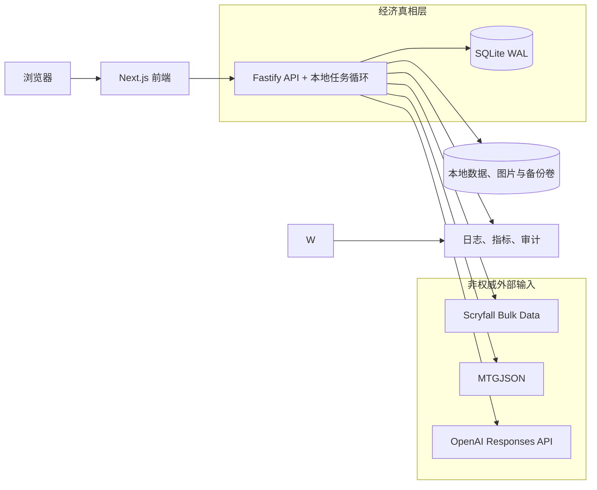
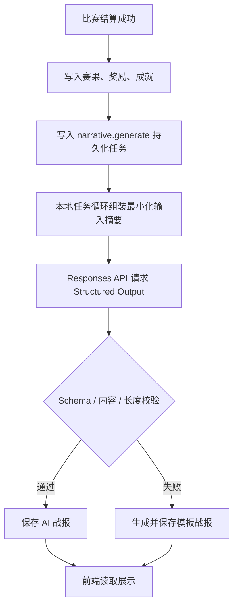

# 卡牌市场模拟器：技术栈与模块职责边界

## 1. 架构目标

本项目面向 5–10 名用户，可在不持续开机的单台 Linux 服务器上运行。首发以 Docker Compose 部署，优先采用本地数据与 SQLite，而非 PostgreSQL、Redis 或分布式队列。架构优先级为：

1. 货币、库存、开包、比赛和订单结算可审计且绝不由前端或 AI 决定。
2. Scryfall 卡池与 MTGJSON 价格同步可失败降级，不影响已有存档和交易。
3. AI 提升赛事叙事真实感，但始终是可替换、可限流、可降级的旁路能力。
4. 前后端可独立迭代，首发仍保持单仓库、单数据库和少量服务，避免过早拆分微服务。

## 2. 推荐技术栈

| 层级 | 推荐选型 | 职责与选型理由 |
| --- | --- | --- |
| 工程组织 | TypeScript + pnpm workspace | 前后端、共享类型、规则包和任务包使用同一语言；减少 DTO 与规则定义重复。首发不需要 Turborepo。 |
| 前端 | Next.js（React）+ TypeScript + Tailwind CSS + TanStack Query + Zustand | 适合响应式游戏界面；TanStack Query 管理服务端数据缓存，Zustand 只存 UI 临时状态。 |
| 图表与动画 | ECharts + Framer Motion | 展示参考价/游戏内价双曲线、指数和持仓；实现开包、比赛结果等轻量动画。 |
| 后端 API | Fastify + TypeScript + OpenAPI | 模块化路由、Schema 校验与插件机制足以覆盖小规模服务；比引入完整框架与多进程更轻。 |
| 规则引擎 | TypeScript 独立 package（纯函数） | 开包、报价、比赛、奖励、保证金规则可脱离 HTTP 与数据库单测、重放和版本化。 |
| 主数据库 | SQLite（WAL 模式）+ Drizzle ORM | 5–10 人、单实例足够；交易、库存和审计仍使用短事务。启用 WAL、外键、`busy_timeout` 与定期完整性检查。 |
| 缓存与队列 | 不引入 Redis；SQLite `jobs` 表 + 进程内调度器 | 任务数量很小。任务持久化在 SQLite，单一 Worker 按序执行同步、每日刷新和 AI 生成；断电后可恢复。 |
| ORM / 迁移 | Drizzle ORM + drizzle-kit | 更贴合 SQLite 与 SQL 事务；迁移文件随仓库版本管理。 |
| 异步 Worker | 同一 Node 进程中的受控后台任务循环 | API 写入 `jobs` 表，后台循环串行领取任务；避免 Redis/BullMQ 服务与额外内存占用。 |
| 本地数据与图片 | Docker 挂载卷：SQLite、数据快照、图片缓存、导出与备份 | 首次通过 Scryfall Bulk Data 导入所需卡池，按需下载本项目实际使用的卡图到本地；Caddy/Nginx 直接静态提供。 |
| 外部数据 | Scryfall Bulk Data + MTGJSON 下载文件 | Scryfall Bulk Data 负责卡牌与印刷版本资料及本地图片准备；MTGJSON 负责每日价格快照。两者均由后端任务低频访问。 |
| AI | OpenAI Responses API + Structured Outputs | 只生成可验证的比赛叙事 JSON；由 Worker 调用，API 不直接等待模型结果。Responses API 支持结构化输出与工具调用，但本项目不向模型开放经济工具。 |
| 认证 | JWT（短期 Access Token）+ HttpOnly Refresh Cookie + Argon2id | 保护账户与后台操作；密码不明文保存；刷新令牌可撤销。 |
| 可观测性 | Pino JSON 日志 + `/health` + SQLite 任务状态页 | 追踪结算、同步和 Agent 错误；监控快照新鲜度、任务失败、经济异常和 AI 成本。 |
| 测试 | Vitest + Fastify inject + Playwright | 规则单测、SQLite 临时文件集成测试与浏览器主流程验证。 |
| 部署 | Docker Compose（`app` + `caddy`）+ GitHub Actions | 一台服务器即可运行；两个持久化卷保存应用数据与 Caddy 证书；CI 执行检查、测试、镜像构建。 |

## 3. 服务拓扑与信任边界



浏览器只负责展示和发起意图；单个 Fastify 进程是唯一能够写入 SQLite 的服务。Scryfall、MTGJSON 与 AI 都是非权威外部输入：必须校验、记录来源并能失败降级。

## 4. 前端需求与职责边界

### 4.1 前端模块

| 模块 | 页面 / 组件 | 负责 | 不负责 |
| --- | --- | --- | --- |
| 认证与存档 | 登录、注册、账户设置 | 表单校验、会话续期、展示账户状态 | 发放初始资金、决定权限。 |
| 仪表盘 | 余额、净资产、每日工作资金、今日比赛、市场指数 | 聚合展示、领取按钮的幂等请求、跳转入口 | 自行计算余额或允许多次领取。 |
| 补充包与开包 | 商店、概率展示、开包动画、结果页 | 展示服务端开包结果和动画；防止重复点击 | 随机抽取卡牌、修改概率、计算价值。 |
| 市场 | 搜索、筛选、双价格曲线、NPC 报价、玩家订单簿 | 查询、展示数据时间、提交买卖意图 | 计算报价、决定订单匹配或资金冻结。 |
| 挂售确认 | SKU 核验、数量、价格、预计到手金额、保证金提示 | 强制二次确认；显示后端返回的结算预览 | 自行算保证金或绕过确认创建订单。 |
| 库存与收藏 | 持仓、成本、图鉴、卡组锁定状态 | 筛选、排序、选择构筑候选卡 | 修改库存、解除订单/比赛锁定。 |
| 卡组与比赛 | 卡组编辑、赛制验证提示、报名、战报、成就 | 编辑草稿、展示后端合法性结果与 AI/模板战报 | 判定赛果、发放奖励或修改成就。 |
| 管理后台 | 内容、市场参数、赛事、任务、日志 | 受权限保护的配置表单、变更预览 | 绕过审计修改生产数据。 |

### 4.2 前端状态规则

- TanStack Query 保存所有服务器真相：余额、库存、订单、价格、比赛、成就和配置。
- Zustand 仅保存筛选条件、开包动画状态、未提交的卡组草稿与界面偏好。
- 不能在浏览器保存或计算可结算的余额、卡价、开包结果、赛果、保证金或奖励。
- 每个写操作使用 idempotency key；成功后仅以服务器响应刷新缓存。

## 5. 后端需求与职责边界

### 5.1 后端业务模块

| 模块 | 核心职责 | 事务 / 一致性要求 |
| --- | --- | --- |
| AuthModule | 注册、登录、会话、角色、后台权限 | 密码 Argon2id 哈希；刷新令牌可撤销；管理动作写审计。 |
| UserModule | 用户档案、存档、初始资金、每日工作资金 | 按用户+自然日唯一约束和幂等键发放，不得重复记账。 |
| CardCatalogModule | Scryfall 卡牌、印刷版本、SKU、系列和图像链接 | 只允许同步任务更新资料；手工例外需记录来源与操作者。 |
| PriceSnapshotModule | MTGJSON 导入、价格映射、外部快照、过期状态 | 外部快照只追加；校验失败不覆盖旧数据；无价 SKU 暂停新增交易。 |
| MarketModule | 参考价、游戏内系数、NPC 买卖价、指数、风控 | 报价计算使用已版本化纯函数；所有报价附带快照和规则版本。 |
| InventoryModule | 库存、平均成本、市值、锁定数量 | 不允许负库存；订单与比赛锁定均扣减可用数量；所有写入保持短事务。 |
| PackModule | 补充包、卡池、概率、保底与开包记录 | 服务端 CSPRNG；开包、扣款、库存变动同一事务；重复请求不可重复开奖。 |
| OrderModule | NPC 买卖、P2P 挂单、撮合、发货、保证金、取消 | 余额、库存、订单、保证金和流水在同一事务内更新；使用行锁防超卖。 |
| DeckModule | 卡组草稿、赛制合法性、库存锁定 | 报名时锁定卡牌；订单与比赛竞争同一可用库存。 |
| TournamentModule | 每日赛事、NPC 对手、规则结算、奖励、成就触发 | 赛果由规则+随机种子确定；结算与奖励流水幂等、可重放。 |
| NarrativeModule | Agent 请求、结构验证、模板降级、生成记录 | 无权访问经济写接口；只接收已结算的摘要；失败不回滚比赛。 |
| AdminModule | 内容、参数、赛事、任务配置与审计查询 | 参数变更须版本化、可回滚；禁止无日志直接修数。 |
| AuditModule | 货币、库存、订单、奖励、后台与 Agent 事件日志 | 仅追加；可按用户、请求、实体、规则版本追踪。 |

### 5.2 规则引擎 package

规则包应放在 `packages/rules`，不依赖 Fastify、Drizzle、HTTP 或 AI SDK，只接收明确输入、输出确定结果。

- `pack-rules`：按概率表和随机种子生成卡牌结果。
- `market-rules`：由外部参考价、价差、系数和限额计算 NPC 报价。
- `order-rules`：验证限价、保证金、取消条件与费用。
- `deck-rules`：验证赛制、卡牌版本和数量。
- `tournament-rules`：计算卡组强度、生成对手参数、使用随机种子结算赛果与奖励。
- `achievement-rules`：依据已结算事件判断解锁条件。

## 6. AI 需求与职责边界

### 6.1 Agent 工作流



### 6.2 Agent 输入、输出与禁止项

| 项目 | 定义 |
| --- | --- |
| 允许输入 | 已结算赛果、赛制、卡组特征标签、NPC 人设、关键事件标签、市场氛围、玩家语言偏好。 |
| 禁止输入 | OpenAI API 密钥、密码、联系方式、完整聊天内容、未结算比赛数据、可修改经济系统的内部指令。 |
| 允许输出 | `headline`、`summary`、`highlights[]`、`npc_quote`、`tone`；全部受 JSON Schema、长度、敏感内容和语言校验。 |
| 禁止输出用途 | 不能作为赛果、奖励、卡牌掉率、市场价格、订单资格、保证金扣款或管理员指令的依据。 |
| 工具权限 | 无函数工具、无数据库写工具、无网络搜索工具、无市场/订单/开奖工具。 |
| 失败处理 | 超时、限流、非 JSON、Schema 失败或内容过滤时，记录失败并使用模板；不重试超过配置上限。 |

### 6.3 调用策略

- 使用本地异步任务循环调用，不在比赛结算 HTTP 请求中同步等待。
- 以一场比赛一条任务为单位，`tournamentId + narrativeVersion` 设置唯一约束，避免重复生成。
- 首发选择成本和质量平衡的模型；模型名、推理强度、最大输出、超时和每日预算均由服务器配置，不能由前端传入。OpenAI 当前文档建议 Responses API 用于推理、工具调用和多轮工作流，且支持结构化输出能力；本项目保持为无工具的受限文本生成即可。[模型使用指南](https://developers.openai.com/api/docs/guides/latest-model) [模型能力说明](https://developers.openai.com/api/docs/models)
- 为每个用户、每个自然日和全局设置调用次数与令牌预算；缓存相同赛果的输出；统计成功率、延迟、令牌和成本。

## 7. 异步任务与数据同步

| 队列任务 | 触发 | 结果 | 失败策略 |
| --- | --- | --- | --- |
| `catalog.sync` | 首次部署、手动或低频定期触发 | 通过 Scryfall Bulk Data 导入卡牌与印刷版本，并只下载项目使用卡图 | 保留上版目录和本地图片，记录差异与失败原因。 |
| `prices.sync` | 每日 | 下载 MTGJSON、校验、写外部快照、更新市场报价 | 保留最近成功快照；市场标记数据过期并告警。 |
| `daily.rollover` | 每个自然日 | 开放工作资金、刷新每日比赛、过期旧任务 | 使用日期幂等键，重试不重复发钱或重置赛事。 |
| `tournament.settle` | 玩家报名后 | 锁定卡牌、结算赛果、奖励与成就 | 使用比赛唯一键与事务，失败可安全重试。 |
| `narrative.generate` | 比赛结算后 | AI 或模板战报 | 失败降级，不影响赛果。 |
| `order.expire` | 定时 | 过期挂单、处理待发货时限与保证金规则 | 每订单加锁，全部变动写审计。 |

## 8. 数据所有权与禁止跨界

| 数据 / 决策 | 唯一权威 | 只读消费者 | 严禁写入者 |
| --- | --- | --- | --- |
| 余额、流水、保证金 | SQLite + Order/User 服务 | 前端、报表、Agent 摘要 | 前端、AI、同步任务原始数据。 |
| 库存、锁定数量、成本 | SQLite + Inventory 服务 | 前端、市场、比赛 | 前端、AI、Scryfall/MTGJSON。 |
| 开包与赛果 | 规则引擎 + 服务端随机种子 | 前端、Agent、成就模块 | 前端、AI。 |
| 卡牌目录 | Scryfall 同步结果 + 管理例外 | 前端、补充包、比赛 | 浏览器直接写入。 |
| 外部参考价 | MTGJSON 快照 | 市场、估值、报表 | AI、前端、市场事件。 |
| 游戏内报价 | MarketModule + 规则版本 | 前端、NPC、风控 | AI、前端。 |
| 比赛叙事 | NarrativeModule 的 AI/模板记录 | 前端、报表 | 经济/比赛结算服务。 |

## 9. 首发目录建议

```text
apps/
  web/                 # Next.js 前端
  api/                 # Fastify API + 本地任务循环
packages/
  contracts/           # DTO、OpenAPI 生成类型、事件定义
  rules/               # 纯规则引擎与版本化规则
  database/            # Drizzle schema、迁移、事务工具
  ui/                  # 共享前端组件
infra/
  docker-compose.yml   # app、caddy、持久化卷
  caddy/
```

## 10. 首发不采用的方案

- 不采用浏览器直接请求 Scryfall、MTGJSON 或 OpenAI：会绕过本地数据、限流和来源审计。
- 不让 AI 通过 function calling 直接操作订单、货币、库存、开奖或比赛结果。
- 不在首发使用 PostgreSQL、Redis、Kubernetes、事件溯源平台或多数据库微服务；SQLite WAL、持久化任务表和模块化单体足够。
- 不把 Cardmarket 实时网页抓取当作价格源；只使用 MTGJSON 的可追溯每日快照。

## 11. 停机、离线与升级边界

- 停机期间不要求任务运行。应用启动后，`daily.rollover`、`prices.sync`、订单到期等任务根据最后成功时间补跑；任何补跑都使用日期/实体唯一键，不能重复发放工作资金、重复刷新比赛或重复扣保证金。
- 运行时读卡牌目录、价格快照和本地图片缓存，不因玩家浏览页面而请求 Scryfall。首次导入和手动扩充卡池才使用 Bulk Data；应只导入本游戏启用的系列和只缓存实际展示的图片，控制磁盘占用。
- SQLite 文件、`data/` 快照、`images/` 缓存和 `backups/` 必须位于宿主机持久化卷。每日关闭前或定时生成 SQLite 一致性备份；至少保留最近 7 份，并提供管理员下载和恢复校验。
- 触发升级到 PostgreSQL + Redis 的信号：需要多台应用实例、同时在线/高频写入明显导致 SQLite 锁等待、需要实时推送规模化订单簿，或任务吞吐持续超过单进程处理能力。在此之前不增加运维复杂度。
