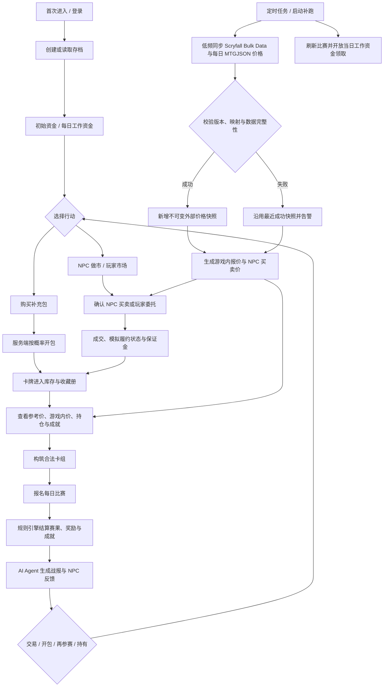
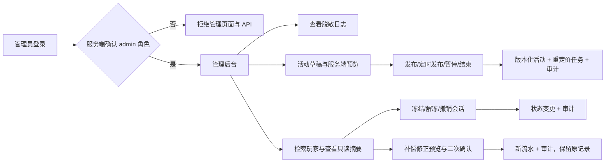
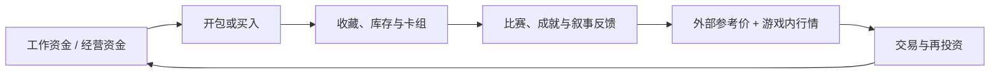
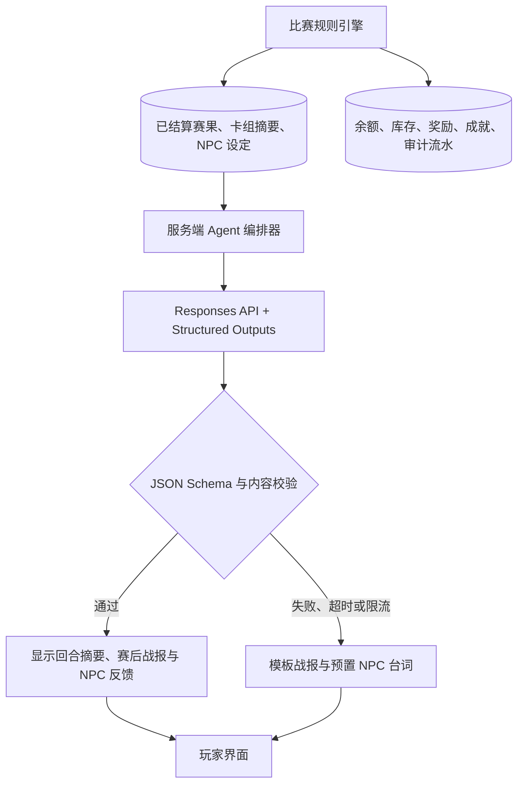
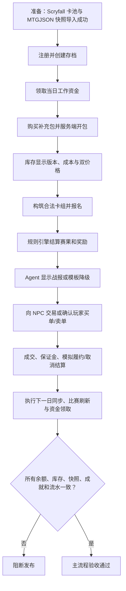

# 卡牌市场模拟器：主流程、体验闭环与核心验收

> 卡池与规则资料来自 Scryfall；外部价格来自 MTGJSON 的每日快照，Cardmarket EUR Trend Price 是欧服参考锚点。AI Agent 只生成叙事，所有经济与比赛结算都由服务端规则引擎完成。

## 1. 产品主流程

管理员运营流程独立于玩家经济结算，但同样受角色、版本、幂等与审计门禁约束：

## 2. 核心体验闭环判断

闭环完整。卡牌同时具有收藏价值、对战使用价值和交易价值；比赛与成就使持仓不只是待售资产，而每日工作资金确保玩家即使经营失误仍能重新参与循环。市场交易仍决定资金效率和高价值卡的需求。

| 体验环节 | 必须功能 | 结论 |
| --- | --- | --- |
| 持续进入 | A2、A3、F1、F2 | 完整：账户、存档、初始资金、每日工作资金。 |
| 获得与认识卡牌 | B1、B3、C1、C2、E1–E3 | 完整：Scryfall 卡池、开包与可追溯参考价。 |
| 使用卡牌 | G1–G3 | 完整：库存构筑、每日比赛、确定性赛果和奖励。 |
| 成就感 | G4–G7 | 完整：战报、NPC 反馈、徽章、收藏里程碑与 Agent 降级。 |
| 交易循环 | D1、D2、D9、D11、D13 | 完整：NPC 做市提供最低流动性，双边委托与 P2P 撮合提供竞争，保证金约束模拟履约取消。 |
| 可靠性 | I1–I5、I7–I11、I13 | 完整：数据、安全、一致性、结算、同步、部署和 AI 文本均有可控边界。 |
| 可运营性 | H1、H5、H6、H8 | 完整：管理员登录后可查看日志、发布活动和安全管理玩家，且每个操作均受权限、版本和审计约束。 |

## 3. 必须遵守的业务标准

### 3.1 卡池与定价

- 卡池的印刷版本、规则文本和图像来自 Scryfall Bulk Data；项目所需图片保存到本地缓存，价格不以 Scryfall 数据结算。
- 仅导入 MTGJSON 中具有 Cardmarket EUR 价格且能准确映射到 Scryfall 印刷版本的单卡作为可交易 SKU。
- 无外部价、价格为零、映射不完整或同步异常的 SKU 暂停新增交易；已有持仓按最近一次成功快照估值。
- 后台兜底价只用于测试卡、原创卡或运营明确标注的例外，不能伪装成 Cardmarket 参考价。
- 同名不同印刷、普通/闪卡与特殊工艺均是独立 SKU。

### 3.2 交易与履约

- NPC 买入和卖出为必须功能：NPC 以受价差约束的报价持续提供最低流动性。
- 玩家可以买入或卖出限价委托；创建时买单预占资金，卖单锁定库存并预占保证金；撮合支持部分成交并遵循版本化的价格—时间优先规则。
- 玩家挂售前必须确认版本、数量、价格、预计到手金额和模拟履约责任；界面必须说明这不是实体卡牌物流或真实交易。
- 撮合后买方资金和卖方库存保持在待履约状态，卖单对应保证金转为履约冻结；卖家确认履约时完成资金/库存转移并返还保证金，取消履约时扣除保证金、退回买方资金、恢复卖方库存并保留审计记录。
- 玩家订单的成交价可与 NPC 报价不同，但需受限价、冷却、反刷与异常检测约束；资产估值不得使用玩家自挂高价。

### 3.3 每日工作资金与比赛

- 以服务器配置的现实自然日为周期，每位玩家只能领取一次固定工作资金；记录日期、规则版本和幂等键，防止重复发放。
- 参赛卡组从库存锁定卡牌，不能与未完成订单重复占用。
- 胜负、奖励、随机种子与成就解锁均由服务端规则引擎结算；抽卡概率不随价格变化。

### 3.4 管理后台与运营

- 管理员登录后进入独立后台；普通玩家即使直接访问管理 URL，也不能读取或写入任何管理 API。前端导航不是授权边界。
- 活动按草稿、预览、发布/定时发布、暂停和结束流转。服务端校验 UTC 时间、作用范围、冲突、影响上限和版本；已发布活动不可原地篡改，成功后以活动版本唯一键触发市场重定价并写审计。
- 玩家管理以最小权限查询为原则。冻结/解冻、会话撤销和余额/库存补偿修正必须使用独立命令、幂等键、必填原因（适用时）和二次确认；补偿新增流水，不直接覆盖最终值或删除原记录。
- 审计、任务、异常交易和 Agent 日志只读、分页、脱敏，可按操作者、用户、实体、动作、结果、请求 ID 和任务追踪；不得显示密码哈希、令牌、密钥或敏感 Provider 原文。

## 4. AI Agent 实现边界

Agent 输入仅包含已结算、可公开的摘要：赛制、卡组特征、双方胜负、关键回合标签、NPC 人设、市场事件与语言。输出固定为 `headline`、`summary`、`highlights[]`、`npc_quote`、`tone`，且长度和枚举值受 JSON Schema 限制。

Agent 不具备余额、库存、开奖、比赛结算、订单、保证金、数据库写入或外部浏览工具。它不能改变胜负与奖励，也不保存 API 密钥；密钥只存在服务器环境变量。服务必须设置每用户/每日调用配额、全局预算、超时与重试上限，并记录模型、输入摘要哈希、输出、失败原因和成本。Responses API 支持结构化输出与函数调用；但此处应仅使用受限结构化文本输出，不授予经济系统工具权限。[OpenAI 模型与 API 能力说明](https://developers.openai.com/api/docs/models/gpt-5.6-terra) [OpenAI 模型使用指南](https://developers.openai.com/api/docs/guides/latest-model)

## 5. 核心验收测试流程

复合验收可使用 `A/B/C` 后缀分阶段保存证据；只有全部子项通过后，父编号才视为通过。发布门禁为 AT-01 至 AT-13。

| 编号 | 前置条件 | 操作 | 预期结果 |
| --- | --- | --- | --- |
| AT-01 | 新用户 | 创建存档并重复提交 | 初始资金只发放一次；账户与存档唯一。 |
| AT-02 | 新自然日已刷新 | 领取工作资金并重复请求 | 当日只领取一次；金额、日期、幂等键和流水正确。 |
| AT-03A | Scryfall 卡池导入成功 | 开包并查看库存 | 产出对应有效印刷 SKU；数量与成本正确；重放请求不重复扣款或开奖。 |
| AT-03B | AT-03A 通过且 MTGJSON 快照、游戏报价已生成 | 查看开包结果与库存估值 | 参考价、游戏内价、数据状态与盈亏正确；无有效价格时明确显示不可交易原因。 |
| AT-04 | 可交易 SKU | NPC 买入、卖出 | NPC 始终给出受价差约束的有效报价；余额、库存、手续费和流水原子更新。 |
| AT-05A | 两个玩家、同一可交易 SKU | 分别创建买单和卖单，并重复确认/撤单 | 预览准确展示方向、版本、数量、限价、费用、预计金额和保证金；买方资金、卖方库存及保证金正确预占，重放不重复冻结，撤单释放未成交预占。 |
| AT-05B | 存在可匹配及部分匹配的买卖委托 | 触发撮合并模拟并发领取 | 撮合遵循价格—时间优先、成交价和部分成交规则；买方资金、卖方库存/保证金转为待履约持有，剩余委托与费用预览原子更新，不超卖、超扣或重复成交。 |
| AT-06 | 已成交卖单 | 正常模拟履约、取消履约分别测试 | 正常流程返还保证金；取消流程扣除保证金、恢复订单/库存/买方资金的规则正确且均可审计。 |
| AT-07 | 已持有合法卡组 | 构筑、报名、重复提交比赛 | 非法或已锁定卡牌被拒绝；赛果和奖励只结算一次，随机种子与规则版本可追溯。 |
| AT-08 | 已结算比赛 | 调用 Agent；分别模拟 schema 错误、超时和限流 | 成功时显示合规 JSON 战报；失败时显示模板；任何路径均不改变赛果、余额、库存或成就。 |
| AT-09 | 已有快照 | 导入无价/零价/映射失败 SKU | 新增交易被暂停；已有库存使用最近成功快照估值；兜底价不标为 Cardmarket 价。 |
| AT-10A | 已有价格快照 | 运行成功与失败的每日价格同步 | 成功新增快照并更新曲线；失败不删除旧价且告警。 |
| AT-10B | 已配置服务器时区、工作资金和比赛模板 | 执行跨日、停机补跑与重复日切 | 资金资格和每日比赛按自然日正确刷新；重复或补跑不重复发钱、重置或创建赛事。 |
| AT-11 | 设定达到配置上限的基础市场事件或异常订单 | 触发事件、提交越界订单 | 游戏内系数不突破上限；事件不改外部快照；风控拦截异常订单。 |
| AT-12 | 服务重启前存在订单、比赛和 Agent 记录 | 重启并登录 | 快照、锁定库存、订单保证金、赛果、成就、流水和 Agent 记录均恢复。 |
| AT-13 | 已有一个管理员、普通玩家、可发布活动和可管理玩家 | 分别验证管理登录/越权；管理员筛选日志，预览并发布/暂停活动，冻结/解冻玩家、撤销会话并执行一笔余额或库存补偿修正；重复提交关键命令 | 普通玩家页面与 API 均被拒绝；活动版本、UTC 区间、影响上限、重定价任务和审计可追溯且不改外部快照；用户操作不暴露敏感字段、不直接覆盖资产，补偿只发生一次并生成新流水；日志只读、脱敏且能按请求/实体串起全部操作。 |

## 6. MVP 通过定义

MVP 必须同时满足：

1. 玩家能完成“领取工作资金 → 获得卡牌 → 构筑参赛 → 获得赛果/成就 → 交易 → 再投资”的完整循环。
2. NPC 做市商确保单人和低在线场景下仍能买卖；玩家双边委托市场与模拟履约保证金机制正常运作。
3. 每一张可交易卡牌、价格、赛事奖励和成就都能追溯到来源或规则版本。
4. Agent 失败只影响叙事展示，不影响任何经济或赛果结算。
5. 每日同步、每日工作资金和每日比赛刷新在重试、失败和服务器重启后仍保持幂等与一致。
6. 管理员能在受保护后台查看脱敏日志、发布/停用活动并通过补偿命令管理玩家数据；普通玩家不能访问，所有变更可追溯且不能直接改写经济历史。
