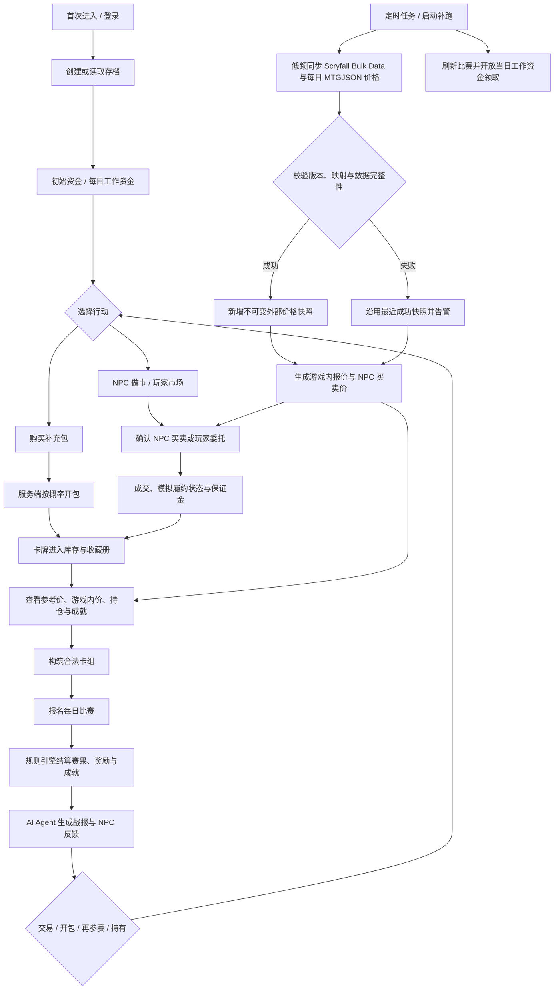
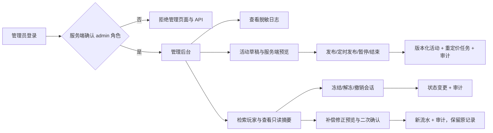
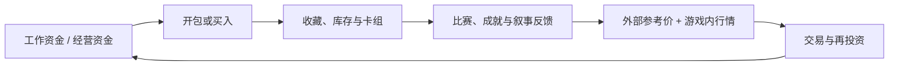
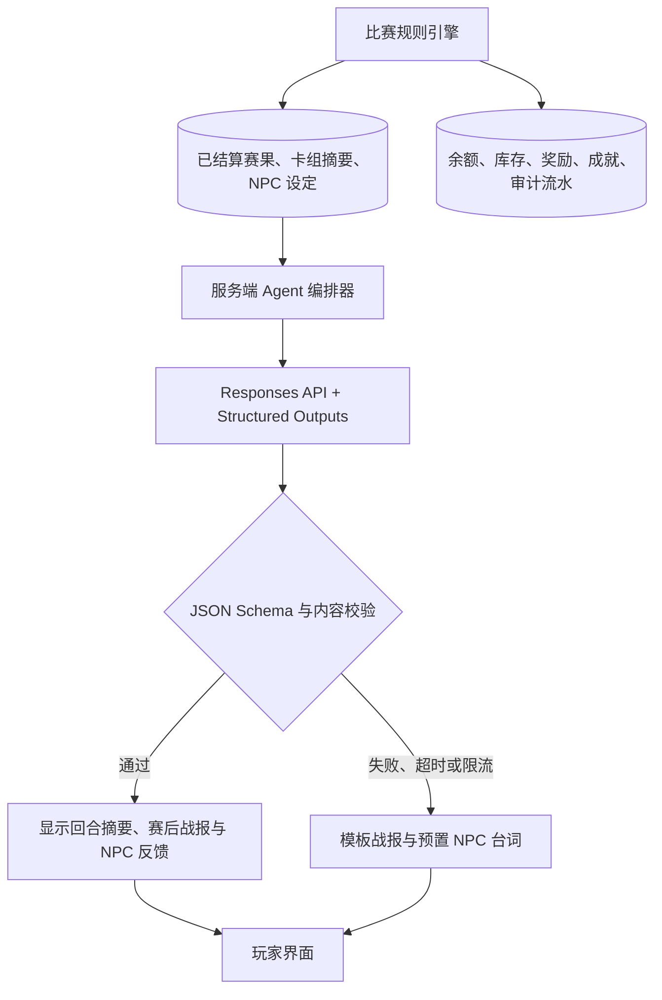
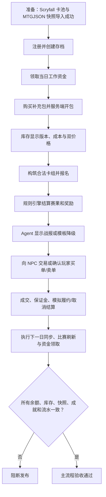

# 卡牌市场模拟器：主流程、体验闭环与核心验收

> 卡池与规则资料来自 Scryfall；外部价格来自 MTGJSON 的每日快照，Cardmarket EUR Trend Price 是欧服参考锚点。AI Agent 只生成叙事，所有经济与比赛结算都由服务端规则引擎完成。

## 1. 产品主流程

```mermaid
flowchart TD
    A[首次进入 / 登录] --> B[创建或读取存档]
    B --> C[初始资金 / 每日工作资金]
    C --> D{选择行动}
    D --> E[购买补充包]
    D --> F[NPC 做市 / 玩家市场]
    E --> G[服务端按概率开包]
    G --> H[卡牌进入库存与收藏册]
    F --> I[确认 NPC 买卖或玩家委托]
    I --> J[成交、模拟履约状态与保证金]
    J --> H
    H --> K[查看参考价、游戏内价、持仓与成就]
    K --> L[构筑合法卡组]
    L --> M[报名每日比赛]
    M --> N[规则引擎结算赛果、奖励与成就]
    N --> O[AI Agent 生成战报与 NPC 反馈]
    O --> P{交易 / 开包 / 再参赛 / 持有}
    P --> D

    Q[定时任务 / 启动补跑] --> R[低频同步 Scryfall Bulk Data 与每日 MTGJSON 价格]
    R --> S{校验版本、映射与数据完整性}
    S -- 成功 --> T[新增不可变外部价格快照]
    S -- 失败 --> U[沿用最近成功快照并告警]
    T --> V[生成游戏内报价与 NPC 买卖价]
    U --> V
    V --> K
    V --> I
    Q --> W[刷新比赛并开放当日工作资金领取]
```

管理员运营流程独立于玩家经济结算，但同样受角色、版本、幂等与审计门禁约束：

```mermaid
flowchart LR
    A[管理员登录] --> B{服务端确认 admin 角色}
    B -- 否 --> X[拒绝管理页面与 API]
    B -- 是 --> C[管理后台]
    C --> D[查看脱敏日志]
    C --> E[活动草稿与服务端预览]
    E --> F[发布/定时发布/暂停/结束]
    F --> G[版本化活动 + 重定价任务 + 审计]
    C --> H[检索玩家与查看只读摘要]
    H --> I[冻结/解冻/撤销会话]
    H --> J[补偿修正预览与二次确认]
    I --> K[状态变更 + 审计]
    J --> L[新流水 + 审计，保留原记录]
```

## 2. 核心体验闭环判断

```mermaid
flowchart LR
    A[工作资金 / 经营资金] --> B[开包或买入]
    B --> C[收藏、库存与卡组]
    C --> D[比赛、成就与叙事反馈]
    D --> E[外部参考价 + 游戏内行情]
    E --> F[交易与再投资]
    F --> A
```

闭环完整。卡牌同时具有收藏价值、对战使用价值和交易价值；比赛与成就使持仓不只是待售资产，而每日工作资金确保玩家即使经营失误仍能重新参与循环。市场交易仍决定资金效率和高价值卡的需求。

| 体验环节 | 必须功能 | 结论 |
| --- | --- | --- |
| 持续进入 | A2、A3、F1、F2 | 完整：账户、存档、初始资金、每日工作资金。 |
| 获得与认识卡牌 | B1、B3、C1、C2、E1–E3 | 完整：Scryfall 卡池、开包与可追溯参考价。 |
| 使用卡牌 | G1–G3 | 完整：库存构筑、每日比赛、确定性赛果和奖励。 |
| 成就感 | G4–G7 | 完整：战报、NPC 反馈、徽章、收藏里程碑与 Agent 降级。 |
| 交易循环 | D1、D2、D9、D11、D13 | 完整：NPC 做市提供最低流动性，双边委托与 P2P 撮合提供竞争，保证金约束模拟履约取消。 |
| 可靠性 | I1–I5、I7–I11、I13 | 完整：数据、安全、一致性、结算、同步、部署和 AI 文本均有可控边界。 |
| 可运营性 | H1、H5、H6、H8 | 完整：管理员登录后可查看日志、发布活动和安全管理玩家，且每个操作均受权限、版本和审计约束。 |

## 3. 必须遵守的业务标准

### 3.1 卡池与定价

- 卡池的印刷版本、规则文本和图像来自 Scryfall Bulk Data；项目所需图片保存到本地缓存，价格不以 Scryfall 数据结算。
- 仅导入 MTGJSON 中具有 Cardmarket EUR 价格且能准确映射到 Scryfall 印刷版本的单卡作为可交易 SKU。
- 无外部价、价格为零、映射不完整或同步异常的 SKU 暂停新增交易；已有持仓按最近一次成功快照估值。
- 后台兜底价只用于测试卡、原创卡或运营明确标注的例外，不能伪装成 Cardmarket 参考价。
- 同名不同印刷、普通/闪卡与特殊工艺均是独立 SKU。

### 3.2 交易与履约

- NPC 买入和卖出为必须功能：NPC 以受价差约束的报价持续提供最低流动性。
- 玩家可以买入或卖出限价委托；创建时买单预占资金，卖单锁定库存并预占保证金；撮合支持部分成交并遵循版本化的价格—时间优先规则。
- 玩家挂售前必须确认版本、数量、价格、预计到手金额和模拟履约责任；界面必须说明这不是实体卡牌物流或真实交易。
- 撮合后买方资金和卖方库存保持在待履约状态，卖单对应保证金转为履约冻结；卖家确认履约时完成资金/库存转移并返还保证金，取消履约时扣除保证金、退回买方资金、恢复卖方库存并保留审计记录。
- 玩家订单的成交价可与 NPC 报价不同，但需受限价、冷却、反刷与异常检测约束；资产估值不得使用玩家自挂高价。

### 3.3 每日工作资金与比赛

- 以服务器配置的现实自然日为周期，每位玩家只能领取一次固定工作资金；记录日期、规则版本和幂等键，防止重复发放。
- 参赛卡组从库存锁定卡牌，不能与未完成订单重复占用。
- 胜负、奖励、随机种子与成就解锁均由服务端规则引擎结算；抽卡概率不随价格变化。

### 3.4 管理后台与运营

- 管理员登录后进入独立后台；普通玩家即使直接访问管理 URL，也不能读取或写入任何管理 API。前端导航不是授权边界。
- 活动按草稿、预览、发布/定时发布、暂停和结束流转。服务端校验 UTC 时间、作用范围、冲突、影响上限和版本；已发布活动不可原地篡改，成功后以活动版本唯一键触发市场重定价并写审计。
- 玩家管理以最小权限查询为原则。冻结/解冻、会话撤销和余额/库存补偿修正必须使用独立命令、幂等键、必填原因（适用时）和二次确认；补偿新增流水，不直接覆盖最终值或删除原记录。
- 审计、任务、异常交易和 Agent 日志只读、分页、脱敏，可按操作者、用户、实体、动作、结果、请求 ID 和任务追踪；不得显示密码哈希、令牌、密钥或敏感 Provider 原文。

## 4. AI Agent 实现边界

```mermaid
flowchart TB
    A[比赛规则引擎] --> B[(已结算赛果、卡组摘要、NPC 设定)]
    B --> C[服务端 Agent 编排器]
    C --> D[Responses API + Structured Outputs]
    D --> E{JSON Schema 与内容校验}
    E -- 通过 --> F[显示回合摘要、赛后战报与 NPC 反馈]
    E -- 失败、超时或限流 --> G[模板战报与预置 NPC 台词]
    F --> H[玩家界面]
    G --> H
    A --> I[(余额、库存、奖励、成就、审计流水)]
```

Agent 输入仅包含已结算、可公开的摘要：赛制、卡组特征、双方胜负、关键回合标签、NPC 人设、市场事件与语言。输出固定为 `headline`、`summary`、`highlights[]`、`npc_quote`、`tone`，且长度和枚举值受 JSON Schema 限制。

Agent 不具备余额、库存、开奖、比赛结算、订单、保证金、数据库写入或外部浏览工具。它不能改变胜负与奖励，也不保存 API 密钥；密钥只存在服务器环境变量。服务必须设置每用户/每日调用配额、全局预算、超时与重试上限，并记录模型、输入摘要哈希、输出、失败原因和成本。Responses API 支持结构化输出与函数调用；但此处应仅使用受限结构化文本输出，不授予经济系统工具权限。[OpenAI 模型与 API 能力说明](https://developers.openai.com/api/docs/models/gpt-5.6-terra) [OpenAI 模型使用指南](https://developers.openai.com/api/docs/guides/latest-model)

## 5. 核心验收测试流程

```mermaid
flowchart TD
    A[准备：Scryfall 卡池与 MTGJSON 快照导入成功] --> B[注册并创建存档]
    B --> C[领取当日工作资金]
    C --> D[购买补充包并服务端开包]
    D --> E[库存显示版本、成本与双价格]
    E --> F[构筑合法卡组并报名]
    F --> G[规则引擎结算赛果和奖励]
    G --> H[Agent 显示战报或模板降级]
    H --> I[向 NPC 交易或确认玩家买单/卖单]
    I --> J[成交、保证金、模拟履约/取消结算]
    J --> K[执行下一日同步、比赛刷新与资金领取]
    K --> L{所有余额、库存、快照、成就和流水一致？}
    L -- 否 --> X[阻断发布]
    L -- 是 --> Y[主流程验收通过]
```

复合验收可使用 `A/B/C` 后缀分阶段保存证据；只有全部子项通过后，父编号才视为通过。发布门禁为 AT-01 至 AT-13。

| 编号 | 前置条件 | 操作 | 预期结果 |
| --- | --- | --- | --- |
| AT-01 | 新用户 | 创建存档并重复提交 | 初始资金只发放一次；账户与存档唯一。 |
| AT-02 | 新自然日已刷新 | 领取工作资金并重复请求 | 当日只领取一次；金额、日期、幂等键和流水正确。 |
| AT-03A | Scryfall 卡池导入成功 | 开包并查看库存 | 产出对应有效印刷 SKU；数量与成本正确；重放请求不重复扣款或开奖。 |
| AT-03B | AT-03A 通过且 MTGJSON 快照、游戏报价已生成 | 查看开包结果与库存估值 | 参考价、游戏内价、数据状态与盈亏正确；无有效价格时明确显示不可交易原因。 |
| AT-04 | 可交易 SKU | NPC 买入、卖出 | NPC 始终给出受价差约束的有效报价；余额、库存、手续费和流水原子更新。 |
| AT-05A | 两个玩家、同一可交易 SKU | 分别创建买单和卖单，并重复确认/撤单 | 预览准确展示方向、版本、数量、限价、费用、预计金额和保证金；买方资金、卖方库存及保证金正确预占，重放不重复冻结，撤单释放未成交预占。 |
| AT-05B | 存在可匹配及部分匹配的买卖委托 | 触发撮合并模拟并发领取 | 撮合遵循价格—时间优先、成交价和部分成交规则；买方资金、卖方库存/保证金转为待履约持有，剩余委托与费用预览原子更新，不超卖、超扣或重复成交。 |
| AT-06 | 已成交卖单 | 正常模拟履约、取消履约分别测试 | 正常流程返还保证金；取消流程扣除保证金、恢复订单/库存/买方资金的规则正确且均可审计。 |
| AT-07 | 已持有合法卡组 | 构筑、报名、重复提交比赛 | 非法或已锁定卡牌被拒绝；赛果和奖励只结算一次，随机种子与规则版本可追溯。 |
| AT-08 | 已结算比赛 | 调用 Agent；分别模拟 schema 错误、超时和限流 | 成功时显示合规 JSON 战报；失败时显示模板；任何路径均不改变赛果、余额、库存或成就。 |
| AT-09 | 已有快照 | 导入无价/零价/映射失败 SKU | 新增交易被暂停；已有库存使用最近成功快照估值；兜底价不标为 Cardmarket 价。 |
| AT-10A | 已有价格快照 | 运行成功与失败的每日价格同步；checksum 不匹配时管理员确认覆写 | 正常成功新增已验证快照并更新曲线；失败不删除旧价且告警；覆写仅在稳定 checksum 失败后经管理员审计确认，成功快照永久标记为已绕过验证。 |
| AT-10B | 已配置服务器时区、工作资金和比赛模板 | 执行跨日、停机补跑与重复日切 | 资金资格和每日比赛按自然日正确刷新；重复或补跑不重复发钱、重置或创建赛事。 |
| AT-11 | 设定达到配置上限的基础市场事件或异常订单 | 触发事件、提交越界订单 | 游戏内系数不突破上限；事件不改外部快照；风控拦截异常订单。 |
| AT-12 | 服务重启前存在订单、比赛和 Agent 记录 | 重启并登录 | 快照、锁定库存、订单保证金、赛果、成就、流水和 Agent 记录均恢复。 |
| AT-13 | 已有一个管理员、普通玩家、可发布活动和可管理玩家 | 分别验证管理登录/越权；管理员筛选日志，预览并发布/暂停活动，冻结/解冻玩家、撤销会话并执行一笔余额或库存补偿修正；重复提交关键命令 | 普通玩家页面与 API 均被拒绝；活动版本、UTC 区间、影响上限、重定价任务和审计可追溯且不改外部快照；用户操作不暴露敏感字段、不直接覆盖资产，补偿只发生一次并生成新流水；日志只读、脱敏且能按请求/实体串起全部操作。 |

### 已执行分阶段验收

- 2026-07-26，I12B：`apps/api/src/modules/packs/api/pack-routes.test.ts` 使用临时 SQLite 与固定目录/补充包夹具验证 AT-03A 的服务端部分：有效 SKU 入库与成本、同键并发重放不重复扣款或发卡，以及余额不足、版本过期、无效/下架包和库存故障时无半完成经济记录。AT-03A 的浏览器操作部分留待 I12F；AT-03B 仍依赖 I17B/F 价格能力。
- 2026-07-26，I12F：`apps/web/tests/e2e/packs.spec.ts` 在桌面及 390 × 844 窄屏使用本地 API 路由桩验证 AT-03A 的浏览器部分：购买预览只显示服务端成本/规则版本，确认期间重复点击不会重复请求，结果动画可跳过，余额不足与版本过期不伪造产出，刷新历史只读取已结算记录。人工操作记录见 `apps/web/tests/manual/I12F.md`；AT-03B 仍依赖 I17B/F 价格能力。
- 2026-07-26，I13B：`apps/api/src/modules/pricing/application/price-sync-service.test.ts` 使用临时 SQLite 与版本固定 MTGJSON 夹具验证 AT-09、AT-10A 的快照写入部分：normal/foil/etched 的 Cardmarket EUR 最新日期价格按整数欧分追加，零价/非 EUR/缺失价及缺失或重复映射 SKU 停止新增交易；checksum 或事务中断只新增失败运行，最近成功快照和 state 指针保持不变。游戏内报价与浏览器展示仍待 I14–I17。
- 2026-07-26，I13F：`apps/web/tests/e2e/price-sync.spec.ts` 在桌面及 390 × 844 窄屏验证管理员可查看失败快照与校验/映射/任务摘要，稳定 `CHECKSUM_MISMATCH` 会弹出覆写风险确认并只投递带覆写标记的任务；玩家只能查看公开来源、更新时间、无价和过期状态，普通玩家直达管理 URL 及请求管理 API 均被拒绝。人工记录见 `apps/web/tests/manual/I13F.md`；该阶段只完成 AT-09、AT-10A 的状态展示，不提前生成游戏内报价。
- 2026-07-27，I14F：`apps/web/tests/e2e/market.spec.ts` 在桌面及 390 × 844 窄屏以本地 API 路由夹具验证市场页只显示服务端双价格、市场指数、来源/更新时间与受界活动原因；无价 SKU 不能进入交易，过期快照不会被称为实时价格，报价失败显示重试而不伪造可交易数据。人工操作记录见 `apps/web/tests/manual/I14F.md`。本期只完成报价展示，AT-04 的 NPC 实际成交仍待 I15B/F。
- 2026-07-27，I15B：`apps/api/src/modules/orders/api/npc-trade-routes.test.ts` 使用临时 SQLite 验证 NPC 买入预览和确认：报价快照/规则版本/限价由服务端校验，账本、库存、成交、事实事件与重定价 outbox 原子写入；同键并发重放不重复成交，同键异参、余额不足、交易额度、报价过期及库存故障均安全失败。AT-04 的 NPC 买入服务端部分通过；玩家页面待 I15F，NPC 卖出待 I16B/F。
- 2026-07-27，I16B：`apps/api/src/modules/orders/api/npc-trade-routes.test.ts` 使用临时 SQLite 验证 NPC 卖出预览、指定数量与 `quantity=all`：只扣减可用库存并以 `npc_sell` credit 账本增加余额，成交、库存流水、`npc.trade.settled`、outbox 与重定价任务原子写入；同键并发重放、同键异参、锁定库存、最低价保护、额度与库存事务故障均安全处理。AT-04 的 NPC 卖出服务端部分通过；浏览器路径待 I16F。
- 2026-07-27，I16F：`apps/web/tests/e2e/npc-sell.spec.ts` 在桌面和 390 × 844 窄屏以本地 API 路由夹具验证 AT-04 的浏览器路径：库存仅显示服务端单价/市值/盈亏，单张、指定数量及 `all` 均先读取卖出预览；锁定量不进入出售，库存不足、报价变化与失败均要求重新预览；同步确认锁阻止双击发送第二次 HTTP 请求，刷新后只读取服务端持仓。人工操作记录见 `apps/web/tests/manual/I16F.md`。至此 AT-04 的 NPC 买入、卖出服务端及浏览器路径均通过。
- 2026-07-27，I17B：`apps/api/src/modules/pricing/application/price-backfill-service.test.ts`、`apps/api/src/modules/market/application/market-service.test.ts` 与 `apps/api/src/modules/jobs/task-worker.test.ts` 使用临时 SQLite 与版本固定夹具验证 AT-03B、AT-10A 的后端部分：价格历史按自然日采样（7d/30d/all）只读只追加表；每日 `prices.sync` 由 task runner 日切轮询以自然日唯一键调度，停机多日只补投一次；`AllPrices` 历史回填只补缺失日期、不移动最近成功/调度指针、不为历史日投递 `market.reprice`，checksum/解析/事务失败整笔回滚不留半批次。AT-03B 的浏览器双曲线展示与 AT-10A 的 checksum 覆写浏览器确认仍待 I17F/I13F；每日资金和比赛刷新对应的 AT-10B 延后至 I23B/I25B。
- 2026-07-27，I17F：`apps/web/tests/e2e/price-history.spec.ts` 在桌面和 390 × 844 窄屏以本地 API 路由夹具验证 AT-03B 的浏览器部分：`/market/history` 只读 `GET /v1/market/index/history` 与 `GET /v1/market/quotes/{skuId}/history` 按自然日采样的服务端历史并以 ECharts 渲染双折线；金色 Cardmarket EUR 参考价/指数与蓝色游戏内报价/指数区分，缺失日 `connectNulls=false` 断线而非插值。默认 30d，切换 7d/全部才把 `range` 写入 URL 并以新 range 重查；选中 SKU 写入 `skuId`。`freshness=stale` 时仍展示旧快照指数与“沿用最近成功快照；这不是实时 Cardmarket 价格。”而非空白；空历史显示“该 SKU 暂无历史快照”，查询失败显示错误重试。每个图表区另渲染同名只读降级表格。人工操作记录见 `apps/web/tests/manual/I17F.md`。至此 AT-03B 浏览器部分通过；AT-10A 的 checksum 覆写浏览器确认仍待 I13F。
- 2026-07-27，I18B：`apps/api/src/modules/orders/api/order-routes.test.ts` 使用临时 SQLite 与版本固定夹具验证 AT-05A 的服务端部分：`GET /v1/orders/buy|sell/{skuId}/preview` 由服务端以 `market_quotes.market_price` 为锚点计算限价带、order_fee 与 fulfillment_deposit，返回 `previewVersion`（报价+方向+数量+带+预占金额派生）；`POST /v1/orders/buy|sell/{skuId}` 只接受未过期 `previewVersion`/`quoteVersion` 与玩家确认的限价。买单原子预占 数量*限价+order_fee（走 `fund_holds`），卖单锁定库存（走 `inventory_holds`）并只预占保证金（order_fee 留到 I19B/I20B 履约时扣除）。同键并发重放（200/201）、同键异参 `IDEMPOTENCY_CONFLICT`、余额/库存不足、单笔/单日额度、限价越界、预览/报价过期、撤单幂等释放、重复撤单 `RESOURCE_CONFLICT`、我的委托分页（只读自己的订单）、订单簿聚合与卖单库存写入异常回滚（不留半完成资金/库存/委托/幂等占位）均有集成测试。AT-05A 的浏览器部分、撮合与模拟履约分别延后至 I18F、I19B/I19F、I20B/I20F。
- 2026-07-27，I18F：`apps/web/tests/e2e/orders.spec.ts` 在桌面和 390 × 844 窄屏以本地 API 路由夹具验证 AT-05A 的浏览器部分：市场页可交易 SKU 行「挂买单」与库存页可用持仓行「挂卖单」打开统一创建弹窗，方向切换、数量输入后读取服务端预览，展示限价带、费用拆分、本次预占资金/保证金、预计金额、报价有效期与额度；二次确认只回传 `{quoteId,quoteVersion,previewVersion,quantity,limitPrice}`，`previewVersion` 为 64 位 hex 原样回传，费用/保证金/限价带/可用量只展示不回传或本地重算。同步 `confirmationLock` ref 使快速双击只发出一个 HTTP 创建请求；报价过期返回 `VERSION_STALE` 后必须重新预览并使用新幂等键。`/orders` 以服务端订单字段展示我的委托并按 status/side/cursor/limit 筛选，撤单经 `ConfirmDialog` 二次确认、幂等提交并释放预占资金/库存/保证金，状态由「挂单中」变为「已撤单」。限价越界即时提示、余额不足禁用确认、查询失败显示重试均有覆盖。人工操作记录见 `apps/web/tests/manual/I18F.md`。至此 AT-05A 浏览器部分通过；撮合与模拟履约仍待 I19B/I19F、I20B/I20F。
- 2026-07-28，I19B：`packages/rules/src/index.ts` 的 `order-matching/v1`（`matchOrders`/`checkSelfTrade`）以纯函数确定价格—时间优先、成交价取 maker、部分成交、剩余数量与自成交跳过；`apps/api/src/modules/orders/application/order-service.ts` 的 `OrderService.match` 以独立 `InventoryService.withLedgerTransaction` 短事务加载 skuId 下 `open/partially_filled` 委托，逐 leg 以条件 UPDATE（`WHERE version=? AND remaining_quantity>=?`）扣减双方剩余，把已成交部分的买方资金（release order_buy hold → reserve order_fulfillment hold + 剩余 order_buy hold）、卖方库存（`inventory_holds` 部分捕获离开持有）与卖方保证金（release 全量 → reserve 已成交 + 剩余）转为待履约持有，落 `bilateral_trades`（status=`matched_pending_fulfillment`），并写买卖各一条审计。`POST /v1/orders/{skuId}/match`（admin）与创建成功后自动撮合是触发入口；并发撮合由 SQLite 短事务串行 + 条件 UPDATE + `bilateral_trades UNIQUE(buy_order_id,sell_order_id,execution_price_amount)` 保证至多执行一次、业务结果至多一次，不转移最终所有权、不写 `p2p.trade.settled`、不结算卖方收入/保证金（留 I20B）。迁移 `0020_p2p_matching.sql` 追加 `bilateral_trades`。AT-05B 服务端部分通过：全量/部分撮合、价格—时间优先、自成交拒绝、不写 `p2p.trade.settled`、admin 显式触发与普通玩家 403、并发不重复成交、撮合写入异常整笔回滚均有集成测试。AT-05B 浏览器部分待 I19F。
- 2026-07-28，I19F：`apps/web/tests/e2e/orders.spec.ts` 在桌面和 390 × 844 窄屏以本地 API 路由夹具验证 AT-05B 的浏览器部分：`/orders` 增加余额状态卡（总额/可用额/冻结额，复用 `useArchiveQuery`）、双边订单簿面板（SKU 选择器默认为最近未完成委托 SKU、可手动切换并写入 URL `?skuId=`；买单价格降序、卖单价格升序、剩余数量与委托数全部由服务端聚合返回，不含用户身份）、我的成交与待履约资产表格（`usePlayerTradesQuery` 只读 `GET /v1/orders/trades`，展示角色、数量、成交价、我的 order_fee、待履约资金、待履约库存、状态「待履约」、规则版本与成交时间）与待履约资产摘要（笔数、待履约资金合计与待履约库存合计）。`useOrderBookQuery` 与 `usePlayerTradesQuery` 在玩家在线时每 10s 轮询、`refetchIntervalInBackground:false`、失败时不轮询；连接失败时组件显示「订单簿/成交数据可能过期，连接失败，正在重试」与「立即刷新」，恢复后只接受服务端最新状态、不伪造空态或最新状态。两个玩家上下文分别看到自己的角色与待履约资产（买方 role=buyer、待履约资金 = 数量×成交价+order_fee、无待履约库存；卖方 role=seller、待履约资金 = 已成交保证金、待履约库存 = 成交数量），成交查询脱敏对手 userId/orderId/holdId。后端新增 `GET /v1/orders/trades`（player 角色）以 `OrderService.listPlayerTrades` 从 `bilateral_trades` 投影 `PlayerBilateralTradeDto`（脱敏对手、附待履约资产），纯读、无写、无幂等键、无审计。`packages/contracts` 新增 `PlayerBilateralTradeDto`。人工操作记录见 `apps/web/tests/manual/I19F.md`。至此 AT-05B 浏览器部分通过；履约确认/取消与到期回收仍待 I20B/I20F、I22B。
- 2026-07-28，I20B：`apps/api/src/modules/orders/api/order-routes.test.ts` 使用临时 SQLite 与版本固定夹具验证 AT-06 的服务端部分：`POST /v1/orders/trades/{tradeId}/fulfill`（player，请求体为空、需 `Idempotency-Key`、买卖任一方均可发起）以 `OrderService.fulfill` 在单 `InventoryService.withLedgerTransaction` 短事务内按成交价结算买方扣款（先 `releaseOrderFunds` 释放撮合时按买单限价预占的全量 `order_fulfillment` hold，再 `spendAvailableFunds` 按 数量×成交价+order_fee 扣款，限价与成交价差额退回买方 available）、把库存以成交价为成本 `acquireInLedgerTransaction` 转入买方、`releaseOrderFunds` 返还卖方保证金、`creditAvailableFunds` 卖方收入（数量×成交价-order_fee），成交推进为 `fulfilled`，并追加 `p2p.trade.settled` 事实事件 + outbox('market.fact-event') + `market.reprice` 任务（market-service 按 `liquidity` 消费一次 quantity），写买卖各一条 `bilateral_trade.fulfilled` 审计；账本有买方 `debit`（`p2p_buy`）、卖方 `credit`（`p2p_sell`）。`POST /v1/orders/trades/{tradeId}/cancel`（player）以 `OrderService.cancelTrade` → `applyTradeCancellation`：`releaseOrderFunds` 退回买方全量待履约资金、`captureFunds` 扣除卖方已冻结保证金（账本 reason 取 hold.reason=`order_fulfillment_deposit`、correlation=`p2p-deposit-forfeited:{tradeId}`）、`restorePartialInLedgerTransaction` 把撮合时已 capture 离开持有的数量加回卖方 quantity/available，成交推进为 `cancelled`，**不写 `p2p.trade.settled`**，写买卖各一条 `bilateral_trade.cancelled` 审计。`order.expire` 任务到期回收：建单与撮合成交时分别投递 `runAfter=expires_at`/`fulfillment_deadline`、`uniqueKey=order-expire:{id}`/`trade-expire:{id}` 的 `order.expire` 任务（`(type, unique_key)` 唯一索引去重），`OrderService.expireByPayload({kind,id})` 到期把 `open/partially_filled` 委托转 `expired`（释放剩余预占）或 `matched_pending_fulfillment` 成交转取消履约（写 `bilateral_trade.expired` 审计）；`POST /v1/orders/trades/{tradeId}/expire`（admin）显式触发，普通玩家 `403`；状态机条件 UPDATE（`WHERE status='matched_pending_fulfillment'`）保证已 fulfilled/cancelled 不重复迁移。履约期限沿用 `bilateral_order_limits.ttl_seconds`，由 `@mtg-market/rules` 的 `order-fulfillment/v1`（`resolveFulfillmentDeadline`）从撮合时刻派生写入 `bilateral_trades.fulfillment_deadline`。迁移 `0021_p2p_fulfillment.sql` 追加该列与索引。正常履约（资金/库存/保证金/收入/p2p 事件/审计/账本）、取消履约（退资金/扣保证金/恢复库存/不写 p2p 事件）、幂等重放与同键异参 conflict、已终态状态机防护、无关玩家 404、撮合投递到期任务、成交到期回收与重复迁移防护、委托到期转 expired 释放预占、履约事务回滚资金/库存/保证金守恒均有集成测试覆盖。AT-06 的浏览器部分待 I20F；端到端一致性恢复回归属 I22B。

## 6. MVP 通过定义

MVP 必须同时满足：

1. 玩家能完成“领取工作资金 → 获得卡牌 → 构筑参赛 → 获得赛果/成就 → 交易 → 再投资”的完整循环。
2. NPC 做市商确保单人和低在线场景下仍能买卖；玩家双边委托市场与模拟履约保证金机制正常运作。
3. 每一张可交易卡牌、价格、赛事奖励和成就都能追溯到来源或规则版本。
4. Agent 失败只影响叙事展示，不影响任何经济或赛果结算。
5. 每日同步、每日工作资金和每日比赛刷新在重试、失败和服务器重启后仍保持幂等与一致。
6. 管理员能在受保护后台查看脱敏日志、发布/停用活动并通过补偿命令管理玩家数据；普通玩家不能访问，所有变更可追溯且不能直接改写经济历史。
